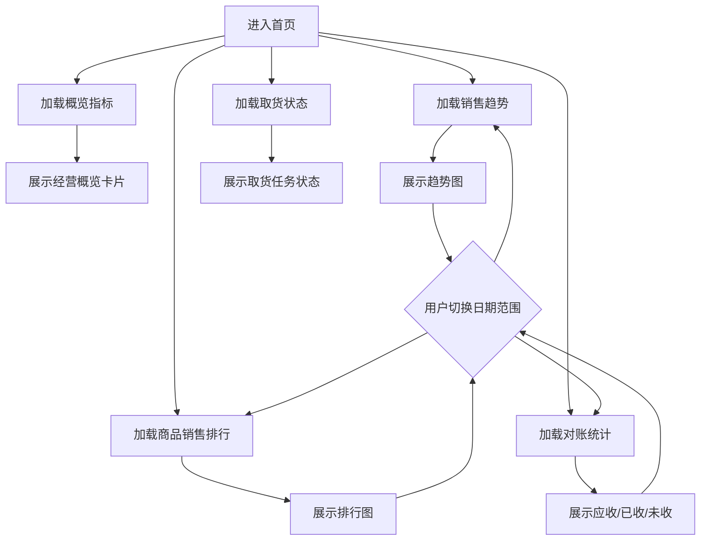

# 首页驾驶舱

## 业务目标

首页用于展示经营概览，不直接改变业务数据。它聚合销售、对账、取货状态、排行等统计，让管理者快速判断当天或某个周期的经营情况。

## 业务流程图

## 页面来源

| 页面 | 旧文件 |
| --- | --- |
| 首页 | `src/views/home/index.vue` |
| 首页旧副本 | `src/views/home/index copy.vue` |

## 接口清单

| 动作 | 方法 | URL | 旧方法 |
| --- | --- | --- | --- |
| 概览卡片 | GET | `/business/index/brief` | `getBrief` |
| 销售趋势 | GET | `/business/index/sale/trend` | `getSalesTrend` |
| 客户销售排行 | GET | `/business/index/customer/sale/rank` | `getCustomerSalesRank` / `getSalesRank` |
| 商品分类销售排行 | GET | `/business/index/goods/type/rank` | `getGoodsSalesRank` |
| 对账统计 | GET | `/business/index/reconciliation` | `getStatement` |
| 取货状态 | GET | `/business/index/pickUp/status` | `getPickUp` |

## 关键字段

| 字段 | 含义 |
| --- | --- |
| `salePrice` | 销售额，字段名需以后端为准 |
| `orderCount` | 订单数，字段名需以后端为准 |
| `customerCount` | 客户数，字段名需以后端为准 |
| `settlementPrice` | 已结金额 |
| `pendingPrice` | 未结金额 |
| `dateBegin` / `dateEnd` | 查询周期 |

## React 重写提示

- 首页建议放在 `features/dashboard`。
- 每个图表接口独立 `queryKey`，避免一个接口失败导致整页失败。
- 趋势和排行图建议复用报表模块图表组件。
- 首页字段需要结合后端响应再精确建类型，旧项目没有集中定义类型。

