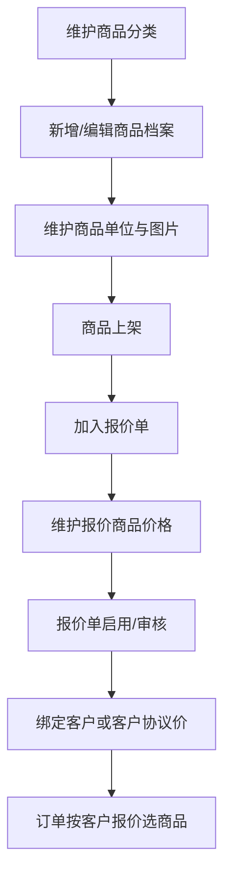
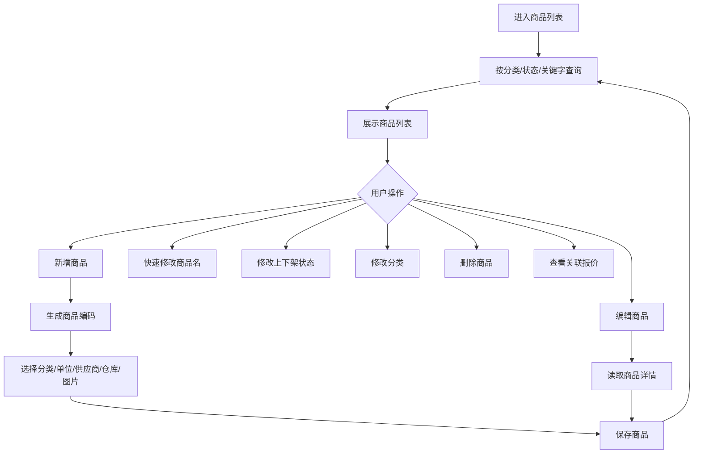
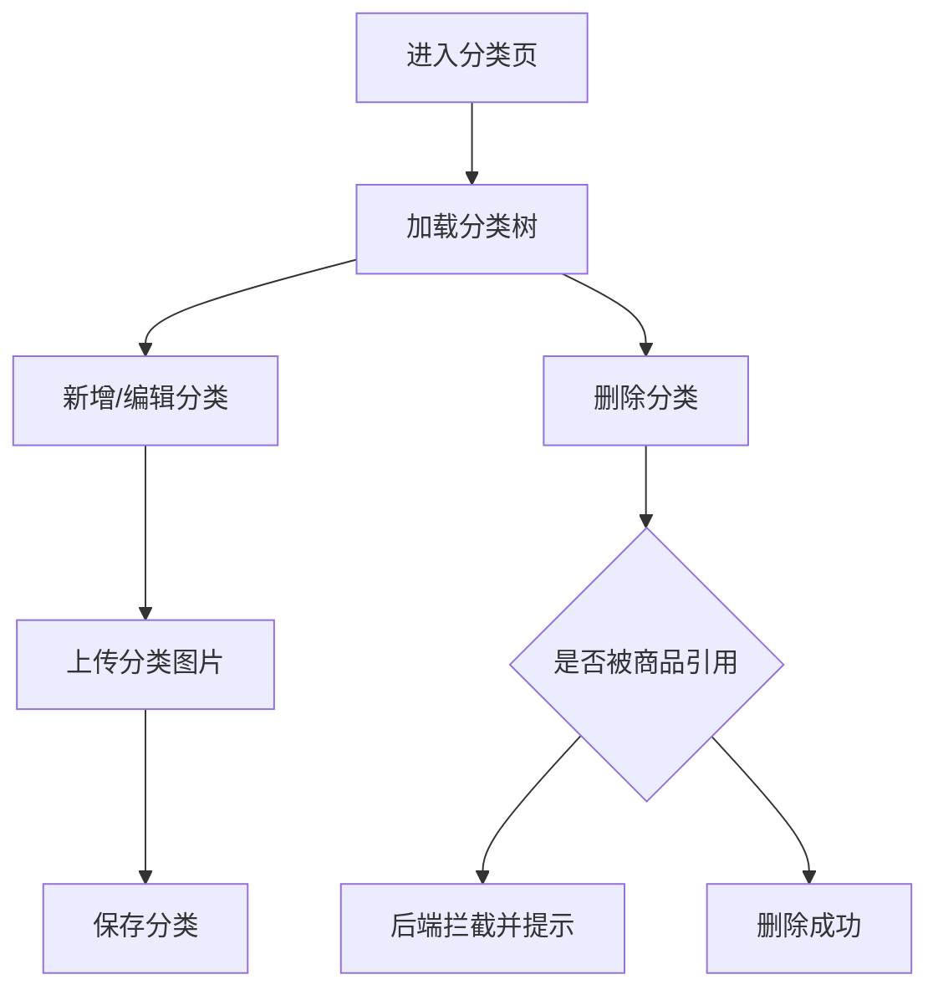
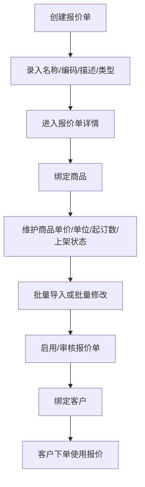
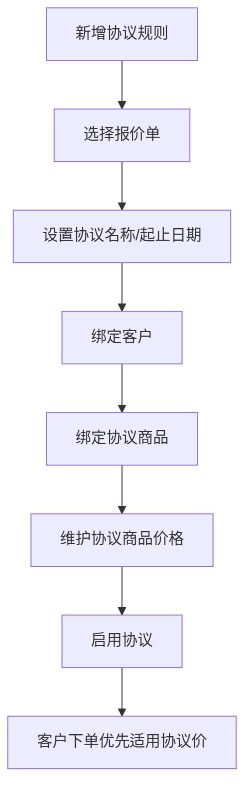

# 商品模块

## 业务目标

商品模块维护商品档案、商品分类、商品单位、报价单、协议价和采购/销售价格体系。它是订单、采购、库存、财务的基础资料来源。

## 模块流程图

## 页面清单

| 业务 | 旧文件 |
| --- | --- |
| 商品列表 | `src/views/goods/goodsManager/goodsList.vue` |
| 新增商品 | `src/views/goods/goodsManager/components/goodsAdd.vue` |
| 编辑商品 | `src/views/goods/goodsManager/components/goodsEdit.vue` |
| 商品单位弹窗 | `src/views/goods/goodsManager/components/UnitManagerDialog.vue` |
| 商品税率 | `src/views/goods/goodsManager/commodityTaxRate.vue` |
| 商品税率弹窗 | `src/views/goods/goodsManager/components/taxRateDialog.vue` |
| 商品分类 | `src/views/goods/productSettings/category.vue` |
| 商品分类弹窗 | `src/views/goods/productSettings/components/dialogCategory.vue` |
| 普通报价单 | `src/views/goods/priceManagement/quotation.vue` |
| 普通报价单新增 | `src/views/goods/priceManagement/components/addQuotation.vue` |
| 普通报价单编辑 | `src/views/goods/priceManagement/components/editQuotation.vue` |
| 周期报价单 | `src/views/goods/priceManagement/components/periodicity.vue` |
| 周期报价表格 | `src/views/goods/priceManagement/components/periodicityTable.vue` |
| 报价商品表 | `src/views/goods/priceManagement/components/addQuotationTable.vue` |
| 关联商品弹窗 | `src/views/goods/priceManagement/components/associatedGoods.vue` |
| 客户/标签页组件 | `src/views/goods/priceManagement/components/unitTabs.vue` |
| 协议价 | `src/views/goods/priceManagement/agreementPrice.vue` |
| 新增协议价弹窗 | `src/views/goods/priceManagement/components/addAgreementPriceDialog.vue` |
| 协议价编辑 | `src/views/goods/priceManagement/agreePriceSonPage/*` |
| 学校报价单 | `src/views/goods/newPriceManagement/*` |

## 商品档案流程

## 商品接口

| 动作 | 方法 | URL | 旧方法 |
| --- | --- | --- | --- |
| 商品列表 | GET | `/business/goods/list` | `goodsList` |
| 生成编码 | GET | `/business/goods/genCode` | `goodsGetCode` |
| 基础单位列表 | GET | `/business/goods/unit/baseList` | `goodsUnitBaseList` |
| 新增商品 | POST | `/business/goods` | `goodsAdd` |
| 修改商品 | PUT | `/business/goods` | `goodsEdit` |
| 商品详情 | GET | `/business/goods/{id}` | `goodsDetails` |
| 修改商品名称 | PUT | `/business/goods/updateName` | `updateGoodsName` |
| 修改上下架 | PUT | `/business/goods/updateSaleStatus` | `updateSaleStatus` |
| 删除商品 | DELETE | `/business/goods/{ids}` | `goodsDelete` |
| 修改分类 | PUT | `/business/goods/updateType` | `updateType` |
| 商品单位列表 | GET | `/business/goods/unit/unitList/{goodsId}` | `goodsUnitListOptions` |
| 修改税率 | PUT | `/business/goods/updateTax` | `updateTax` |
| 商品关联报价 | GET | `/business/quotation/list/{goodsId}` | `quotationGridData` |
| 新增基础单位 | POST | `/business/goods/unit/base` | `goodsUnitBaseAdd` |
| 按客户取商品价格 | GET | `/business/goods/listBasicPriceDetail` | `getGoodsListByCustomer` |
| 税率分类树 | GET | `/business/goods/tax/type/tree/list` | `taxTypeTreeList` |

## 商品字段

| 字段 | 含义 |
| --- | --- |
| `id` | 商品 ID |
| `goodsName` | 商品名称 |
| `goodsCode` | 商品编码 |
| `goodsImage` | 商品图片，旧项目多图用逗号分隔 |
| `goodsTypeId` / `goodsTypeIdList` | 商品分类 |
| `goodsTypeName` / `goodsTypeNameF/S/T` | 分类名称 |
| `goodsDesc` | 商品描述 |
| `status` / `saleStatus` | 上下架状态，常见 `1` 上架，`0` 下架 |
| `baseUnitId` / `baseUnitName` | 基本单位 |
| `goodsUnitId` / `goodsUnitName` | 当前业务单位 |
| `unitList` | 单位换算列表 |
| `supplierId` | 默认供应商 |
| `wareId` | 默认仓库 |

## 商品分类流程

分类接口：

| 动作 | 方法 | URL |
| --- | --- | --- |
| 分类列表 | GET | `/business/goods/type/list` |
| 新增分类 | POST | `/business/goods/type` |
| 修改分类 | PUT | `/business/goods/type` |
| 删除分类 | DELETE | `/business/goods/type/{id}` |

## 报价单流程

普通报价接口：

| 动作 | 方法 | URL |
| --- | --- | --- |
| 报价列表 | GET | `/business/quotation/list` |
| 新增报价 | POST | `/business/quotation` |
| 报价详情 | GET | `/business/quotation/{id}` |
| 修改报价 | PUT | `/business/quotation` |
| 删除报价 | DELETE | `/business/quotation/{ids}` |
| 报价商品列表 | GET | `/business/quotation/goods/list/{quotationId}` |
| 可绑定商品 | GET | `/business/goods/listForBindingQuotation` |
| 绑定商品 | POST | `/business/quotation/goods` |
| 删除报价商品 | DELETE | `/business/quotation/goods/{ids}` |
| 修改报价商品 | PUT | `/business/quotation/goods` |
| 批量修改报价商品 | PUT | `/business/quotation/goods/batch` |
| 新增子报价 | POST | `/business/quotation/subQuotation` |
| 子报价列表 | GET | `/business/quotation/subList/{id}` |
| 修改子报价 | PUT | `/business/quotation/subQuotation` |
| 审核报价 | PUT | `/business/quotation/audit/{id}` |
| 修改报价状态 | PUT | `/business/quotation/updateStatus` |
| 复制报价 | POST | `/business/quotation/copy` |

学校报价接口：

| 动作 | 方法 | URL |
| --- | --- | --- |
| 学校报价列表 | GET | `/business/schoolQuotation/list` |
| 新增学校报价 | POST | `/business/schoolQuotation` |
| 学校报价详情 | GET | `/business/schoolQuotation/{id}` |
| 修改学校报价 | PUT | `/business/schoolQuotation` |
| 删除学校报价 | DELETE | `/business/schoolQuotation/{ids}` |
| 学校报价商品列表 | GET | `/business/schoolQuotation/goods/list/{quotationId}` |
| 绑定学校报价商品 | POST | `/business/schoolQuotation/goods` |
| 删除学校报价商品 | DELETE | `/business/schoolQuotation/goods/{ids}` |
| 修改学校报价商品 | PUT | `/business/schoolQuotation/goods` |
| 批量修改学校报价商品 | PUT | `/business/schoolQuotation/goods/batch` |
| 新增学校子报价 | POST | `/business/schoolQuotation/subQuotation` |
| 学校子报价列表 | GET | `/business/schoolQuotation/subList/{id}` |
| 修改学校子报价 | PUT | `/business/schoolQuotation/subQuotation` |
| 审核学校报价 | PUT | `/business/schoolQuotation/audit/{id}` |
| 修改学校报价状态 | PUT | `/business/schoolQuotation/updateStatus` |
| 复制学校报价 | POST | `/business/schoolQuotation/copy` |
| 学校报价绑定客户 | PUT | `/business/schoolQuotation/bindCustomer` |
| 学校报价解绑客户 | PUT | `/business/schoolQuotation/removeCustomer` |
| 学校报价客户列表 | GET | `/business/customerWithSchoolQuotation/list` |

报价字段：

| 字段 | 含义 |
| --- | --- |
| `quotationId` | 报价单 ID |
| `quotationName` | 报价单名称 |
| `quotationCode` | 报价单编码 |
| `quotationDesc` | 描述 |
| `goodsNumber` | 商品数 |
| `customerNumber` | 客户数 |
| `status` | 状态，旧页面展示 `1` 启用，其它禁用 |

报价商品字段：

| 字段 | 含义 |
| --- | --- |
| `goodsId` | 商品 ID |
| `goodsName` | 商品名称 |
| `goodsCode` | 商品编码 |
| `goodsUnitId` / `goodsUnitName` | 下单单位 |
| `unitPrice` | 商品单价 |
| `minOrderNum` | 最小起订数 |
| `status` | 商品在报价单内状态，`1` 上架，`0` 下架 |

## 协议价流程

协议价接口：

| 动作 | 方法 | URL |
| --- | --- | --- |
| 协议列表 | GET | `/business/customer/protocol/list` |
| 新增协议 | POST | `/business/customer/protocol` |
| 删除协议 | DELETE | `/business/customer/protocol/{ids}` |
| 批量改状态 | PUT | `/business/customer/protocol/updateStatus/batch` |
| 协议详情 | GET | `/business/customer/protocol/{id}` |
| 协议商品列表 | GET | `/business/customer/protocol/goods/list/{customerProtocolId}` |
| 可绑定协议商品 | GET | `/business/customer/protocol/goods/listForBindGoods` |
| 绑定协议商品 | POST | `/business/customer/protocol/goods` |
| 删除协议商品 | DELETE | `/business/customer/protocol/goods/{ids}` |
| 修改协议商品 | PUT | `/business/customer/protocol/goods` |
| 绑定客户 | PUT | `/business/customer/protocol/bindCustomer` |
| 解绑客户 | PUT | `/business/customer/protocol/removeCustomer` |

## React 重写提示

- 把商品档案、分类、报价单、协议价拆成独立子域。
- 商品远程选择组件要复用到订单、采购、库存、溯源。
- 价格和单位换算逻辑不要写在表格组件里，应抽成 `goods-pricing` 服务。
- 图片字段建议新项目改成数组模型，提交前再适配旧后端逗号字符串。
- 学校报价和普通报价可用同一套 UI，通过 API adapter 区分路径。
