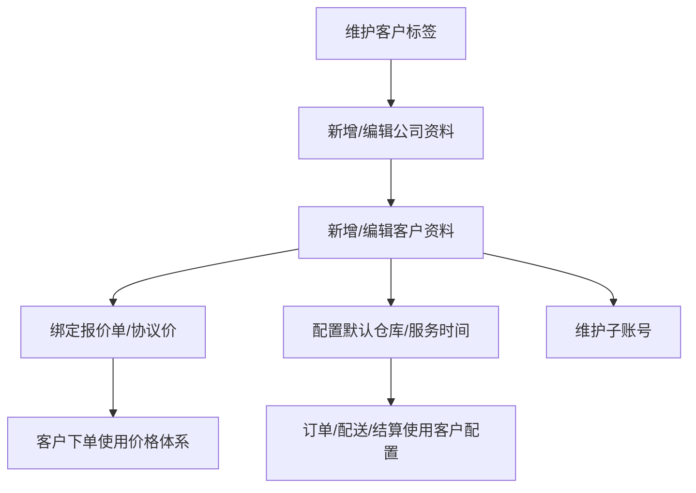
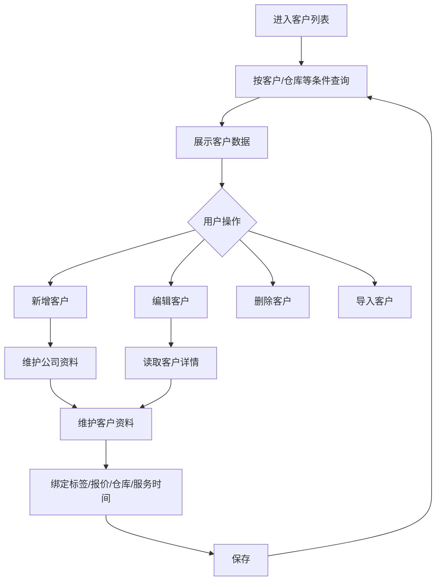
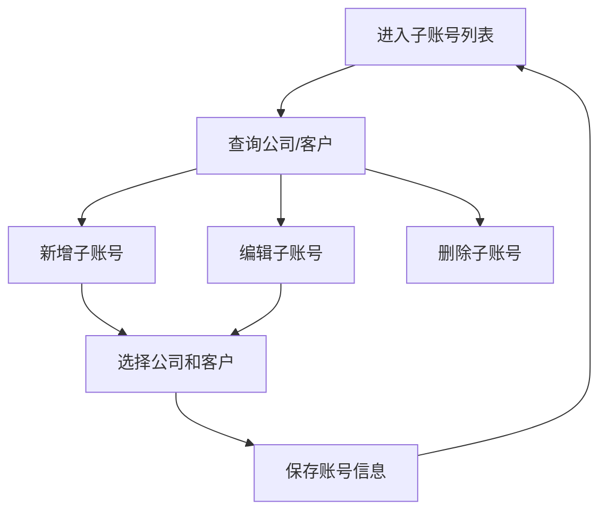
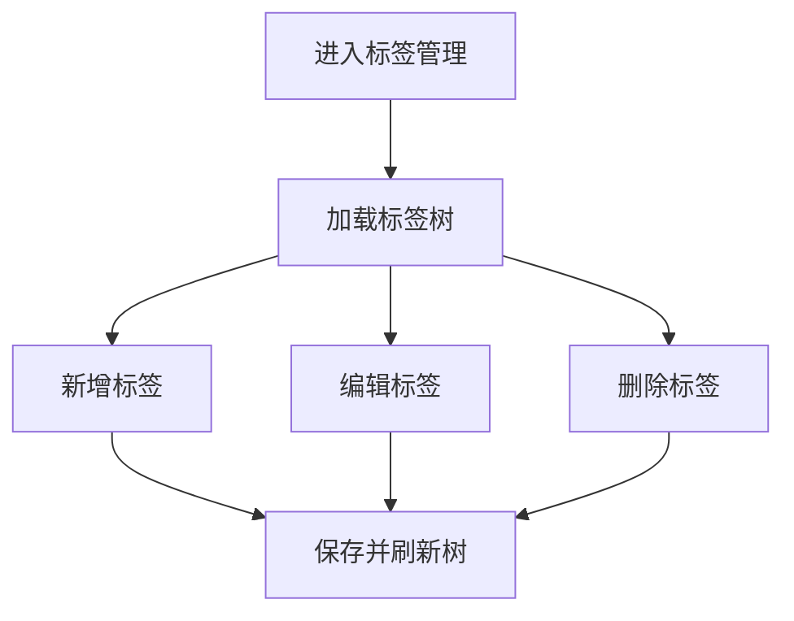

# 客户模块

## 业务目标

客户模块维护客户单位、公司资料、子账号、标签、客户报价、仓库、服务时间等，是订单、报价、采购计划、配送和结算的基础。

## 模块流程图

## 页面清单

| 业务 | 旧文件 |
| --- | --- |
| 客户列表 | `src/views/customer/customerManager/customerList.vue` |
| 新增客户 | `src/views/customer/customerManager/addCustomer.vue` |
| 编辑客户 | `src/views/customer/customerManager/editCustomer.vue` |
| 子账号列表 | `src/views/customer/subAccountManager/subAccount.vue` |
| 新增子账号 | `src/views/customer/subAccountManager/addSubAccount.vue` |
| 编辑子账号 | `src/views/customer/subAccountManager/editSubAccount.vue` |
| 标签管理 | `src/views/customer/tagsManager/tagsList.vue` |

## 客户资料流程

## 接口清单

| 动作 | 方法 | URL | 旧方法 |
| --- | --- | --- | --- |
| 客户列表 | GET | `/business/customer/list` | `customerList` |
| 公司列表 | GET | `/business/company/list` | `companyList` |
| 公司详情 | GET | `/business/company/{id}` | `companyDetails` |
| 新增公司 | POST | `/business/company` | `companyAdd` |
| 新增客户 | POST | `/business/customer` | `customerAdd` |
| 修改客户 | PUT | `/business/customer` | `customerEdit` |
| 删除客户 | DELETE | `/business/customer/{ids}` | `customerRemove` |
| 客户详情 | GET | `/business/customer/{id}` | `customerDetails` |
| 报价解绑客户 | PUT | `/business/quotation/removeCustomer` | `removeCustomer` |
| 报价绑定客户 | PUT | `/business/quotation/bindCustomer` | `bindCustomer` |

## 关键字段

| 字段 | 含义 |
| --- | --- |
| `id` / `customerId` | 客户 ID |
| `customerName` | 客户/单位名称 |
| `customerCode` | 客户编码 |
| `companyId` | 公司/单位 ID |
| `quotationId` | 绑定报价单 |
| `customerTagIds` | 客户标签 ID |
| `wareId` | 默认仓库 |
| `servicePeriodId` | 服务时间 |
| `contactName` | 联系人 |
| `contactPhone` | 联系电话 |
| `address` | 地址 |

## 子账号流程

子账号接口：

| 动作 | 方法 | URL |
| --- | --- | --- |
| 子账号列表 | GET | `/business/company/sub/list` |
| 新增子账号 | POST | `/business/company/sub` |
| 修改子账号 | PUT | `/business/company/sub` |
| 删除子账号 | DELETE | `/business/company/sub/{ids}` |
| 绑定客户协议 | PUT | `/business/customer/protocol/bindCustomer` |
| 解绑客户协议 | PUT | `/business/customer/protocol/removeCustomer` |

## 标签流程

标签接口：

| 动作 | 方法 | URL |
| --- | --- | --- |
| 标签树 | GET | `/business/customer/tag/tree/list` |
| 新增标签 | POST | `/business/customer/tag` |
| 修改标签 | PUT | `/business/customer/tag` |
| 删除标签 | DELETE | `/business/customer/tag/{ids}` |

## React 重写提示

- 客户、公司、子账号建议分成三个模型，不要在一个大表单里混成任意对象。
- 客户标签树要作为公共筛选组件，订单、采购计划、销售报表都会用。
- 客户绑定报价和协议价属于价格体系，建议通过 goods/price 的 adapter 调用。
- 新项目要明确客户删除对历史订单、结算数据的影响，前端至少显示后端返回的拦截原因。

