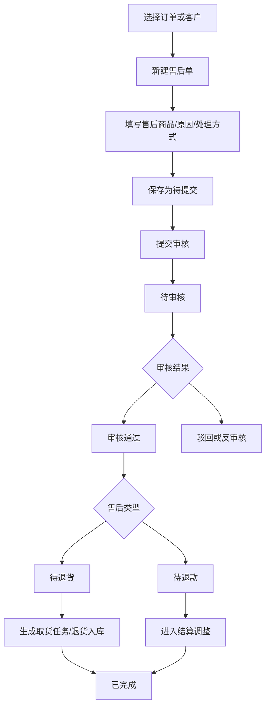
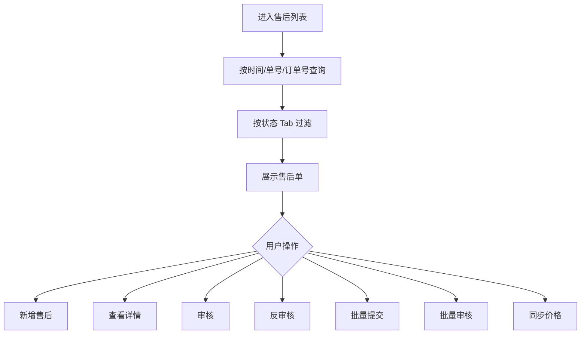
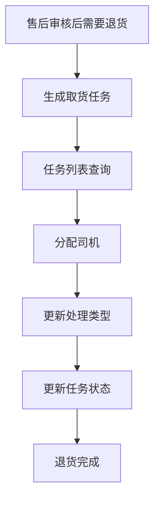

# 售后模块

## 业务目标

售后模块处理订单完成前后的退款、退货、补货、换货、客户沟通、核算账单等问题。它关联订单、客户、商品、供应商、部门、取货任务和财务结算。

## 主流程图

## 页面清单

| 业务 | 旧文件 |
| --- | --- |
| 售后列表 | `src/views/order/afterSales/index.vue` |
| 新建售后 | `src/views/order/afterSales/create.vue` |
| 售后详情 | `src/views/order/afterSales/detail.vue` |
| 审核售后 | `src/views/order/afterSales/examine.vue` |
| 反审核售后 | `src/views/order/afterSales/noTexamine.vue` |
| 取货任务 | `src/views/order/takeGoodsTask/index.vue` |

## 状态枚举

| 字段 | 值 | 含义 |
| --- | --- | --- |
| `afterStatus` | `1` | 待提交 |
| `afterStatus` | `2` | 待审核 |
| `afterStatus` | `3` | 待退货 |
| `afterStatus` | `4` | 待退款 |
| `afterStatus` | `5` | 已完成 |

订单状态在售后里也会展示：

| 字段 | 值 | 含义 |
| --- | --- | --- |
| `orderStatus` | `1` | 待分拣 |
| `orderStatus` | `2` | 分拣中 |
| `orderStatus` | `3` | 分拣完成 |
| `orderStatus` | `4` | 配送中 |
| `orderStatus` | `5` | 已签收 |

## 售后列表流程

## 售后接口

| 动作 | 方法 | URL | 旧方法 |
| --- | --- | --- | --- |
| 售后列表 | GET | `/business/after/sale/list` | `getAfterSalesList` |
| 新增售后 | POST | `/business/after/sale` | `addAfterSales` |
| 售后详情 | GET | `/business/after/sale/{id}` | `getAfterSalesDetail` |
| 修改售后 | PUT | `/business/after/sale` | `updateAfterSales` |
| 审核售后 | PUT | `/business/after/sale/audit` | `afterSalesAudit` |
| 反审核售后 | POST | `/business/after/sale/{ids}` | `afterSalesUnAudit` |
| 删除售后 | DELETE | `/business/after/sale/{ids}` | `deleteAfterSales` |
| 批量审核 | POST | `/business/after/sale/audit/batch/{ids}` | `batchAuditAfterSales` |
| 批量提交 | PUT | `/business/after/sale/commit/{ids}` | `batchSubmitAfterSales` |
| 同步售后价格 | PUT | `/business/after/sale/syncPrice` | `batchSyncPrice` |

## 售后字段

| 字段 | 含义 |
| --- | --- |
| `id` | 售后单 ID |
| `afterSaleNo` | 售后单号 |
| `orderId` / `orderNo` | 关联订单 |
| `customerId` / `customerName` | 客户 |
| `source` | 售后来源 |
| `createBy` / `createTime` | 建单人/建单时间 |
| `orderPrice` | 原订单金额 |
| `settlementPrice` | 结算金额 |
| `remark` | 备注 |
| `goodsBoList` / `goodsVoList` | 售后商品列表 |

售后商品字段：

| 字段 | 含义 |
| --- | --- |
| `goodsId` / `goodsName` / `goodsCode` | 商品 |
| `goodsTypeName` | 商品分类 |
| `afterSaleType` | 售后类型，页面可选仅退款、退货退款 |
| `actualRefundNum` | 实际退款/退货数量 |
| `applyGoodsUnitId` | 申请单位 |
| `supplierId` / `supplierName` | 供应商 |
| `deptId` | 部门 |
| `reasonType` | 售后原因 |
| `handleType` | 处理方式 |

## 售后原因

- 未按时送达
- 漏单
- 送错商品
- 下错单
- 斤两不对
- 质量问题
- 规格问题
- 司机弄丢/弄坏
- 市场缺货(未出库)
- 系统问题
- 采购问题
- 无法送达
- 其它

## 处理方式

- 货品减免
- 补货
- 换货
- 核算账单
- 客户沟通
- 其它

## 取货任务流程

取货任务接口：

| 动作 | 方法 | URL |
| --- | --- | --- |
| 取货任务列表 | GET | `/business/after/sale/goods/pickUp` |
| 修改取货任务 | PUT | `/business/after/sale/goods/pickUp` |
| 批量更新处理类型 | PUT | `/business/after/sale/goods/pickUp/batch/handleType/{handleType}/{ids}` |
| 批量分配司机 | PUT | `/business/after/sale/goods/pickUp/batch/driver/{driver}/{ids}` |
| 批量更新状态 | PUT | `/business/after/sale/goods/pickUp/batch/status/{status}/{ids}` |

## React 重写提示

- 售后新建页和审核页字段高度相似，应拆出 `AfterSaleForm` 和 `AfterSaleGoodsTable`。
- 售后原因和处理方式要做成常量枚举，后续最好由后端字典提供。
- 从订单创建售后时，需要复用订单详情和客户商品价格接口。
- 取货任务建议作为 after-sales 子域，不要混进配送主任务。

