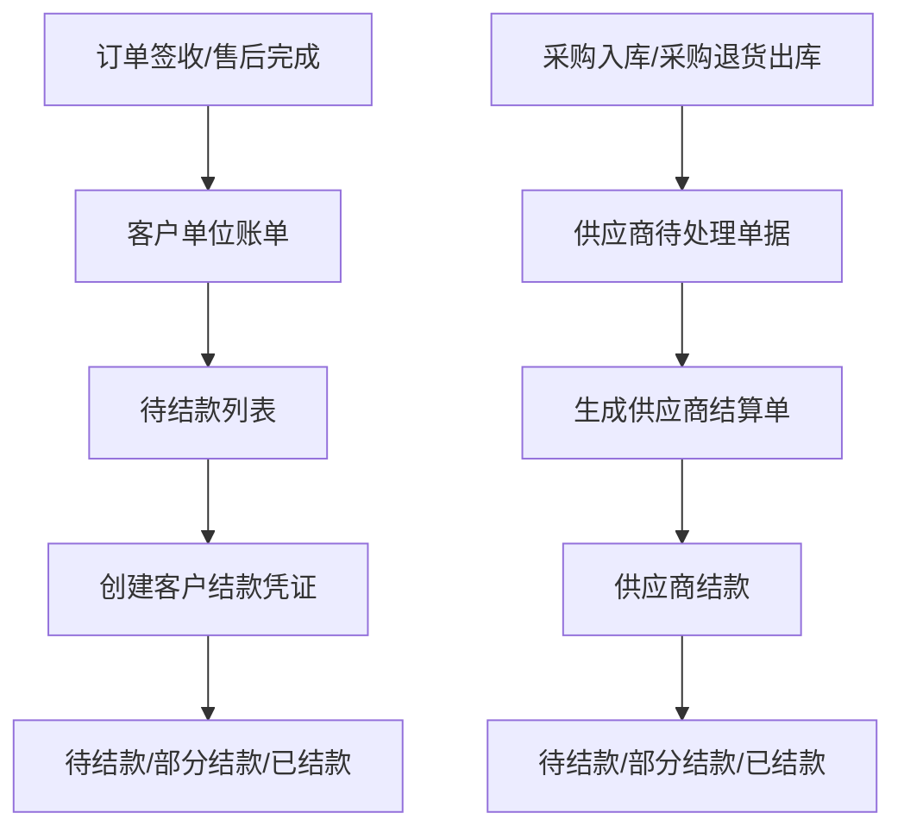
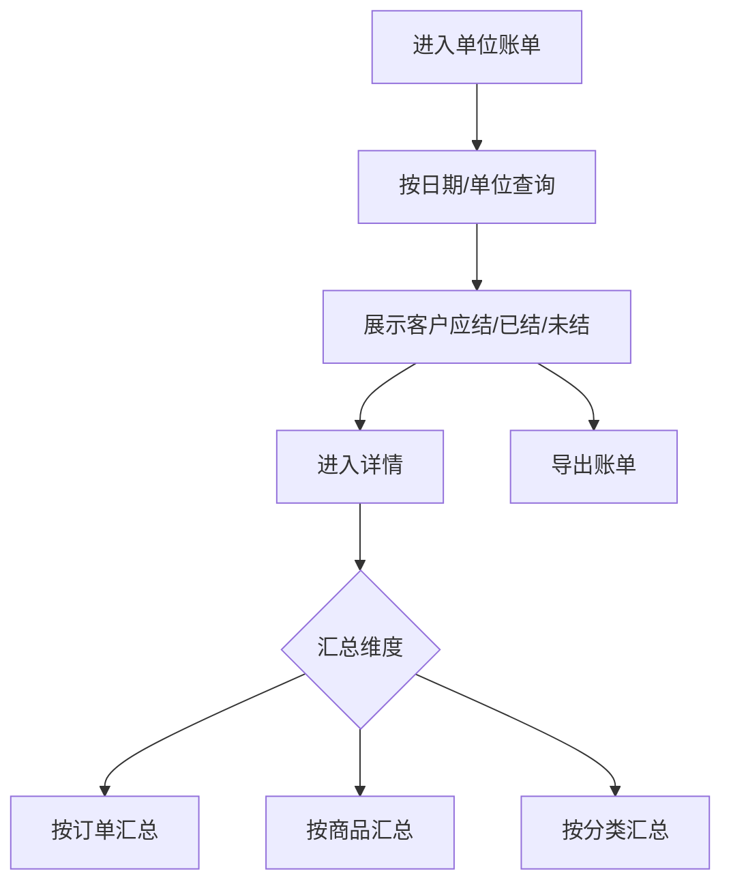
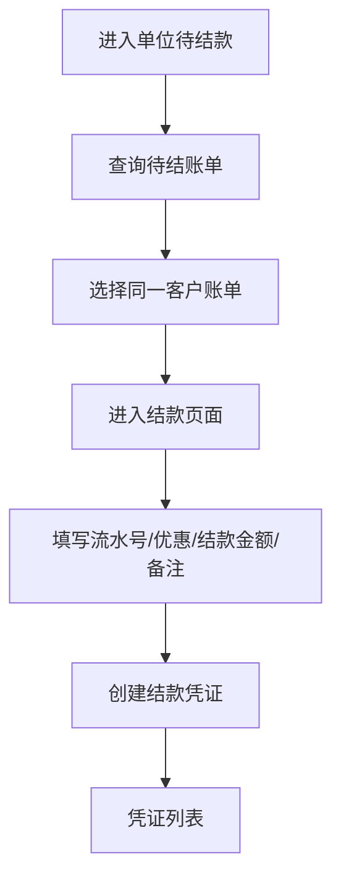
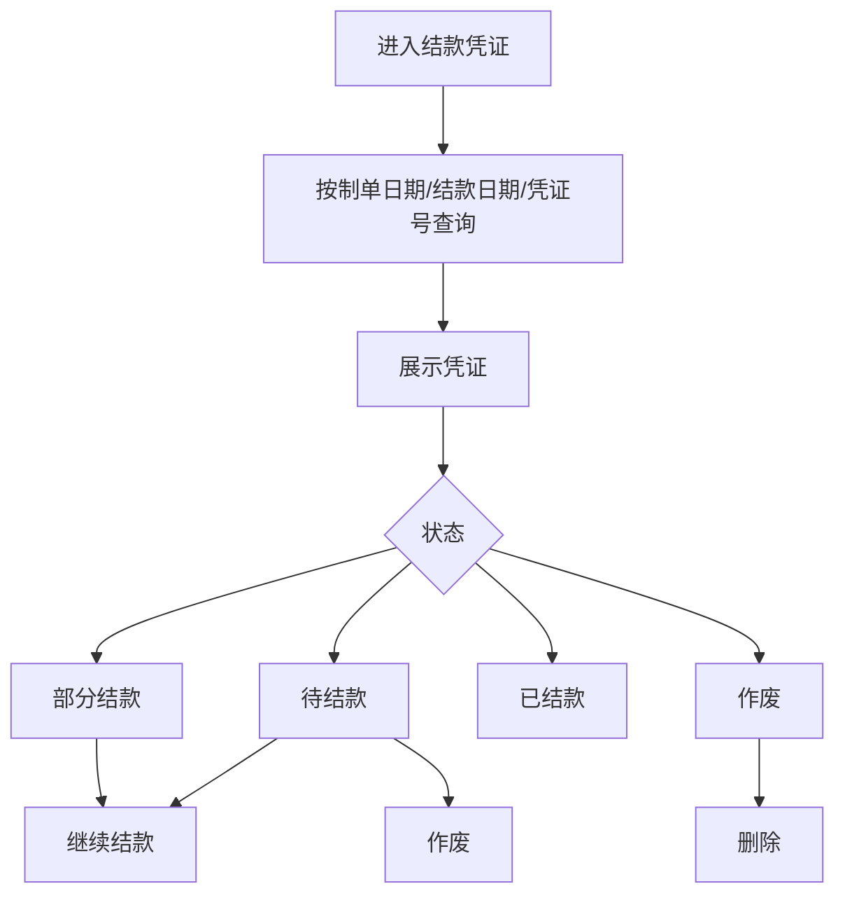
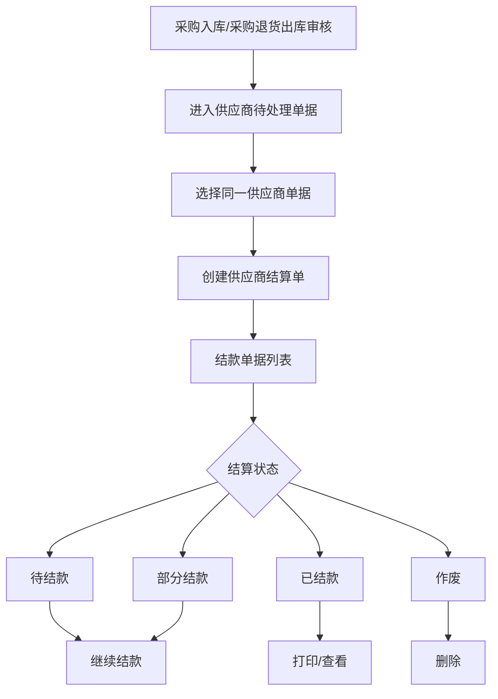

# 财务模块

## 业务目标

财务模块处理客户单位账单、客户结款凭证、供应商结算和供应商付款。它连接订单签收、售后调整、采购入库、采购退货出库等业务结果。

## 主流程图

## 页面清单

| 业务 | 旧文件 |
| --- | --- |
| 单位账单 | `src/views/finance/unitBill/index.vue` |
| 单位账单详情 | `src/views/finance/unitBill/detail.vue` |
| 单位待结款 | `src/views/finance/unitPayment/index.vue` |
| 单位结款 | `src/views/finance/unitPayment/payment.vue` |
| 结款凭证 | `src/views/finance/settlementProof/index.vue` |
| 结款凭证详情 | `src/views/finance/settlementProof/detail.vue` |
| 供应商结算 | `src/views/finance/supplierSettlement/index.vue` |
| 供应商结算详情 | `src/views/finance/supplierSettlement/detail.vue` |
| 供应商结算备注弹窗 | `src/views/finance/supplierSettlement/remarkDialog.vue` |

## 单位账单流程

接口：

| 动作 | 方法 | URL |
| --- | --- | --- |
| 单位账单分页 | GET | `/business/customer/settlement/bill/page` |
| 单位账单详情 | GET | `/business/customer/settlement/bill/detail/{customerId}` |
| 明细详情 | GET | `/business/customer/settlement/bill/detail/detail/{type}/{customerId}` |

字段：

| 字段 | 含义 |
| --- | --- |
| `customerId` | 客户 ID |
| `customerCode` | 客户编码 |
| `customerName` | 客户名称 |
| `shouldPrice` | 应结金额 |
| `orderPrice` | 订单金额 |
| `settlementPrice` | 已结金额 |
| `pendingPrice` | 未结金额 |
| `dateBegin` / `dateEnd` | 账单周期 |

## 单位结款流程

接口：

| 动作 | 方法 | URL |
| --- | --- | --- |
| 待结款列表 | GET | `/business/customer/settlement/pending/list` |
| 按 ID 取待结数据 | POST | `/business/customer/settlement/pending/list` |
| 创建结款 | POST | `/business/customer/settlement` |

## 结款凭证流程

状态：

| 字段 | 值 | 含义 |
| --- | --- | --- |
| `settlementStatus` | `-1` | 作废 |
| `settlementStatus` | `1` | 待结款 |
| `settlementStatus` | `2` | 部分结款 |
| `settlementStatus` | `3` | 已结款 |

接口：

| 动作 | 方法 | URL |
| --- | --- | --- |
| 凭证列表 | GET | `/business/customer/settlement/list` |
| 凭证详情 | GET | `/business/customer/settlement/{id}` |
| 批量结款 | PUT | `/business/customer/settlement/batch/settle` |
| 作废 | DELETE | `/business/customer/settlement/wasted/{ids}` |
| 删除 | DELETE | `/business/customer/settlement/{ids}` |

凭证明细字段：

| 字段 | 含义 |
| --- | --- |
| `settlementCode` | 结款凭证号 |
| `companyName` | 结款单位 |
| `shouldPrice` | 应结金额 |
| `newSettlementPrice` | 已结金额 |
| `pendingPrice` | 未结金额 |
| `serialNo` | 交易流水号 |
| `discountPrice` | 优惠金额 |
| `settlementPrice` | 本次交易金额 |
| `remark` | 备注 |

## 供应商结算流程

状态：

| 字段 | 值 | 含义 |
| --- | --- | --- |
| `settlementStatus` | `-1` | 作废 |
| `settlementStatus` | `1` | 待结款 |
| `settlementStatus` | `2` | 部分结款 |
| `settlementStatus` | `3` | 已结款 |

单据类型：

| 字段 | 值 | 含义 |
| --- | --- | --- |
| `orderType` | `1` | 采购入库 |
| `orderType` | `2` | 采购退货出库 |

接口：

| 动作 | 方法 | URL |
| --- | --- | --- |
| 待处理列表 | GET | `/business/supplier/settlement/pending/list` |
| 结算单列表 | GET | `/business/supplier/settlement/list` |
| 结算单详情 | GET | `/business/supplier/settlement/{id}` |
| 创建结算单 | POST | `/business/supplier/settlement` |
| 批量结款 | PUT | `/business/supplier/settlement/batch/settle` |
| 作废 | DELETE | `/business/supplier/settlement/wasted/{ids}` |
| 删除 | DELETE | `/business/supplier/settlement/{ids}` |
| 打印 | GET | `/business/print/data/supplierSettlement/{settlementIds}` |
| 合并结算 | PUT | `/business/supplier/settlement/{settlementId}` |

## React 重写提示

- 客户结算和供应商结算状态相同，可共用状态常量。
- 创建结算单时必须校验选中单据属于同一客户或同一供应商。
- 金额输入要统一处理精度，优惠金额不能导致结款金额小于 0。
- 作废、删除、继续结款的按钮权限由状态机配置控制。
- 财务模块强依赖后端响应结构，重写前必须拿完整接口响应体。
