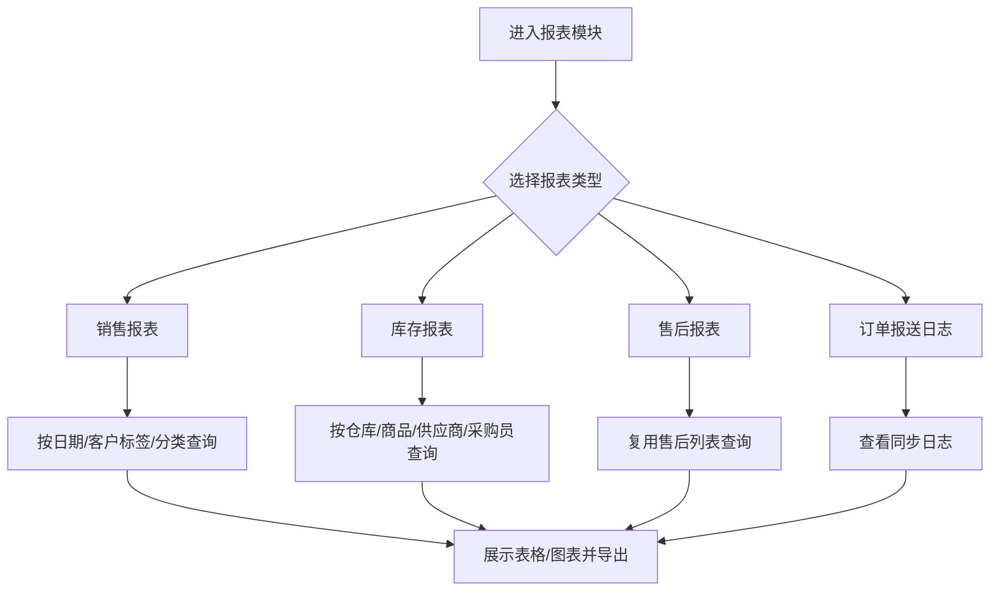
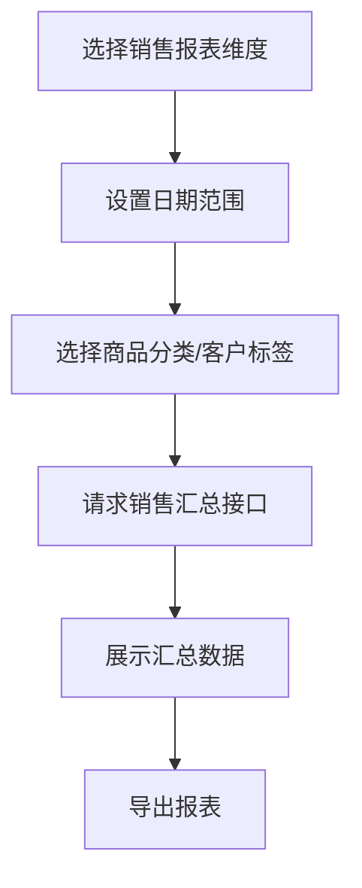
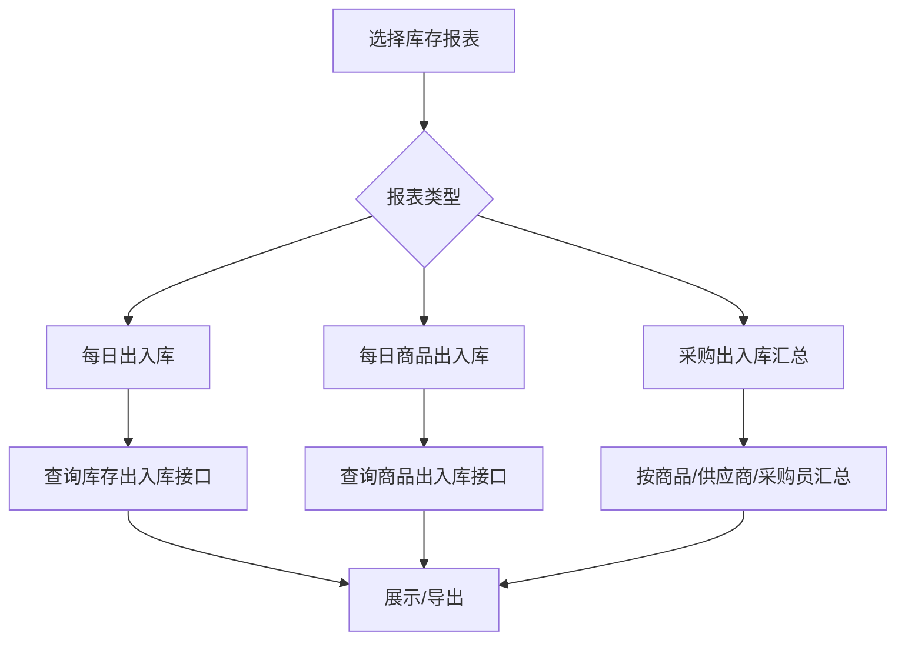
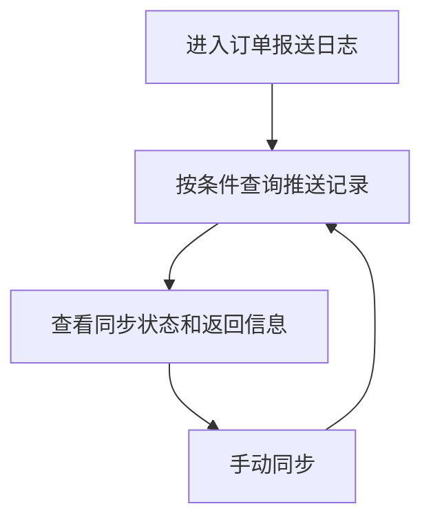

# 报表模块

## 业务目标

报表模块对销售、库存、采购出入库、售后、订单报送等数据进行汇总查询和导出。它主要是只读分析，不直接改变业务状态。

## 模块流程图

## 页面清单

| 业务 | 旧文件 |
| --- | --- |
| 销售商品汇总 | `src/views/report/salesReport/goodsSummary.vue` |
| 销售分类汇总 | `src/views/report/salesReport/goodsTypeSummary.vue` |
| 销售单位汇总 | `src/views/report/salesReport/unitSummary.vue` |
| 销售区域汇总 | `src/views/report/salesReport/areaSummary.vue` |
| 限制商品 | `src/views/report/salesReport/restrictedGoods.vue` |
| 日库存报表 | `src/views/report/stockReport/dayStockReport.vue` |
| 日商品库存报表 | `src/views/report/stockReport/dayGoodsStockReport.vue` |
| 采购入库/出库汇总 | `src/views/report/stockReport/*` |
| 售后报表 | `src/views/report/afterSaleReport/afterSaleReportList.vue` |
| 订单报送日志 | `src/views/Traceability/orderReport.vue` |

## 销售报表流程

销售报表接口：

| 动作 | 方法 | URL | 旧方法 |
| --- | --- | --- | --- |
| 销售汇总 | GET | `/business/index/sale/summary/{type}` | `saleSummary` |
| 限制商品 | GET | `/business/index/queryListGoodsInfo` | `restrictedGoods` |

常见查询条件：

| 字段 | 含义 |
| --- | --- |
| `dateBegin` / `dateEnd` | 日期范围 |
| `goodsTypeIdList` | 商品分类 |
| `customerTagIds` | 客户标签 |
| `type` | 汇总维度 |

## 库存报表流程

库存报表接口：

| 动作 | 方法 | URL |
| --- | --- | --- |
| 日库存出入库 | GET | `/business/index/daily/report/inOut` |
| 日库存出入库分类 | GET | `/business/index/daily/report/inOut/type` |
| 日商品出入库 | GET | `/business/index/daily/goods/report/inOut` |
| 日商品出入库分类 | GET | `/business/index/daily/goods/report/inOut/type` |
| 采购出入库商品汇总 | GET | `/business/purchase/inOut/detail/goods` |
| 采购出入库供应商汇总 | GET | `/business/purchase/inOut/detail/supplier` |
| 采购出入库采购员汇总 | GET | `/business/purchase/inOut/detail/purchaser` |
| 供应商明细 | GET | `/business/purchase/inOut/detail/supplier/detail` |

## 售后报表

售后报表复用售后列表接口：

| 动作 | 方法 | URL |
| --- | --- | --- |
| 售后列表/报表 | GET | `/business/after/sale/list` |

## 订单报送日志

接口：

| 动作 | 方法 | URL |
| --- | --- | --- |
| 推送日志 | GET | `/business/apiPushLog/list` |
| 手动同步 | POST | `/api/sunshine/sync/{type}` |

## React 重写提示

- 报表模块建议统一使用 `ReportPageShell`：查询区、表格区、图表区、导出按钮。
- 销售报表的不同维度用 `type` 区分，不要复制多套逻辑。
- 报表导出复用全局导出能力。
- 报表字段以后端响应为准，旧项目缺少统一类型定义。

