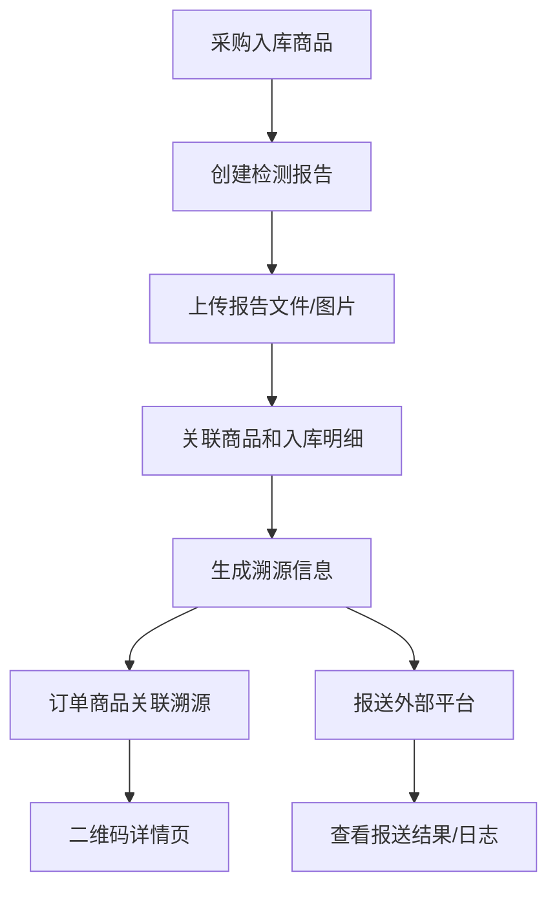
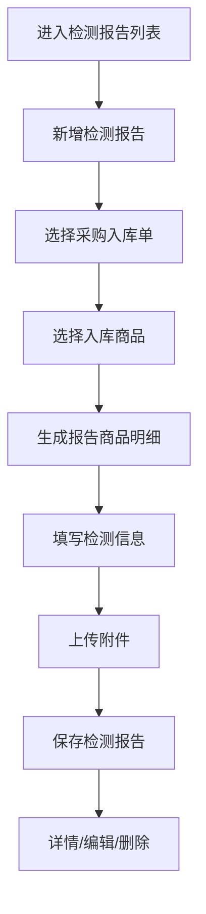
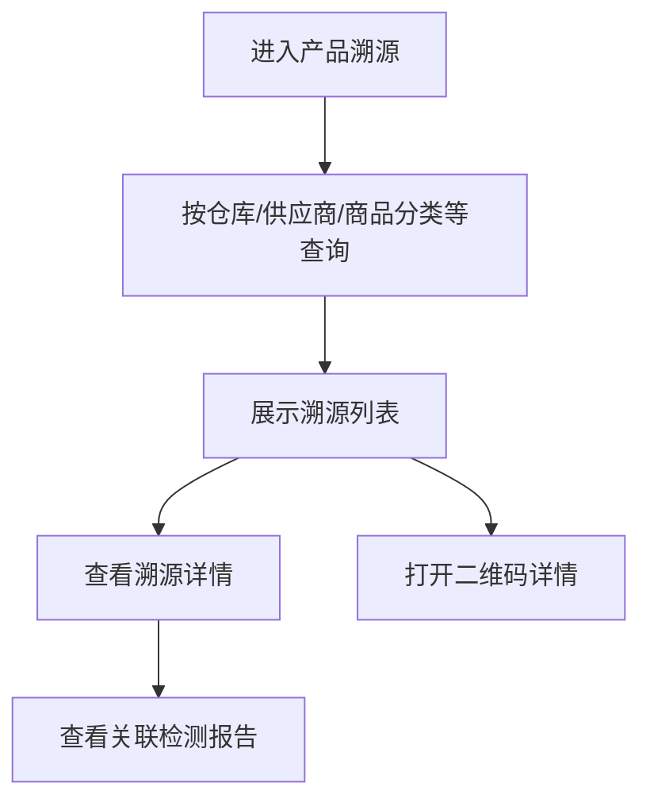

# 溯源模块

## 业务目标

溯源模块围绕检测报告、采购入库商品、订单商品、二维码详情和外部报送结果，提供商品从采购到销售的追踪能力。

## 主流程图

## 页面清单

| 业务 | 旧文件 |
| --- | --- |
| 检测报告列表 | `src/views/Traceability/testReport.vue` |
| 新增检测报告 | `src/views/Traceability/testReportCom/create.vue` |
| 编辑检测报告 | `src/views/Traceability/testReportCom/edit.vue` |
| 检测报告详情 | `src/views/Traceability/testReportCom/details.vue` |
| 选择入库商品 | `src/views/Traceability/testReportCom/checkGoodsByOrder.vue` |
| 选择商品弹窗 | `src/views/Traceability/testReportCom/checkGoodsDialog.vue` |
| 产品溯源 | `src/views/Traceability/ProductTraceability.vue` |
| 二维码页面 | `src/views/Traceability/QrCodePage.vue` |
| 溯源结果 | `src/views/Traceability/reportResults.vue` |
| 订单报送日志 | `src/views/Traceability/orderReport.vue` |

## 检测报告流程

接口：

| 动作 | 方法 | URL | 旧方法 |
| --- | --- | --- | --- |
| 检测报告列表 | GET | `/business/inspection/list` | `inspectionList` |
| 检测报告详情 | GET | `/business/inspection/{id}` | `inspectionDetails` |
| 修改检测报告 | PUT | `/business/inspection` | `inspectionEdit` |
| 删除检测报告 | DELETE | `/business/inspection/{ids}` | `inspectionRemove` |
| 入库单列表 | GET | `/business/inspection/inPurchase/list` | `inPurchaseList` |
| 入库单明细 | GET | `/business/inspection/inPurchase/detail` | `inPurchaseDetails` |
| 生成报告明细 | POST | `/business/inspection/inPurchase/detail/testReport` | `inPurchaseDetailsByCreate` |
| 新增检测报告 | POST | `/business/inspection` | `inspectionAdd` |

## 溯源查询流程

接口：

| 动作 | 方法 | URL |
| --- | --- | --- |
| 溯源列表 | GET | `/business/inspection/trace/list` |
| 溯源详情 | GET | `/business/inspection/trace/detail/{id}` |
| 二维码详情 | GET | `/business/inspection/trace/qr/{orderId}` |
| 溯源结果列表 | GET | `/business/inspection/trace/result/list` |
| 溯源报告 | GET | `/business/inspection/trace/report/{orderId}` |
| 推送日志 | GET | `/business/apiPushLog/list` |
| 手动同步 | POST | `/api/sunshine/sync/{type}` |

## 关键字段

| 字段 | 含义 |
| --- | --- |
| `inspectionId` / `id` | 检测报告 ID |
| `inspectionNo` | 检测报告编号，需以后端为准 |
| `inPurchaseId` | 采购入库单 ID |
| `goodsId` / `goodsName` | 商品 |
| `supplierId` / `supplierName` | 供应商 |
| `wareId` / `wareName` | 仓库 |
| `orderId` | 订单 ID |
| `reportFile` | 报告附件，字段需以后端为准 |

## React 重写提示

- 检测报告的商品选择应复用库存入库商品选择逻辑。
- 二维码页面是白名单路由，不走后台权限校验。
- 上传能力复用全局文件上传。
- 溯源结果和订单报送日志与外部同步相关，需补齐外部平台状态枚举。
