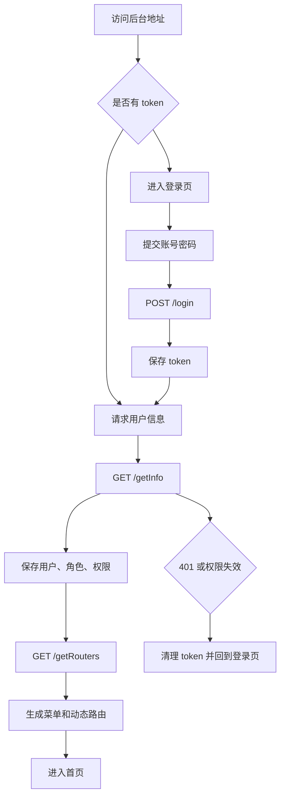
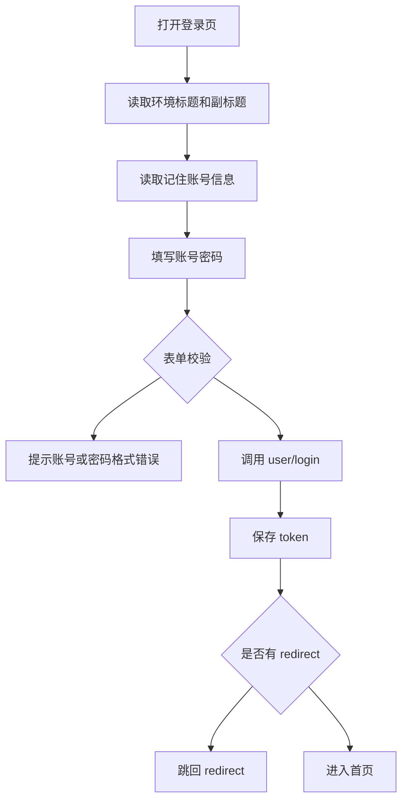
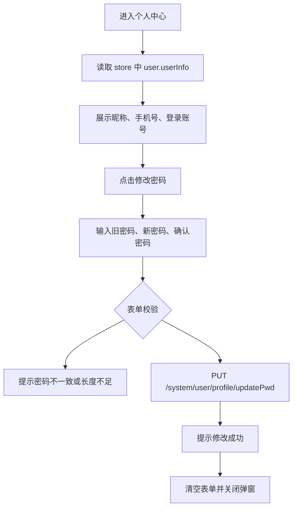
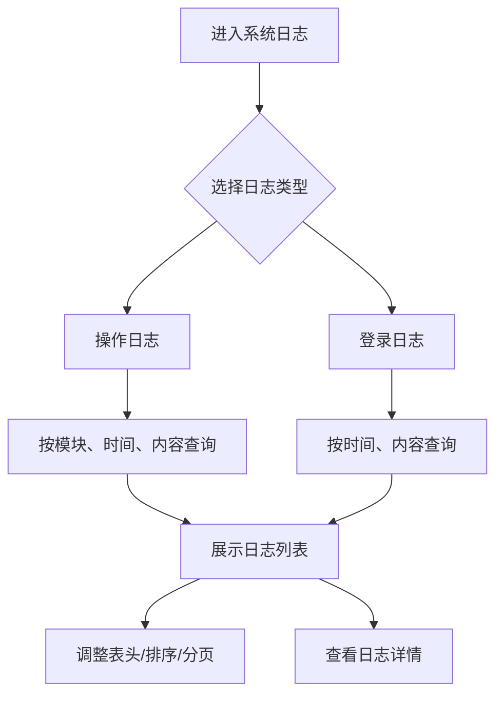
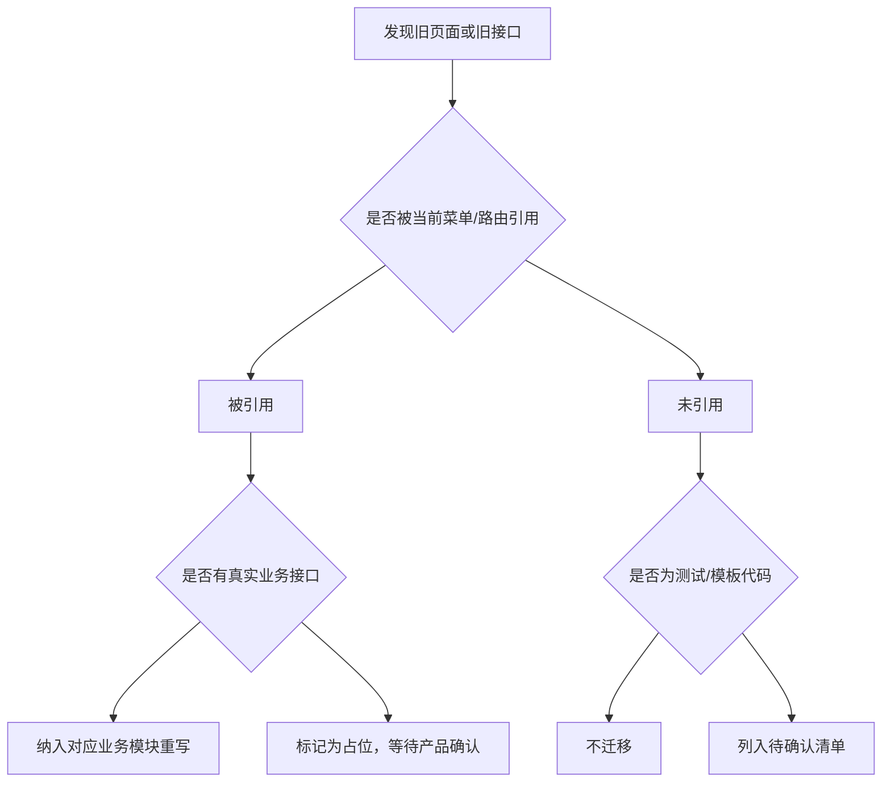

# 登录、个人中心与遗留页面

## 业务目标

本模块补齐登录、权限初始化、个人中心、日志监控占位页、测试页和 Vue 模板遗留接口。它不是一个独立业务域，但会影响 React 新项目的首屏进入、账号安全、动态菜单和重写范围判断。

## 主流程图

## 页面清单

| 业务 | 旧文件 | React 重写建议 |
| --- | --- | --- |
| 登录页 | `src/views/login/index.vue` | 必须重写，放入 `auth` 或 `app/routes/login` |
| 个人中心 | `src/views/personalPage/personalPage.vue` | 必须重写，作为账号设置页 |
| 系统日志实际页 | `src/views/system/log/index.vue` | 已归入系统模块，建议保留 |
| 顶层日志占位页 | `src/views/log/index.vue` | 只有静态文字，不建议迁移 |
| 监控登录日志占位页 | `src/views/monitor/logininfor/index.vue` | 只有静态文字，不建议迁移，功能由系统日志页承接 |
| 监控操作日志占位页 | `src/views/monitor/operlog/index.vue` | 只有静态文字，不建议迁移，功能由系统日志页承接 |
| 系统用户占位页 | `src/views/system/user/index.vue` | 只有静态文字，需确认是否废弃 |
| 测试页面 | `src/views/test/**/*` | 测试/示例页面，不纳入业务重写 |
| 测试入口页 | `src/views/test/*.vue` | 测试/示例页面，不纳入业务重写 |
| 视图 mixin | `src/views/mixins/*` | 不是页面，React 中改成 hooks 或 shared utils |
| 未启用图表路由 | `src/router/modules/charts.js` | 当前未在主路由引入，且缺少对应 views，不迁移 |
| 未启用 goods 路由模块 | `src/router/modules/goods.js` | 当前未在主路由引入，内容与库存路由重复，不迁移 |

## 登录流程

表单规则：

| 字段 | 规则 |
| --- | --- |
| `username` | 必填，旧项目限制 3 到 10 个字符 |
| `password` | 必填，旧项目限制 6 到 16 个字符 |
| `rememberMe` | 旧项目保存账号和密码，React 新项目不建议保存明文密码 |
| `redirect` | 登录成功后跳回原目标页面 |

接口：

| 动作 | 方法 | URL |
| --- | --- | --- |
| 登录 | POST | `/login` |
| 用户信息 | GET | `/getInfo` |
| 菜单路由 | GET | `/getRouters` |
| 登出 | POST | `/logout` |

## 个人中心流程

接口：

| 动作 | 方法 | URL |
| --- | --- | --- |
| 修改密码 | PUT | `/system/user/profile/updatePwd` |

关键字段：

| 字段 | 含义 |
| --- | --- |
| `nickName` | 用户昵称 |
| `phonenumber` | 手机号 |
| `userName` | 登录账号 |
| `oldPassword` | 旧密码 |
| `newPassword` | 新密码 |
| `confirmPassword` | 前端确认密码，不提交后端 |

## 日志监控流程

接口：

| 动作 | 方法 | URL |
| --- | --- | --- |
| 操作日志 | GET | `/monitor/operlog/list` |
| 登录日志 | GET | `/monitor/logininfor/list` |

日志字段：

| 字段 | 含义 |
| --- | --- |
| `operateBy` | 操作人 |
| `operateIP` | 操作 IP |
| `operateModule` | 操作模块 |
| `operateType` | 操作类型 |
| `loginAccount` | 登录账号 |
| `loginIP` | 登录 IP |
| `logContent` | 日志内容 |
| `operateTime` | 操作时间 |

## 遗留页面与接口分流

疑似 Vue 模板遗留接口：

| 文件 | URL | 建议 |
| --- | --- | --- |
| `src/api/article.js` | `/vue-element-admin/article/*` | 示例文章接口，不迁移 |
| `src/api/remote-search.js` | `/vue-element-admin/search/user`、`/vue-element-admin/transaction/list` | 示例远程搜索/交易接口，不迁移 |
| `src/api/role.js` | `/vue-element-admin/routes`、`/vue-element-admin/roles`、`/vue-element-admin/role/*` | 示例权限接口，不迁移，使用 `src/api/system/role.js` |
| `src/api/qiniu.js` | `/qiniu/upload/token` | 注释标明是假地址，除非确认七牛上传需求，否则不迁移 |

## React 重写提示

- 登录、权限、菜单必须第一阶段完成，否则其它业务模块无法进入。
- 旧项目动态菜单来自 `/getRouters`，React 需要把后端路由数据转换成前端 route config 和 sidebar menu。
- 个人中心当前只做展示和修改密码，不包含头像、资料编辑、手机号修改。
- 系统日志实际功能在 `src/views/system/log/index.vue`，`src/views/log` 和 `src/views/monitor` 下的页面只是占位。
- 所有 `/vue-element-admin/*` 接口都应默认视为模板遗留，除非产品或后端确认仍在生产使用。
