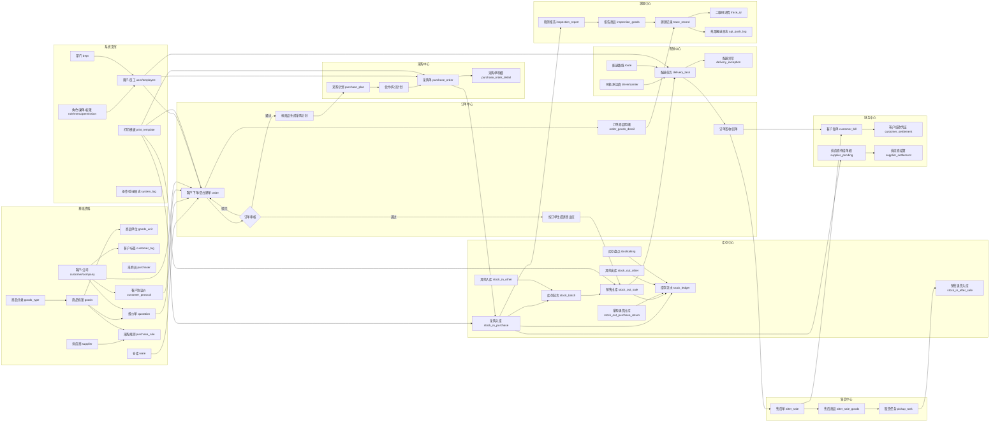
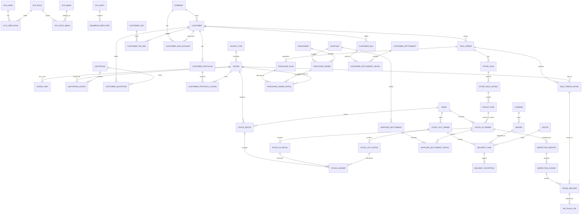
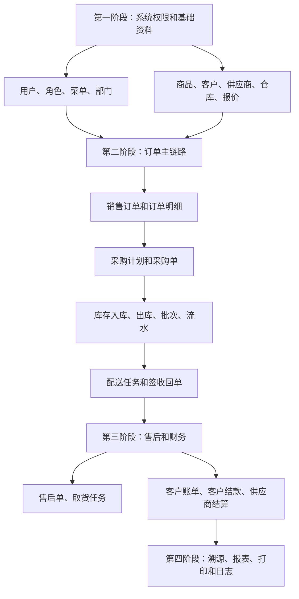

# 主业务流程总图

## 用途

本文档用于给后续 AI 识别整体业务，并据此推导数据库表。它把商品、客户、订单、采购、库存、配送、售后、财务、溯源、报表、系统权限串成一条主业务链路。

原则：

- 基础资料先建表，交易单据再建表。
- 所有业务单据采用“主表 + 明细表 + 状态字段 + 审计字段”。
- 商品、客户、供应商、仓库、员工等核心资料在单据明细里保留必要快照，避免历史单据受基础资料改名影响。
- 金额、数量、单位换算、批次库存、结算状态必须独立建模，不要只依赖页面展示字段。

## 主业务流程图

## 主表关系图

## 流程节点到数据库表

| 流程节点 | 触发动作 | 建议主表 | 建议明细/关系表 | 关键外键 |
| --- | --- | --- | --- | --- |
| 商品建档 | 新增/编辑商品 | `goods` | `goods_unit`、`goods_image`、`goods_supplier_rel` | `goods_type_id` |
| 报价维护 | 新增报价、绑定商品 | `quotation` | `quotation_goods`、`customer_quotation` | `goods_id`、`customer_id` |
| 协议价 | 客户协议价配置 | `customer_protocol` | `customer_protocol_goods`、`customer_protocol_customer` | `customer_id`、`goods_id` |
| 客户资料 | 新增公司、客户、子账号 | `company`、`customer` | `customer_tag_rel`、`customer_sub_account` | `company_id`、`tag_id` |
| 采购规则 | 配置客户/商品/供应商规则 | `purchase_rule` | `purchase_rule_goods`、`purchase_rule_customer` | `goods_id`、`supplier_id`、`customer_id` |
| 销售订单 | 客户下单、后台建单 | `sale_order` | `sale_order_detail` | `customer_id`、`quotation_id`、`ware_id` |
| 订单审核 | 审核通过/驳回/重提 | `sale_order` | `order_audit_log` | `order_id`、`audit_user_id` |
| 采购计划 | 订单商品生成计划 | `purchase_plan` | `purchase_plan_order_rel` | `order_id`、`goods_id`、`supplier_id` |
| 采购单 | 计划生成或手工新增采购单 | `purchase_order` | `purchase_order_detail` | `supplier_id`、`purchaser_id` |
| 采购入库 | 采购到货入库 | `stock_in_order` | `stock_in_detail`、`stock_batch`、`stock_ledger` | `purchase_order_id`、`ware_id` |
| 销售出库 | 订单生成销售出库 | `stock_out_order` | `stock_out_detail`、`stock_ledger` | `sale_order_id`、`ware_id`、`batch_id` |
| 其他入库 | 手工库存增加 | `stock_in_order` | `stock_in_detail`、`stock_ledger` | `ware_id`、`goods_id` |
| 采购退货出库 | 供应商退货 | `stock_out_order` | `stock_out_detail`、`stock_ledger` | `supplier_id`、`batch_id` |
| 其他出库 | 手工库存扣减 | `stock_out_order` | `stock_out_detail`、`stock_ledger` | `ware_id`、`goods_id` |
| 库存盘点 | 盘盈/盘亏调整 | `stocktaking_order` | `stocktaking_detail`、`stock_ledger` | `ware_id`、`batch_id` |
| 配送任务 | 销售出库后分配配送 | `delivery_task` | `delivery_task_order_rel` | `stock_out_order_id`、`driver_id`、`route_id` |
| 签收回单 | 客户签收、验收 | `sale_order` | `order_receipt`、`order_check_detail` | `order_id` |
| 售后单 | 退款、退货、补货、换货 | `after_sale` | `after_sale_goods` | `order_id`、`customer_id` |
| 取货任务 | 售后退货取货 | `pickup_task` | `pickup_task_goods` | `after_sale_id`、`driver_id` |
| 客户账单 | 签收和售后后生成应收 | `customer_bill` | `customer_bill_detail` | `customer_id`、`order_id`、`after_sale_id` |
| 客户结款 | 客户付款/优惠/流水 | `customer_settlement` | `customer_settlement_detail` | `customer_bill_id` |
| 供应商结算 | 采购入库/采购退货结算 | `supplier_settlement` | `supplier_settlement_detail` | `supplier_id`、`stock_in_order_id` |
| 检测报告 | 入库商品关联检测 | `inspection_report` | `inspection_goods`、`inspection_attachment` | `stock_in_order_id`、`goods_id` |
| 溯源记录 | 订单商品关联报告 | `trace_record` | `trace_record_goods`、`api_push_log` | `order_detail_id`、`inspection_report_id` |
| 报表查询 | 销售、库存、采购、售后汇总 | 通常不单独建业务表 | 可建 `report_export_job` | 来源于订单、库存、财务 |
| 打印模板 | 打印配送单、采购单、出入库单 | `print_template` | `print_template_field` | `template_code` |
| 系统权限 | 菜单、角色、用户权限 | `sys_user`、`sys_role`、`sys_menu` | `sys_user_role`、`sys_role_menu` | `user_id`、`role_id`、`menu_id` |
| 操作日志 | 登录、操作审计 | `system_log` | 无或 `system_log_detail` | `user_id`、`module` |

## 建表优先级

## 核心状态字段

| 表 | 字段 | 建议枚举 |
| --- | --- | --- |
| `sale_order` | `order_status` | `pending_audit`、`rejected`、`sorting_pending`、`sorting`、`sorting_done`、`delivering`、`signed` |
| `sale_order` | `return_status` | `not_returned`、`returned` |
| `purchase_plan` | `purchase_status` | `unpublished`、`generated`、`part_generated` |
| `purchase_order` | `status` | `draft`、`completed`、`cancelled` |
| `stock_in_order` | `status` | `draft`、`pending_audit`、`audited`、`reversed`、`deleted` |
| `stock_out_order` | `status` | `draft`、`pending_audit`、`audited`、`reversed`、`deleted` |
| `delivery_task` | `delivery_status` | `pending_assign`、`assigned`、`delivering`、`exception`、`signed` |
| `after_sale` | `after_status` | `draft`、`pending_audit`、`return_pending`、`refund_pending`、`done` |
| `customer_settlement` | `settlement_status` | `pending`、`partial`、`paid`、`voided` |
| `supplier_settlement` | `settlement_status` | `pending`、`partial`、`paid`、`voided` |
| `inspection_report` | `status` | `draft`、`effective`、`voided` |
| `api_push_log` | `push_status` | `pending`、`success`、`failed` |

## AI 建表提示

- 单据类表统一字段：`id`、`order_no`、`status`、`remark`、`created_by`、`created_at`、`updated_by`、`updated_at`、`deleted_flag`。
- 明细类表统一字段：`id`、`parent_id`、`goods_id`、`goods_name_snapshot`、`goods_code_snapshot`、`unit_id`、`unit_name_snapshot`、`quantity`、`base_quantity`、`unit_price`、`total_price`。
- 库存不要只存当前数，必须有 `stock_batch` 当前批次数和 `stock_ledger` 流水。
- 金额字段使用 decimal，不使用 float；数量字段也使用 decimal。
- 报价、协议价、订单、采购、库存、结算都要保留价格快照。
- 反审核不要直接删除历史，建议新增反向流水或记录 `reversed_from_id`。
- 报表优先基于业务表查询生成，除非性能要求再设计汇总表。

