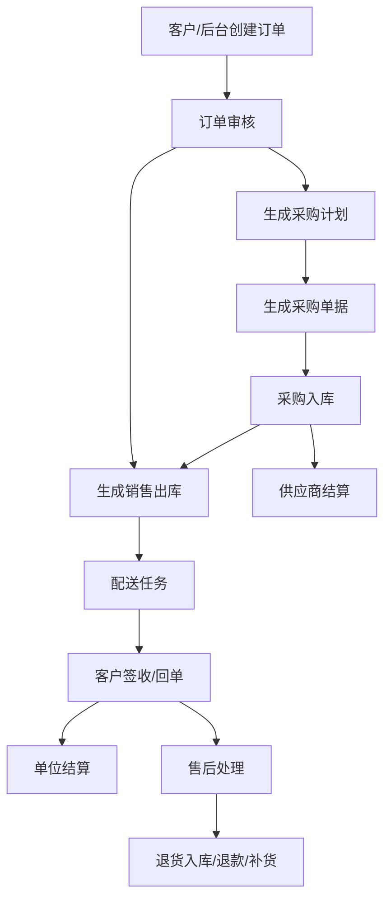
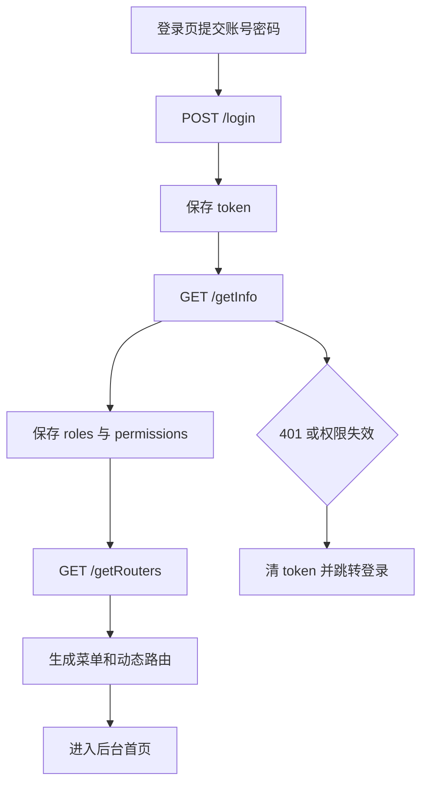
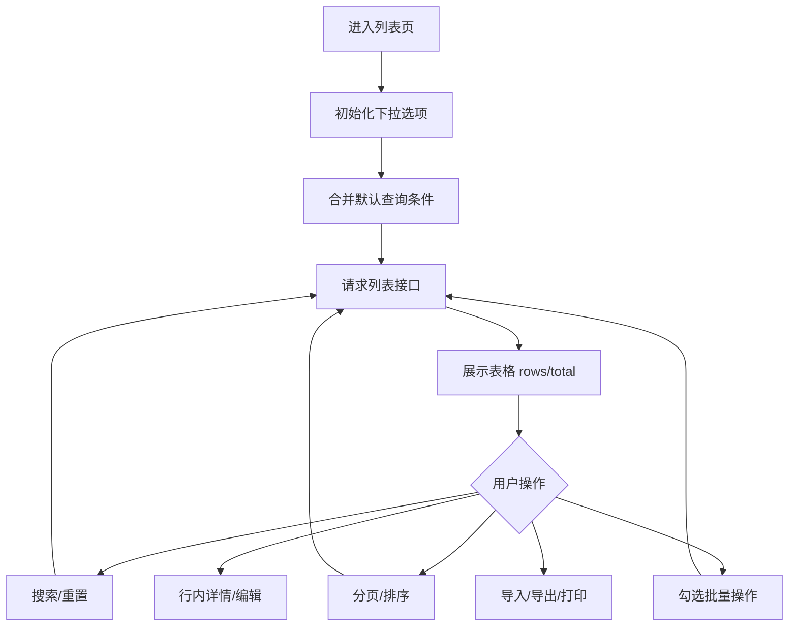
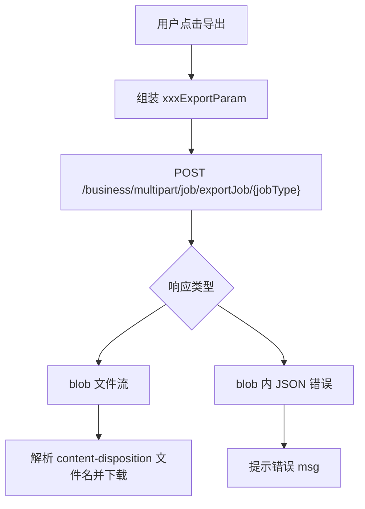
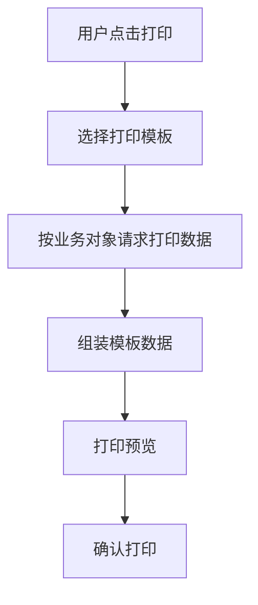

# 全局约定

## 业务定位

当前系统是生鲜供应链后台，核心链路是：客户下单 -> 订单审核 -> 采购计划 -> 采购单 -> 入库 -> 销售出库 -> 配送 -> 签收/回单 -> 售后/结算。



## 前端重写目标

- 用 React + TypeScript 重建，不迁移 Vue 代码。
- 旧项目只作为业务、接口、字段和状态来源。
- 新项目建议按领域模块组织，而不是照搬页面目录。

推荐目录：

```text
src/
  app/
  shared/
    api/
    auth/
    components/
    constants/
    hooks/
    utils/
  features/
    dashboard/
    goods/
    customer/
    order/
    after-sales/
    purchase/
    storage/
    delivery/
    finance/
    reports/
    traceability/
    system/
```

## 请求约定

旧项目请求封装来源：`src/utils/request.js`。

| 项 | 规则 |
| --- | --- |
| baseURL | `process.env.VUE_APP_BASE_API` |
| token | `Authorization: Bearer ${token}` |
| 超时 | 3 分钟 |
| 成功码 | 通常 `code === 200` |
| 列表响应 | 通常 `rows + total` |
| 详情响应 | 通常 `data` |
| 登录失效 | `code === 401` 时清 token 并重新登录 |
| 导出 | blob 响应，需兼容 blob 中返回 JSON 错误 |

建议 React 类型：

```ts
export type ApiResult<T> = {
  code: number;
  msg?: string;
  data: T;
};

export type PageResult<T> = {
  code: number;
  msg?: string;
  rows: T[];
  total: number;
};

export type PageParams = {
  pageNum: number;
  pageSize: number;
};
```

## 登录权限流程



接口：

| 动作 | 方法 | URL |
| --- | --- | --- |
| 登录 | POST | `/login` |
| 用户信息 | GET | `/getInfo` |
| 登出 | POST | `/logout` |
| 菜单路由 | GET | `/getRouters` |
| 查询本人资料 | GET | `/api/system/user/profile` |
| 更新本人资料 | PUT | `/api/system/user/profile` |
| 修改密码 | PUT | `/api/system/user/profile/updatePwd` |

权限规则：

- 用户权限来自 `getInfo.data.permissions`。
- API 权限编码采用稳定的 `module:resource:action` 三段式格式，已发布编码不得复用或改变含义。
- 用户角色关联的菜单按钮编码会在登录和刷新令牌时写入 `permission` JWT Claim；`getUserInfo` 同时返回 `permissions`，并通过 `buttons` 兼容现有前端字段。
- 独立业务动作的授权策略以权限编码为策略名，由统一的 `PermissionRequirement` 和 `PermissionAuthorizationHandler` 校验。
- 基础资料通用 CRUD 通过控制器的权限资源与 `read/create/update/delete` 操作组合成权限编码，由 `ResourcePermissionRequirement` 和处理器校验，避免继承动作漏配。
- 超级权限：`*:*:*`。
- 旧项目管理员角色：`admin`、`superadmin`、`administrator`、`pljzLk`。
- 新项目建议把菜单权限、按钮权限、接口权限拆成独立工具。

当前已固定系统管理与基础资料权限编码。商品、客户、定价、采购和仓库控制器已接入细粒度策略；报价审核使用独立的 `business:pricing:audit` 权限。

## 通用列表流程



通用能力：

- 分页：`pageNum`、`pageSize`。
- 表头配置：旧项目由后端保存表格字段显示顺序；本次重写已移出需求范围，不迁移（详见下文“表头配置”）。
- 批量选择：支持当前页选择和全选查询结果。
- 导入导出：统一 multipart job 接口。
- 打印：选择模板 -> 获取打印数据 -> 预览/打印。

## 基础下拉接口

| 数据 | 方法 | URL |
| --- | --- | --- |
| 仓库 | GET | `/business/ware/dropList` |
| 部门 | GET | `/system/dept/dropList` |
| 客户 | GET | `/business/customer/list` |
| 供应商 | GET | `/business/supplier/list` |
| 采购员 | GET | `/business/purchaser/list` |
| 商品分类 | GET | `/business/goods/type/list` |
| 打印分类 | GET | `/business/goods/type/flat/list` |
| 承运商 | GET | `/business/carrier/list` |
| 司机 | GET | `/business/driver/list` |
| 客户标签树 | GET | `/business/customer/tag/tree/list` |

## 导入导出



| 动作 | 方法 | URL |
| --- | --- | --- |
| 导出任务 | POST | `/business/multipart/job/exportJob/{jobType}` |
| 导入任务 | POST | `/business/multipart/job/importJob/{jobType}` |
| 下载模板 | POST | `/business/multipart/job/download/{jobType}` |
| 文件上传 | POST | `/system/file/upload` |

## 打印



模板接口：

| 动作 | 方法 | URL |
| --- | --- | --- |
| 按编码取模板 | GET | `/system/sysPrintTemplate/getByCode` |
| 模板分页 | GET | `/system/sysPrintTemplate/pageSysPrintTemplate` |
| 新增模板 | POST | `/system/sysPrintTemplate/addSysPrintTemplate` |
| 修改模板 | PUT | `/system/sysPrintTemplate/updateSysPrintTemplate` |
| 删除模板 | DELETE | `/system/sysPrintTemplate/delSysPrintTemplate/{id}` |

业务打印接口：

| 对象 | 方法 | URL |
| --- | --- | --- |
| 客户配送单 | GET/POST | `/business/print/data/customer/order/delivery/{ids}` |
| 账户配送单 | GET | `/business/print/data/customer/group/order/delivery/{ids}` |
| 采购单据 | GET | `/business/print/data/purchase/order/{ids}` |
| 入库单 | GET | `/business/print/data/stock/in/{orderType}/{orderIds}` |
| 出库单 | GET | `/business/print/data/stock/out/{orderType}/{orderIds}` |
| 供应商结款旧接口 | GET | `/business/print/data/supplier/settlement/{settlementIds}` |
| 供应商结算 | GET | `/business/print/data/supplierSettlement/{settlementIds}` |
| 采购计划-供应商 | GET | `/business/print/data/purchasePlan/supplier/{planIds}` |
| 采购计划-商品分类 | GET | `/business/print/data/purchasePlan/goodsType/{planIds}` |

配送单打印分组：

| 动作 | 方法 | URL |
| --- | --- | --- |
| 打印分组列表 | GET | `/business/print/data/filter/group/list` |
| 保存打印分组 | POST | `/business/print/data/filter/group` |
| 删除打印分组 | DELETE | `/business/print/data/filter/group/{ids}` |

## 表头配置

> 已移出重写需求范围：P4-07 只保留安全文件上传，不再实现用户级表头配置保存/读取。以下为旧系统参考，除非产品重新确认需求，否则不迁移对应后端接口。

旧项目通过 `src/utils/headerColumnsSetting.js` 维护表格字段配置。

| 动作 | 方法 | URL |
| --- | --- | --- |
| 当前表头配置 | GET | `/business/table/setting/current` |
| 保存表头配置 | POST | `/business/table/setting` |

旧项目 React 重写建议（仅在恢复需求时参考）：

- 每个列表定义稳定的 `tableKey`。
- 默认列配置写在前端。
- 后端配置只覆盖显示/隐藏/顺序。
- 禁止把业务字段名写死在表格组件内部。

## 后续必须补齐

- 后端 OpenAPI/Swagger 请求体和响应体。
- 导入导出 `jobType` 全量枚举。
- 打印模板数据结构。
- 状态流转的后端校验规则。
- 金额、数量、单位换算精度。
- 反审核、作废、删除是否产生冲销记录。
