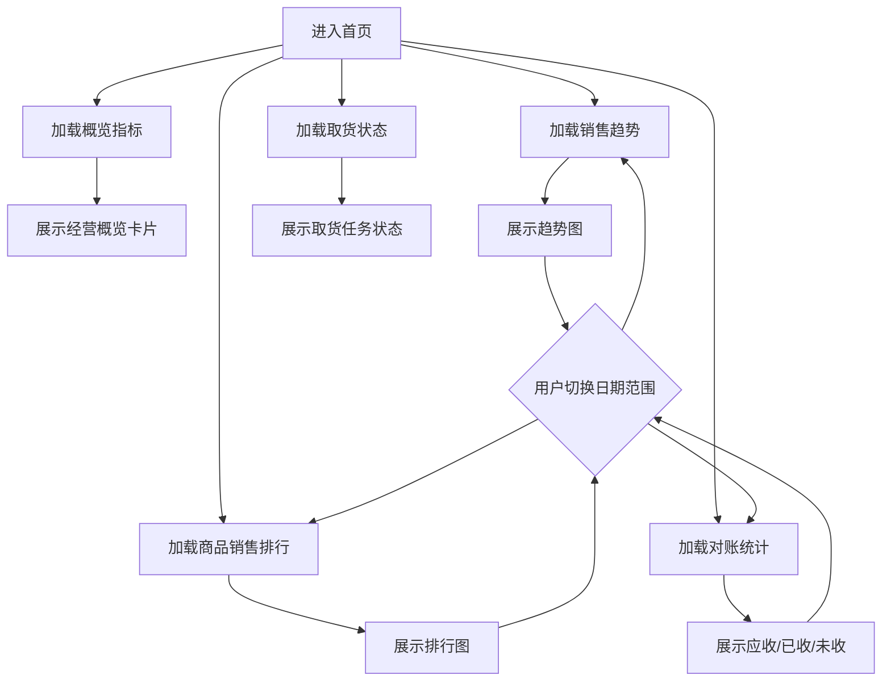

# 首页驾驶舱

## 业务目标

首页用于展示经营概览，不直接改变业务数据。它聚合销售、对账、取货状态、排行等统计，让管理者快速判断当天或某个周期的经营情况。

## 业务流程图

## 页面来源

| 页面 | 旧文件 |
| --- | --- |
| 首页 | `src/views/home/index.vue` |
| 首页旧副本 | `src/views/home/index copy.vue` |

## 接口清单

| 动作 | 方法 | URL | 旧方法 |
| --- | --- | --- | --- |
| 概览卡片 | GET | `/api/dashboard/brief` | `getBrief` |
| 销售趋势 | GET | `/api/dashboard/sales-trend` | `getSalesTrend` |
| 客户销售排行 | GET | `/api/dashboard/customer-sales-rank` | `getCustomerSalesRank` / `getSalesRank` |
| 商品分类销售排行 | GET | `/api/dashboard/goods-type-sales-rank` | `getGoodsSalesRank` |
| 对账统计 | GET | `/api/dashboard/reconciliation` | `getStatement` |
| 取货状态 | GET | `/api/dashboard/pickup-statuses` | `getPickUp` |

## 关键字段

| 字段 | 含义 |
| --- | --- |
| `saleAmount` | 客户验收后的销售额 |
| `orderCount` | 已签收销售订单数 |
| `customerCount` | 产生已签收订单的去重客户数 |
| `settledAmount` | 已结金额 |
| `pendingAmount` | 未结金额（逐账单非负待结余额之和） |
| `billCount` | 参与对账统计的客户账单数 |
| `dateStart` / `dateEnd` | UTC 查询周期 |

## SkyRoc 驾驶舱统计口径

- 六个接口均为只读查询，统一需要 `business:report:read` 权限；`dateStart` 与 `dateEnd` 为 UTC 包含边界，未传时不限制对应边界。
- 概览、趋势和两类排行仅统计“已签收”销售订单，销售金额取订单明细的客户验收金额，不回退到下单金额；趋势按订单日期归属自然日。
- 客户与商品分类排行按验收销售金额降序、名称升序稳定排序，`rankSize` 默认 10，服务端限制为 1 至 100。
- 对账以客户账单的业务日期归属周期，展示账单净应收、已结和逐账单非负待结余额，避免售后调整使单张账单待结额为负。
- 取货状态按取货任务创建时间筛选、按任务当前状态聚合，并始终返回全部状态（无任务的状态计数为 0），便于前端固定展示。

## React 重写提示

- 首页建议放在 `features/dashboard`。
- 每个图表接口独立 `queryKey`，避免一个接口失败导致整页失败。
- 趋势和排行图建议复用报表模块图表组件。
- 首页字段需要结合后端响应再精确建类型，旧项目没有集中定义类型。
