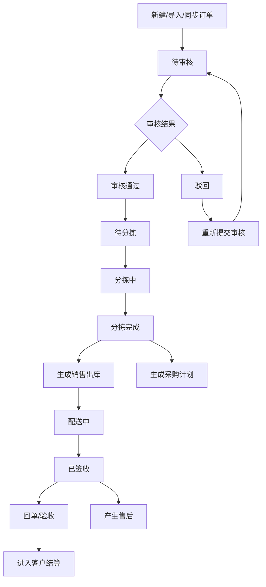
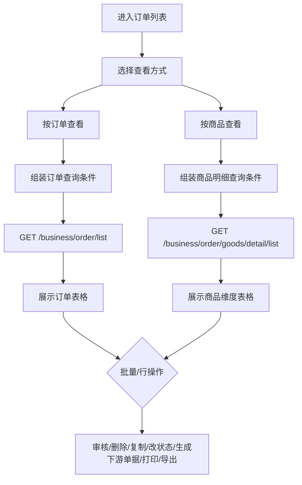
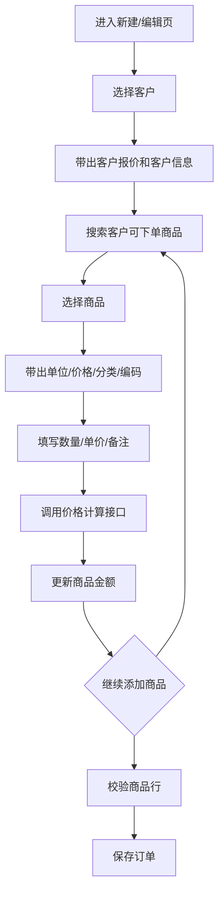
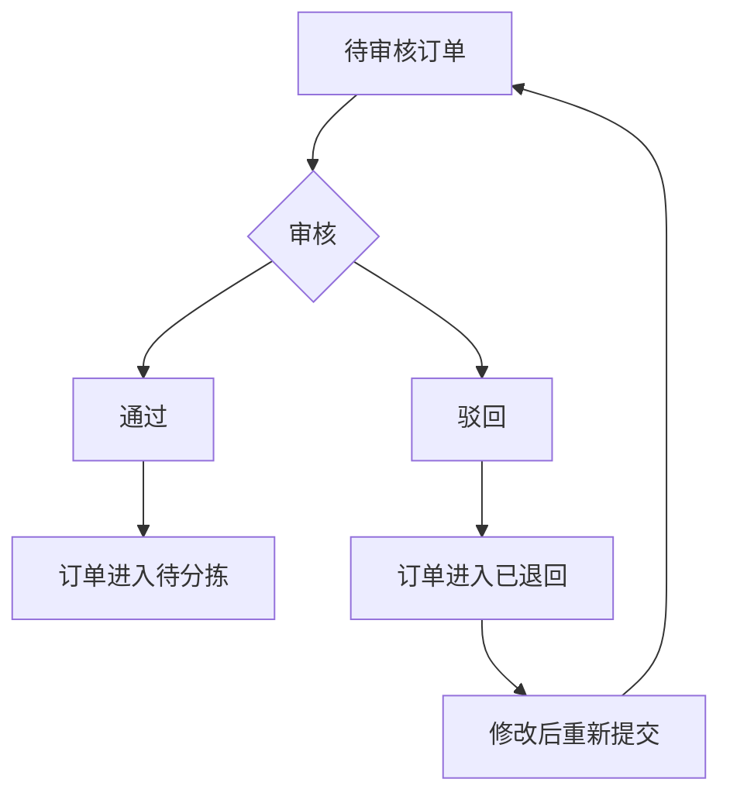
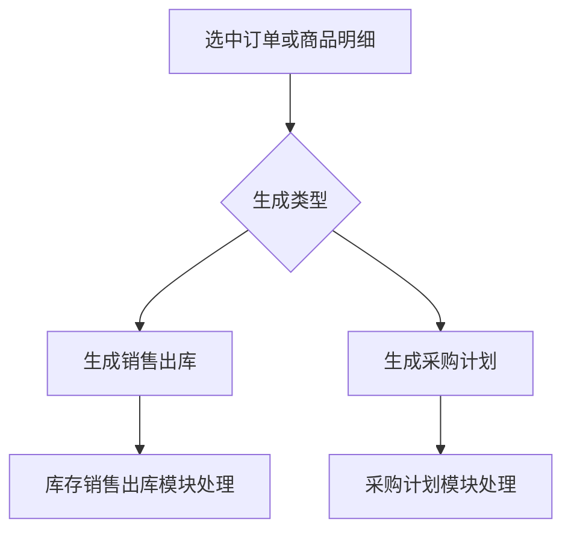

# 订单模块

## 业务目标

订单模块承载客户下单、后台补单、订单审核、订单修改、按商品查看、生成采购计划、生成销售出库、打印配送单、回单和验收等核心流程。

## 主流程图

## 页面清单

| 业务 | 旧文件 |
| --- | --- |
| 订单列表 | `src/views/order/list/index.vue` |
| 新建订单 | `src/views/order/list/create.vue` |
| 订单详情/编辑 | `src/views/order/list/detail.vue` |
| 补录订单 | `src/views/order/list/repair.vue` |
| 订单审核列表 | `src/views/order/review/index.vue` |
| 审核详情 | `src/views/order/review/detail.vue` |
| 未下单客户 | `src/views/order/notOrderCustomer/index.vue` |

## 状态枚举

| 字段 | 值 | 含义 |
| --- | --- | --- |
| `orderStatus` | `-1` | 待审核 |
| `orderStatus` | `1` | 待分拣 |
| `orderStatus` | `2` | 分拣中 |
| `orderStatus` | `3` | 分拣完成 |
| `orderStatus` | `4` | 配送中 |
| `orderStatus` | `5` | 已签收 |
| `orderStatus` | `6` | 已退回，主要用于审核列表 |
| `returnStatus` | `0` | 未回单 |
| `returnStatus` | `1` | 已回单 |
| `printStatus` | `0` | 未打印 |
| `printStatus` | `1` | 已打印 |

## 列表查询流程

查询条件：

| 字段 | 含义 |
| --- | --- |
| `dateType` | 日期类型：下单、收货、出库 |
| `date` | 日期范围 |
| `keyword` | 搜索关键字 |
| `orderStatus` | 订单状态 |
| `customerId` | 客户 |
| `hasOutSale` | 是否有下游销售出库 |
| `updateStatus` | 是否修改 |
| `customerTagIds` | 客户标签 |
| `returnStatus` | 回单状态 |
| `goodsKey` / `goodsIds` | 商品 |
| `goodsTypeIdList` | 商品分类 |
| `hasPurchasePlan` | 是否发布采购计划 |
| `supplierId` | 供应商 |
| `shortageStatus` | 是否缺货 |

## 新建/编辑订单流程

校验规则：

- 必须先选择客户，再选择商品。
- 商品行必须有商品、单位、数量、单价、单价单位。
- 数量、单位、单价变化后需要重新计算金额。
- 编辑详情保存前要剔除只读字段，如客户标签展示字段。

## 订单接口

| 动作 | 方法 | URL | 旧方法 |
| --- | --- | --- | --- |
| 订单列表 | GET | `/business/order/list` | `getOrderList` |
| 审核列表 | GET | `/business/order/audit/list` | `getOrderAuditList` |
| 计算商品价格 | POST | `/business/order/culOrderGoodsPrice` | `getFiexdPriceToNum` |
| 新增订单 | POST | `/business/order` | `addOrder` |
| 订单详情 | GET | `/business/order/{id}` | `getOrderDetailById` |
| 修改订单 | PUT | `/business/order` | `updateOrder` |
| 修改基本信息 | PUT | `/business/order/info` | `updateOrderInfo` |
| 删除订单 | DELETE | `/business/order/{ids}` | `deleteOrder` |
| 修改订单状态 | PUT | `/business/order/orderStatus/{status}/{ids}` | `updateOrderStatus` |
| 修改回单状态 | PUT | `/business/order/returnStatus/{status}/{ids}` | `updateOrderBackStatus` |
| 生成销售出库 | POST | `/business/order/saleOut/gen/{ids}` | `batchCreateOrderOutbound` |
| 生成采购计划 | POST | `/business/order/purchasePlan/gen/{ids}` | `batchCreateOrderPurchasePlan` |
| 未下单客户 | GET | `/business/order/notOrdered/customer` | `getNoOrderCustomerList` |
| 重新提交审核 | POST | `/business/order/resubmit/{ids}` | `batchSubmitReview` |
| 批量审核 | POST | `/business/order/audit/{ids}` | `batchAuditOrder` |
| 审核驳回 | POST | `/business/order/reject` | `rejectOrderAudit` |
| 按商品查看 | GET | `/business/order/goods/detail/list` | `getOrderListByGoods` |
| 修改商品明细 | PUT | `/business/order/goods/detail` | `updateOrderByGoods` |
| 删除商品明细 | DELETE | `/business/order/goods/detail` | `deleteOrderGoodsDetail` |
| 明细生成采购计划 | POST | `/business/order/detail/purchasePlan/gen` | `orderGoodsDetailPlan` |
| 复制整单 | POST | `/business/order/copy/whole` | `copyOrderInfoAll` |
| 同步价格 | PUT | `/business/order/syncPrice` | `batchSyncPriceApi` |
| 签收/验收 | PUT | `/business/app/order/order/signAll/{orderId}` | `checkOrder` |
| 外部同步 | POST | `/api/sunshine/sync/{type}` | `orderSync` |

当前后端的签收与回单由配送任务驱动：`PUT /api/delivery-tasks/{id}/sign` 按销售出库行保存验收明细，`PUT /api/delivery-tasks/{id}/receipt` 归档纸质扫描件或电子回单。分批配送场景下，首张任务签收或回单不会提前完成整张销售订单；整单状态按全部有效销售出库对应的配送任务聚合。

## 订单字段

| 字段 | 含义 |
| --- | --- |
| `id` | 订单 ID |
| `orderNo` | 订单号 |
| `customerId` / `customerName` | 客户 |
| `customerCode` | 客户编码 |
| `quotationId` | 客户报价单 |
| `orderDate` | 下单时间 |
| `receiveDate` | 收货时间 |
| `outDate` | 出库时间 |
| `orderStatus` | 订单状态 |
| `returnStatus` | 回单状态 |
| `orderPrice` | 下单金额/销售金额 |
| `settlementPrice` | 结算金额 |
| `outStorageStatus` | 出库状态 |
| `hasOutSale` | 是否有下游销售出库 |
| `updateStatus` | 是否修改 |
| `goodsVoList` | 商品明细列表 |

商品明细字段：

| 字段 | 含义 |
| --- | --- |
| `goodsId` | 商品 ID |
| `goodsName` | 商品名称 |
| `goodsCode` | 商品编码 |
| `goodsImage` | 商品图片 |
| `goodsTypeName` | 商品分类 |
| `goodsDesc` | 商品描述 |
| `goodsUnitId` / `goodsUnitName` | 下单单位 |
| `goodsNum` | 下单数量 |
| `goodsNumBase` | 基本单位数量 |
| `baseUnitId` / `baseUnitName` | 基本单位 |
| `goodsUnitConversion` | 下单单位换算比例 |
| `fixedPrice` | 固定单价 |
| `fixedGoodsUnitId` / `fixedGoodsUnitName` | 单价单位 |
| `goodsPrice` | 商品金额 |
| `remark` | 商品备注 |
| `innerRemark` | 对内备注 |
| `customerCheckStatus` | 验收状态 |
| `customerCheckAmountBase` | 验收数量，基本单位 |
| `customerCheckPrice` | 验收金额 |

## 审核流程

## 下游单据生成

## 复制订单规则

| 方式 | 规则 |
| --- | --- |
| 复制下单商品 | 复制商品行，可选择是否同步商品单价 |
| 复制整单信息 | 复制整单，需要新的下单时间、收货时间 |
| 删除原单 | 可选，复制后删除原订单 |

## 打印

| 模板 | 含义 |
| --- | --- |
| `CUSTOMER_ORDER_DELIVERY` | 客户配送单 |
| `CUSTOMER_GROUP_ORDER_DELIVERY` | 账户配送单 |

打印数据使用 `GET /api/print-data/1?ids={orderId}`；预览不会改变订单状态，实际打印完成后调用 `POST /api/print-data/1/confirm` 才会将订单 `printStatus` 标记为已打印。模板和字段接口见全局文档。

## React 重写提示

- 订单列表不要做成单个巨型组件，应拆成 `OrderSearchBar`、`OrderTable`、`OrderGoodsTable`、`BatchActionBar`、`CopyOrderDialog`、`PrintDialog`。
- 订单商品行编辑建议用领域 service 管理价格计算和单位换算。
- 按订单查看和按商品查看建议是两个 query model，不要共用混乱字段。
- 订单状态按钮要集中成状态机配置，避免散落 `if orderStatus === ...`。
- 订单模块是第一优先级重写对象，建议先补后端请求体/响应体。
