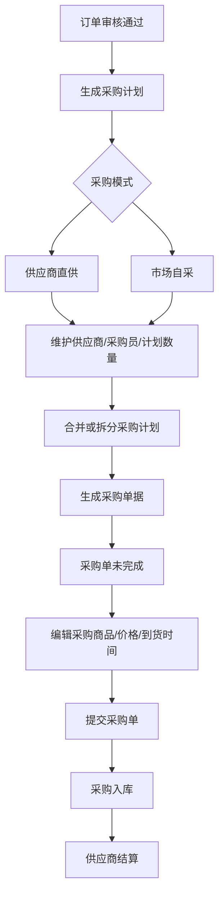
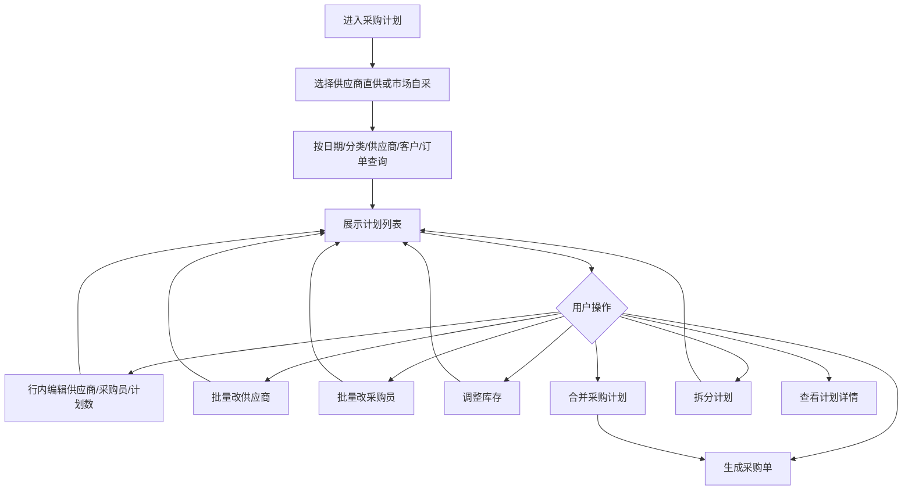
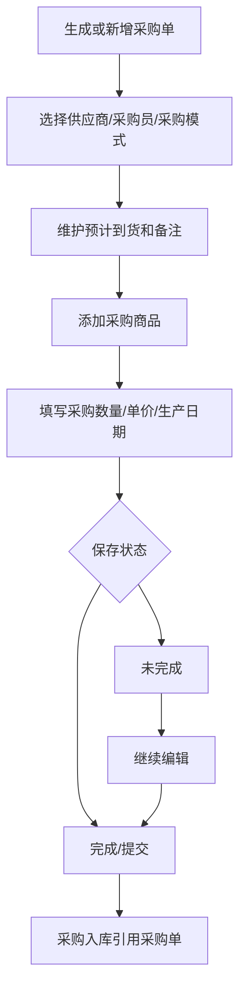
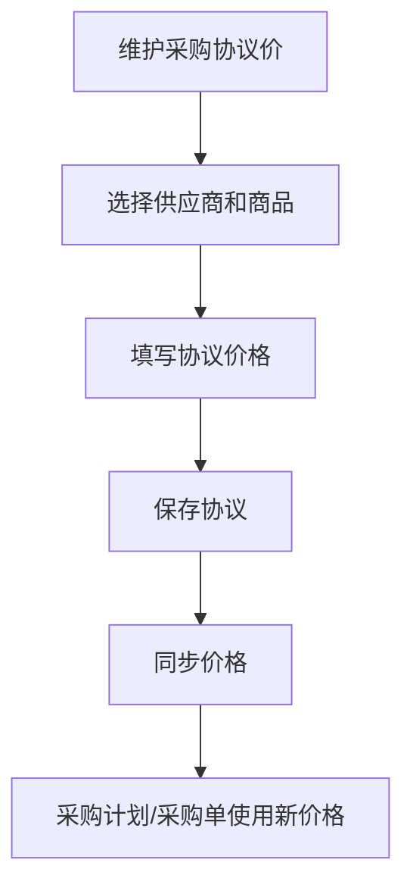
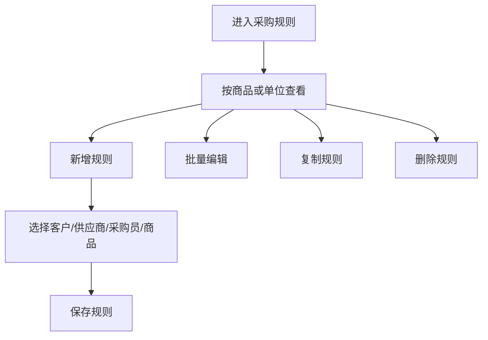

# 采购模块

## 业务目标

采购模块负责把订单商品需求转成采购计划，再生成采购单据，并和采购入库、供应商结算联动。它覆盖供应商直供、市场自采、采购协议价、采购规则、供应商和采购员资料。

## 主流程图

## 页面清单

| 业务 | 旧文件 |
| --- | --- |
| 采购计划入口 | `src/views/purchase/plan/planList.vue` |
| 供应商直供计划 | `src/views/purchase/plan/components/supplier.vue` |
| 市场自采计划 | `src/views/purchase/plan/components/market.vue` |
| 新增采购计划 | `src/views/purchase/plan/planAdd.vue` |
| 合并计划弹窗 | `src/views/purchase/plan/components/ProcurementDialog.vue` |
| 拆分计划弹窗 | `src/views/purchase/plan/components/splitDialog.vue` |
| 采购单列表 | `src/views/purchase/document/documentList.vue` |
| 新增采购单 | `src/views/purchase/document/documentAdd.vue` |
| 未完成采购单详情 | `src/views/purchase/document/documentDetailsByNotFinish.vue` |
| 已完成采购单详情 | `src/views/purchase/document/documentDetails.vue` |
| 供应商资料 | `src/views/purchase/information/*` |
| 采购员 | `src/views/purchase/purchaser/purchaserList.vue` |
| 采购规则 | `src/views/purchase/rules/*` |
| 采购协议价 | `src/views/purchase/contractRate/*` |
| 采购出入库汇总 | `src/views/purchase/store/storeList.vue` |
| 采购出入库商品汇总 | `src/views/purchase/store/components/goods.vue` |
| 采购出入库供应商汇总 | `src/views/purchase/store/components/supplier.vue` |
| 采购出入库采购员汇总 | `src/views/purchase/store/components/purchaser.vue` |

## 采购计划流程

## 采购计划接口

| 动作 | 方法 | URL | 旧方法 |
| --- | --- | --- | --- |
| 计划列表 | GET | `/business/purchase/plan/list` | `planList` |
| 计划详情 | GET | `/business/purchase/plan/{id}` | `planDetails` |
| 新增计划 | POST | `/business/purchase/plan` | `planAdd` |
| 修改计划 | PUT | `/business/purchase/plan` | `planEdit` |
| 批量改供应商 | PUT | `/business/purchase/plan/updateSupplier` | `updateSupplier` |
| 批量改采购员 | PUT | `/business/purchase/plan/updatePurchaser` | `updatePurchaser` |
| 生成采购单 | POST | `/business/purchase/plan/purchase/gen` | `purchaseGen` |
| 预合并 | POST | `/business/purchase/plan/preMerge` | `preMerge` |
| 合并计划 | POST | `/business/purchase/plan/merge` | `planMerge` |
| 调整库存 | POST | `/business/purchase/plan/adjustStock` | `adjustStock` |
| 按订单拆分 | POST | `/business/purchase/plan/split/order` | `splitOrder` |
| 按商品数量拆分 | POST | `/business/purchase/plan/split/goodsNum` | `splitGoodsNum` |
| 可拆分订单列表 | GET | `/business/purchase/plan/split/order/list/{planId}` | `checkSplitPlan` |

## 采购计划字段

| 字段 | 含义 |
| --- | --- |
| `id` / `planId` | 采购计划 ID |
| `planNo` | 计划编号 |
| `planDate` | 计划交期 |
| `goodsId` / `goodsCode` / `goodsName` | 商品 |
| `goodsTypeIdList` | 商品分类筛选 |
| `supplierId` / `supplierName` | 供应商 |
| `purchaserId` / `purchaserName` | 采购员 |
| `purchasePattern` | 采购模式：`1` 供应商直供，`2` 市场自采 |
| `planAmount` | 计划采购数 |
| `requireAmount` | 需求数，采购单位 |
| `purchasedAmount` | 已采购数 |
| `purchaseStatus` | 采购单生成状态，`1` 未发布，其它为已生成采购单 |
| `customerList` | 关联客户/订单明细 |
| `purchaseList` | 关联采购单 |

## 采购单据流程

采购单接口：

| 动作 | 方法 | URL | 旧方法 |
| --- | --- | --- | --- |
| 采购单列表 | GET | `/business/purchase/list` | `purchaseList` |
| 采购单详情 | GET | `/business/purchase/{id}` | `purchaseDetails` |
| 新增采购单 | POST | `/business/purchase` | `purchaseAdd` |
| 修改采购单 | PUT | `/business/purchase` | `purchaseEdit` |
| 删除采购单 | DELETE | `/business/purchase/{ids}` | `purchaseRemove` |
| 提交采购单 | PUT | `/business/purchase/commit/{ids}` | `purchaseCommit` |

采购单状态：

| 字段 | 值 | 含义 |
| --- | --- | --- |
| `status` | `1` | 未完成 |
| `status` | `2` | 已完成 |

采购单字段：

| 字段 | 含义 |
| --- | --- |
| `purchaseNo` | 采购单据号 |
| `supplierId` / `supplierName` | 供应商 |
| `purchaserId` / `purchaserName` | 采购员 |
| `receiveTime` | 预计到货 |
| `purchasePattern` | 采购模式 |
| `remark` | 单据备注 |
| `supplierContactName` / `supplierContactPhone` | 供应商联系人 |
| `goodsBoList` | 商品列表 |

采购商品字段：

| 字段 | 含义 |
| --- | --- |
| `goodsId` / `goodsName` / `goodsCode` | 商品 |
| `goodsInfo` | 商品详情快照 |
| `purchaseUnitName` | 采购单位 |
| `requireAmount` | 需求数 |
| `purchaseAmount` | 采购数量 |
| `purchasePrice` | 采购单价 |
| `purchaseTotalPrice` | 采购金额 |
| `productDate` | 生产日期 |
| `remark` | 采购备注 |

## 采购协议价流程

接口：

| 动作 | 方法 | URL |
| --- | --- | --- |
| 协议价列表 | GET | `/business/purchase/protocol/list` |
| 新增协议价 | POST | `/business/purchase/protocol` |
| 修改协议价 | PUT | `/business/purchase/protocol` |
| 协议价详情 | GET | `/business/purchase/protocol/{id}` |
| 同步价格 | PUT | `/business/purchase/protocol/syncPrice` |
| 停用协议价 | PUT | `/business/purchase/protocol/stop/{id}` |

## 供应商和采购员

供应商接口：

| 动作 | 方法 | URL |
| --- | --- | --- |
| 供应商列表 | GET | `/business/supplier/list` |
| 供应商详情 | GET | `/business/supplier/{id}` |
| 新增供应商 | POST | `/business/supplier` |
| 修改供应商 | PUT | `/business/supplier` |
| 恢复供应商 | PUT | `/business/supplier/resume/{id}` |
| 删除供应商 | DELETE | `/business/supplier/{ids}` |

采购员接口：

| 动作 | 方法 | URL |
| --- | --- | --- |
| 采购员列表 | GET | `/business/purchaser/list` |
| 采购员详情 | GET | `/business/purchaser/{id}` |
| 新增采购员 | POST | `/business/purchaser` |
| 修改采购员 | PUT | `/business/purchaser` |
| 删除采购员 | DELETE | `/business/purchaser/{ids}` |

## 采购规则

接口：

| 动作 | 方法 | URL |
| --- | --- | --- |
| 采购规则列表 | GET | `/business/purchase/rule/list` |
| 批量编辑 | PUT | `/business/purchase/rule/batchEdit` |
| 单条编辑 | PUT | `/business/purchase/rule` |
| 删除规则 | DELETE | `/business/purchase/rule/{id}` |
| 批量删除 | DELETE | `/business/purchase/rule/batchRemove` |
| 复制规则 | POST | `/business/purchase/rule/copy` |
| 新增规则 | POST | `/business/purchase/rule` |

## React 重写提示

## 打印

采购单使用 `GET /api/print-data/2?ids={purchaseOrderId}` 获取模板数据快照。采购单当前不维护 `printStatus`，因此没有正式打印确认接口；模板选择与字段定义见全局打印能力。

- 采购计划是订单到库存的桥，应优先定义清楚 `PurchasePlan` 类型。
- 供应商直供和市场自采 UI 很像，建议用同一列表组件加 `purchasePattern` 区分。
- 计划合并和拆分要独立弹窗组件，并把校验规则集中。
- 采购单商品行应复用商品选择、数量、金额输入组件。
- 采购协议价和销售报价不要混用 API adapter。
