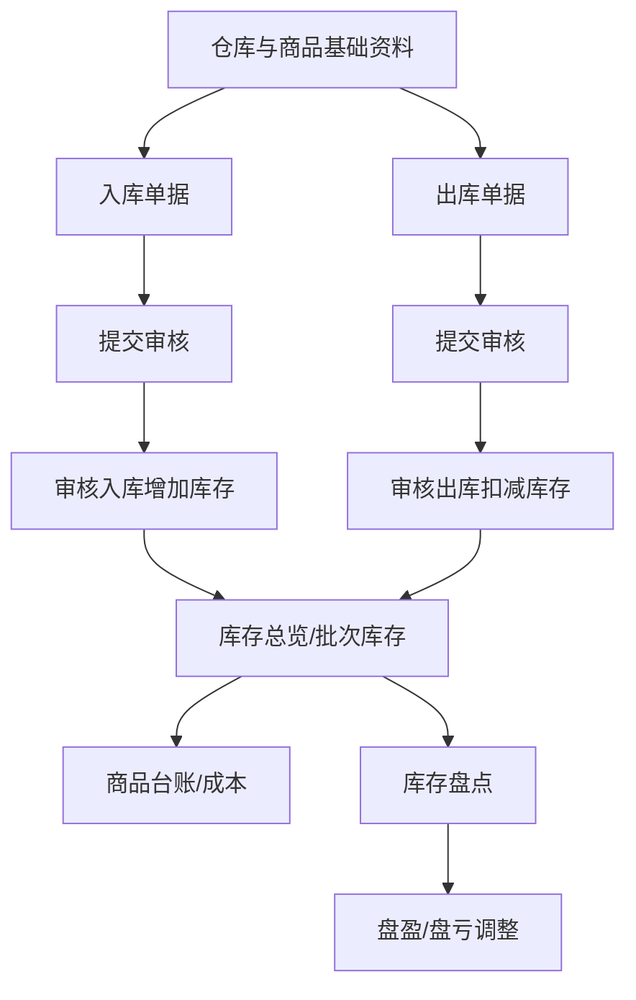
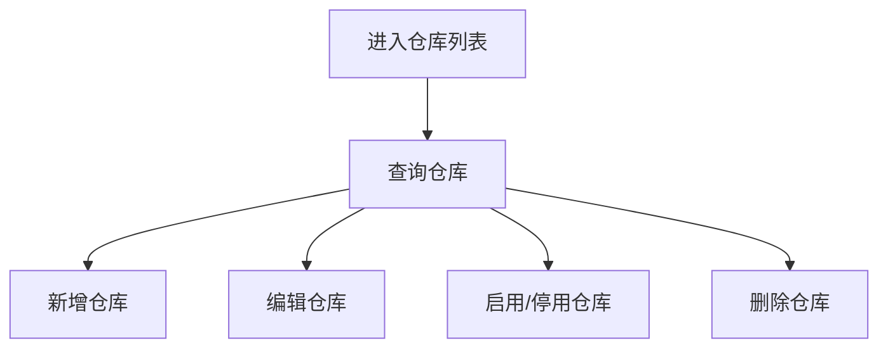
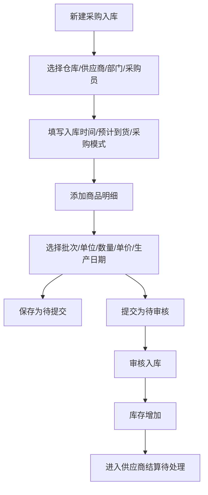
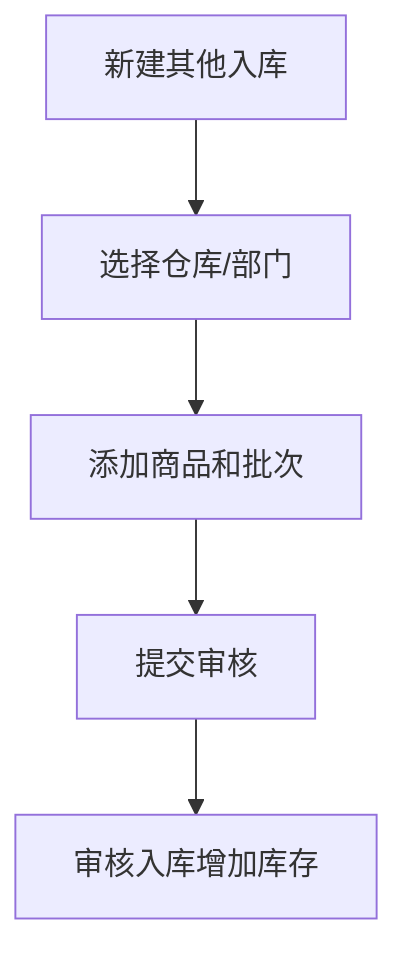
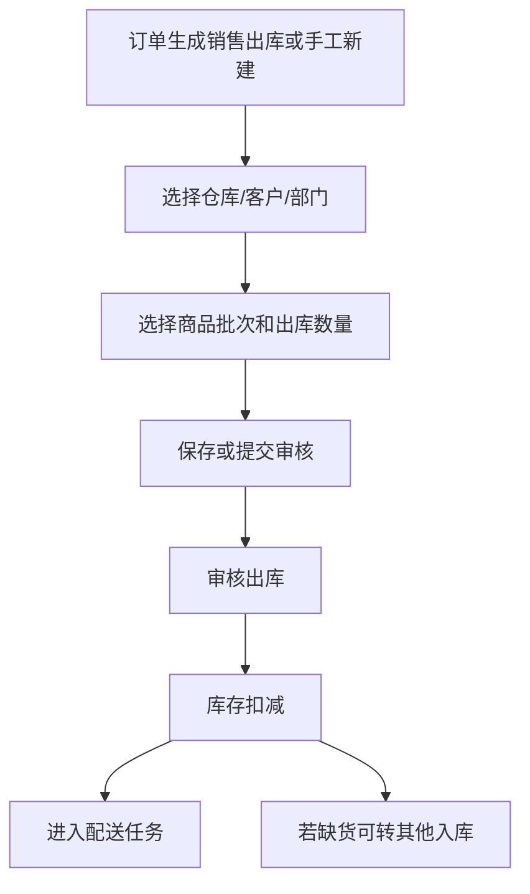
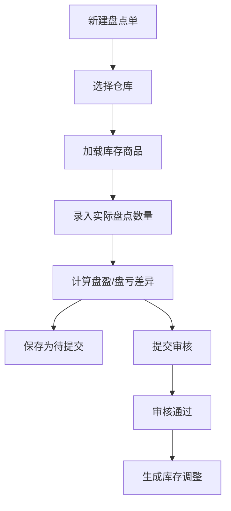
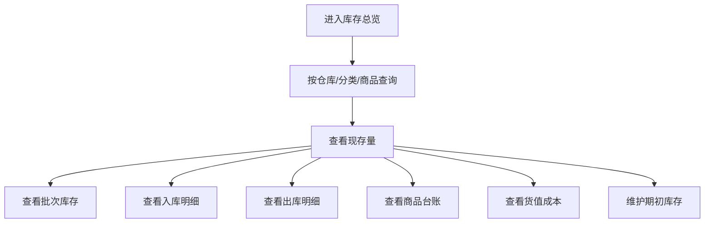

# 库存模块

## 业务目标

库存模块管理仓库、采购入库、其他入库、销售退货入库、销售出库、采购退货出库、其他出库、盘点、库存总览、批次、台账、成本和期初库存。

## 主流程图

## 页面清单

| 业务 | 旧文件 |
| --- | --- |
| 仓库 | `src/views/storage/ware/index.vue` |
| 采购入库 | `src/views/storage/purchaseStore/*` |
| 其他入库 | `src/views/storage/otherStock/*` |
| 销售退货入库 | `src/views/storage/stockInSale/index.vue` |
| 销售出库 | `src/views/storage/stockOutSale/*` |
| 采购退货出库 | `src/views/storage/purchaseStockOut/*` |
| 其他出库 | `src/views/storage/stockOutOther/*` |
| 库存盘点 | `src/views/storage/stocktaking/*` |
| 库存总览 | `src/views/storage/stockOverview/*` |

## 通用状态

| 字段 | 值 | 含义 |
| --- | --- | --- |
| `status` | `-1` | 已删除 |
| `status` | `1` | 待提交 |
| `status` | `2` | 待审核 |
| `status` | `3` | 已入库/已出库/已审核 |
| `printStatus` | `0` | 未打印 |
| `printStatus` | `1` | 已打印 |
| `settlementStatus` | `1` | 未支付 |
| `settlementStatus` | `2` | 已支付 |

## 仓库流程

仓库接口：

| 动作 | 方法 | URL |
| --- | --- | --- |
| 仓库列表 | GET | `/business/ware/list` |
| 新增仓库 | POST | `/business/ware` |
| 仓库详情 | GET | `/business/ware/{id}` |
| 修改仓库 | PUT | `/business/ware` |
| 修改状态 | PUT | `/business/ware/updateStatus` |
| 删除仓库 | DELETE | `/business/ware/{ids}` |

## 采购入库流程

采购入库接口：

| 动作 | 方法 | URL |
| --- | --- | --- |
| 列表 | GET | `/business/stock/in/purchase/list` |
| 新增 | POST | `/business/stock/in/purchase` |
| 详情 | GET | `/business/stock/in/purchase/{id}` |
| 修改 | PUT | `/business/stock/in/purchase` |
| 删除 | DELETE | `/business/stock/in/purchase/{ids}` |
| 审核 | POST | `/business/stock/in/purchase/audit/{ids}` |
| 反审核 | POST | `/business/stock/in/purchase/{ids}` |
| 打印数据预览 | GET | `/api/print-data/3?ids={id}` |
| 确认正式打印 | POST | `/api/print-data/3/confirm` |

入库单字段：

| 字段 | 含义 |
| --- | --- |
| `inNo` | 入库单号 |
| `wareId` / `wareName` | 仓库 |
| `supplierId` / `supplierName` | 供应商 |
| `deptId` / `deptName` | 部门 |
| `inDate` | 入库时间 |
| `purchaserId` / `purchaserName` | 采购员 |
| `receiveDate` | 预计到货 |
| `purchasePattern` | 采购模式，`1` 供应商直供，`2` 市场直采 |
| `remark` | 备注 |
| `goodsBoList` / `goodsVoList` | 商品明细 |

入库商品字段：

| 字段 | 含义 |
| --- | --- |
| `goodsId` / `goodsName` / `goodsCode` | 商品 |
| `batchNo` | 批次号 |
| `goodsUnitId` / `goodsUnitName` | 入库单位 |
| `inAmount` | 入库数量 |
| `inAmountBase` | 基本单位数量 |
| `goodsBaseUnitName` | 基本单位 |
| `unitPrice` | 入库单价 |
| `productDate` | 生产日期 |
| `expireDate` | 到期日期 |
| `currentStock` | 当前库存 |

## 其他入库和销售退货入库

其他入库流程：

其他入库接口：

| 动作 | 方法 | URL |
| --- | --- | --- |
| 列表 | GET | `/business/stock/in/other/list` |
| 新增 | POST | `/business/stock/in/other` |
| 详情 | GET | `/business/stock/in/other/{id}` |
| 修改 | PUT | `/business/stock/in/other` |
| 删除 | DELETE | `/business/stock/in/other/{ids}` |
| 审核 | POST | `/business/stock/in/other/audit/{ids}` |
| 反审核 | POST | `/business/stock/in/other/{ids}` |
| 销售出库缺货转入库 | GET | `/business/stock/in/other/inOtherFromOutSale/{uuid}` |

销售退货入库接口：

| 动作 | 方法 | URL |
| --- | --- | --- |
| 列表 | GET | `/business/stock/in/after/sale/list` |
| 修改 | PUT | `/business/stock/in/after/sale` |
| 删除 | DELETE | `/business/stock/in/after/sale/{ids}` |

SkyRoc 当前实现允许销售退货入库继续手工建单，也支持携带 `afterSaleId` 和逐行 `pickupTaskId` 从已完成售后取货任务建单。来源建单会锁定取货任务，校验客户、商品、单位、批准退货数量和售后价格快照，并以取货任务唯一索引防止重复入库；审核后仍沿用销售退货库存流水和移动加权成本规则。

## 销售出库流程

销售出库接口：

| 动作 | 方法 | URL |
| --- | --- | --- |
| 列表 | GET | `/business/stock/out/sale/list` |
| 新增 | POST | `/business/stock/out/sale` |
| 详情 | GET | `/business/stock/out/sale/{id}` |
| 修改 | PUT | `/business/stock/out/sale` |
| 删除 | DELETE | `/business/stock/out/sale/{ids}` |
| 审核 | POST | `/business/stock/out/sale/audit/{ids}` |
| 反审核 | POST | `/business/stock/out/sale/{ids}` |
| 转其他入库 | POST | `/business/stock/out/sale/genInOther/{ids}` |
| 打印数据预览 | GET | `/api/print-data/4?ids={id}` |
| 确认正式打印 | POST | `/api/print-data/4/confirm` |

## 采购退货出库和其他出库

采购退货出库接口：

| 动作 | 方法 | URL |
| --- | --- | --- |
| 列表 | GET | `/business/stock/out/after/sale/list` |
| 批次库存列表 | GET | `/business/stock/detail/total/batch/list` |
| 新增 | POST | `/business/stock/out/after/sale` |
| 详情 | GET | `/business/stock/out/after/sale/{id}` |
| 修改 | PUT | `/business/stock/out/after/sale` |
| 删除 | DELETE | `/business/stock/out/after/sale/{ids}` |
| 审核 | POST | `/business/stock/out/after/sale/audit/{ids}` |
| 反审核 | POST | `/business/stock/out/after/sale/{ids}` |

其他出库接口：

| 动作 | 方法 | URL |
| --- | --- | --- |
| 列表 | GET | `/business/stock/out/other/list` |
| 新增 | POST | `/business/stock/out/other` |
| 详情 | GET | `/business/stock/out/other/{id}` |
| 修改 | PUT | `/business/stock/out/other` |
| 删除 | DELETE | `/business/stock/out/other/{ids}` |
| 审核 | POST | `/business/stock/out/other/audit/{ids}` |
| 反审核 | POST | `/business/stock/out/other/{ids}` |

## 库存盘点流程

盘点接口：

| 动作 | 方法 | URL |
| --- | --- | --- |
| 盘点列表 | GET | `/business/stocktaking/list` |
| 查询可用库存 | POST | `/business/order/getOrderGoodsAvailableStock` |
| 新增盘点 | POST | `/business/stocktaking` |
| 盘点详情 | GET | `/business/stocktaking/{id}` |
| 修改盘点 | PUT | `/business/stocktaking` |
| 删除盘点 | DELETE | `/business/stocktaking/{ids}` |
| 审核 | POST | `/business/stocktaking/audit/{ids}` |
| 反审核 | POST | `/business/stocktaking/{ids}` |

## 库存总览流程

库存查询接口：

| 动作 | 方法 | URL |
| --- | --- | --- |
| 库存总览 | GET | `/business/stock/detail/total/list` |
| 批次库存 | GET | `/business/stock/detail/total/batch` |
| 入库明细 | GET | `/business/stock/detail/in/detail` |
| 出库明细 | GET | `/business/stock/detail/out/detail` |
| 出库批次明细 | GET | `/business/stock/detail/out/batch/{orderType}/{orderDetailId}` |
| 商品台账 | GET | `/business/stock/detail/stock/detail` |
| 货值成本 | GET | `/business/stock/detail/cost` |
| 期初库存 | GET | `/business/stock/detail/initStock` |
| 保存期初库存 | POST | `/business/stock/detail/initStock` |
| 同步商品期初库存 | POST | `/business/stock/detail/initStock/syncGoods/{wareId}` |

## React 重写提示

- 入库单、出库单、盘点单有高度相似的表单结构，应抽象 `StockOrderForm` 和 `StockGoodsTable`。
- 不同单据的 API、状态文案、打印 orderType 用配置区分。
- 商品批次选择要独立组件，出库必须从批次库存选择。
- 审核、反审核、删除要做统一状态机配置。
- 库存模块必须明确数量精度、单位换算和反审核回滚规则。
