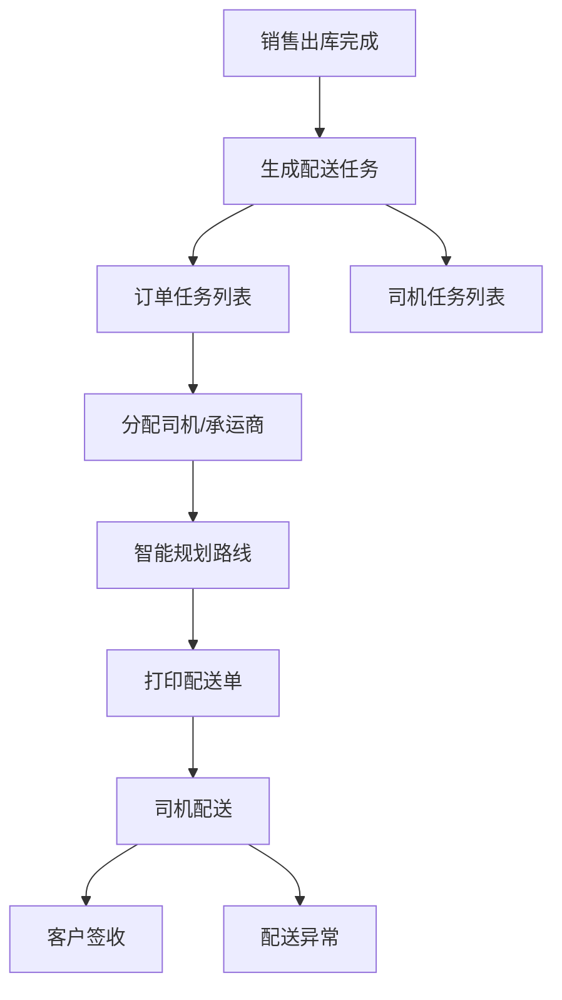
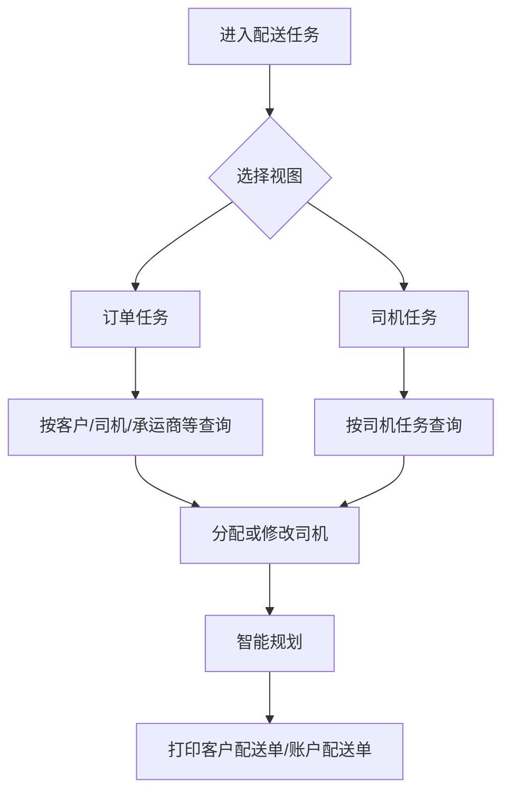
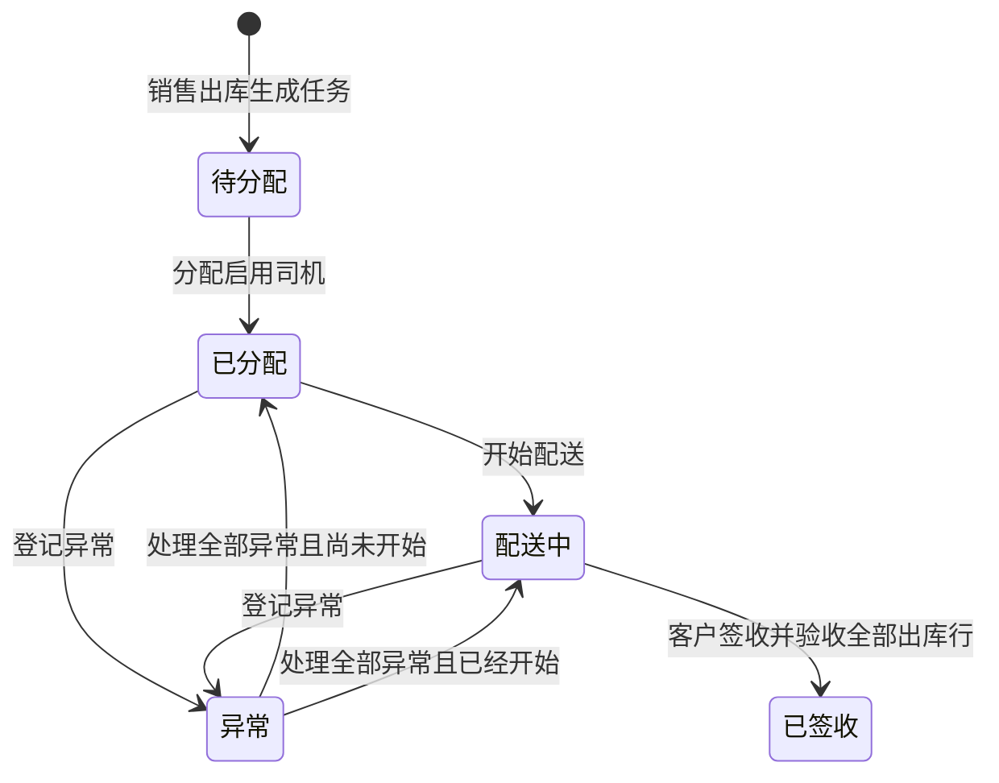
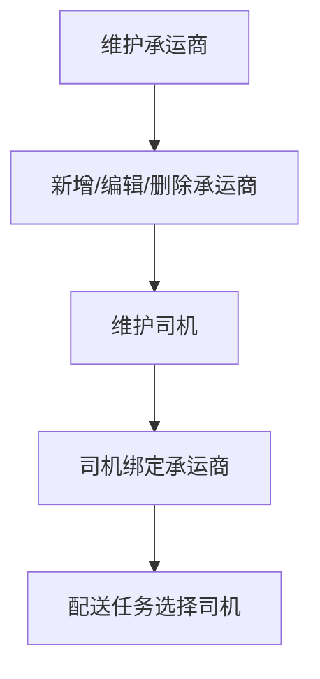
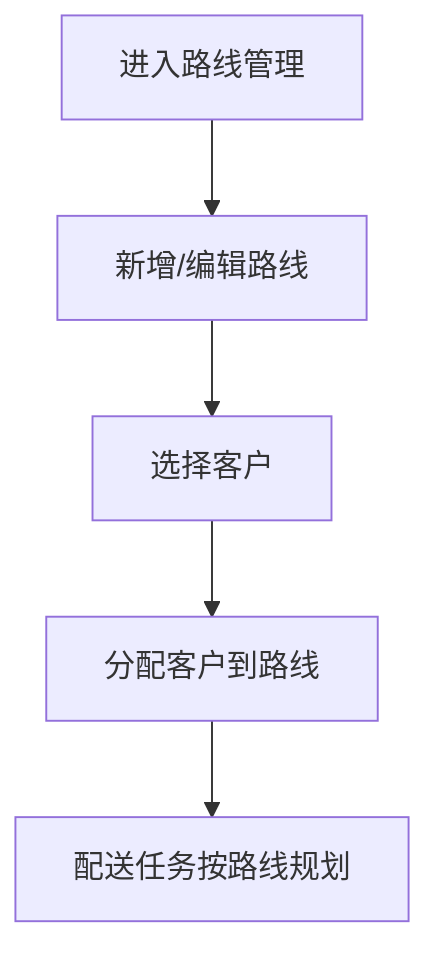
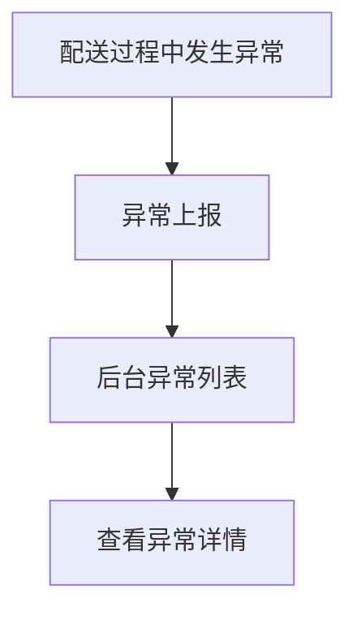

# 配送模块

## 业务目标

配送模块负责销售出库后的配送任务管理，包括订单任务、司机任务、司机/承运商资料、路线维护、客户路线分配和配送异常。

## 主流程图

## 页面清单

| 业务 | 旧文件 |
| --- | --- |
| 配送任务 | `src/views/delivery/task/index.vue` |
| 配送路线 | `src/views/delivery/route/index.vue` |
| 司机/承运商列表 | `src/views/delivery/driverOrCarrier/index.vue` |
| 新建司机 | `src/views/delivery/driverOrCarrier/driverCreate.vue` |
| 编辑司机 | `src/views/delivery/driverOrCarrier/driverDetail.vue` |
| 配送异常 | `src/views/delivery/exception/index.vue` |

## 配送任务流程

配送任务接口：

| 动作 | 方法 | URL | 旧方法 |
| --- | --- | --- | --- |
| 订单任务列表 | GET | `/business/order/delivery` | `getDeliveryTaskOrderList` |
| 司机任务列表 | GET | `/business/order/delivery/driver` | `getDeliveryTaskDriverList` |
| 修改配送司机 | PUT | `/business/order/delivery` | `editDeliveryTaskDriver` |
| 智能规划 | PUT | `/business/order/delivery/intelligent/plan` | `smartPlan` |

当前后端在 `/api/delivery-tasks` 下提供对应任务接口，并补充以下履约状态机：

| 当前后端动作 | 方法 | URL | 约束 |
| --- | --- | --- | --- |
| 开始配送 | PUT | `/api/delivery-tasks/{id}/start` | 仅已分配任务；订单同步为配送中 |
| 客户签收 | PUT | `/api/delivery-tasks/{id}/sign` | 仅配送中任务；验收明细必须完整覆盖本次出库行 |
| 回单归档 | PUT | `/api/delivery-tasks/{id}/receipt` | 仅已签收任务；每张回单只能归档一次 |
| 处理异常 | PUT | `/api/delivery-exceptions/{id}/handle` | 仅待处理异常；全部异常处理后恢复任务状态 |

销售订单可能分批出库并形成多张配送任务。只有订单已全部出库、所有有效销售出库均已生成配送任务且全部任务签收，订单才同步为已签收并汇总商品验收数量、结算金额；只有全部签收回单均归档，订单才同步为已回单。

## 司机与承运商流程

接口：

| 动作 | 方法 | URL |
| --- | --- | --- |
| 司机列表 | GET | `/business/driver/list` |
| 承运商列表 | GET | `/business/carrier/list` |
| 新增承运商 | POST | `/business/carrier` |
| 承运商详情 | GET | `/business/carrier/{id}` |
| 修改承运商 | PUT | `/business/carrier` |
| 删除承运商 | DELETE | `/business/carrier/{ids}` |
| 新增司机 | POST | `/business/driver` |
| 司机详情 | GET | `/business/driver/{id}` |
| 修改司机 | PUT | `/business/driver` |
| 删除司机 | DELETE | `/business/driver/{ids}` |

## 配送路线流程

接口：

| 动作 | 方法 | URL |
| --- | --- | --- |
| 路线列表 | GET | `/business/route/list` |
| 新增路线 | POST | `/business/route` |
| 修改路线 | PUT | `/business/route` |
| 删除路线 | DELETE | `/business/route/{ids}` |
| 分配客户路线 | PUT | `/business/route/dispatch/customer/{routeId}` |

## 配送异常

接口：

| 动作 | 方法 | URL |
| --- | --- | --- |
| 配送异常列表 | GET | `/driver/delivery/exception/web/page` |

## React 重写提示

- 配送任务列表建议拆成订单任务和司机任务两个 tab，各自独立 query。
- 打印能力复用全局打印模块，不要在配送模块重复实现。
- 路线分配客户建议用穿梭框或可搜索多选表格。
- 配送异常接口路径不在 `/business` 下，要在 API adapter 中单独标注。
