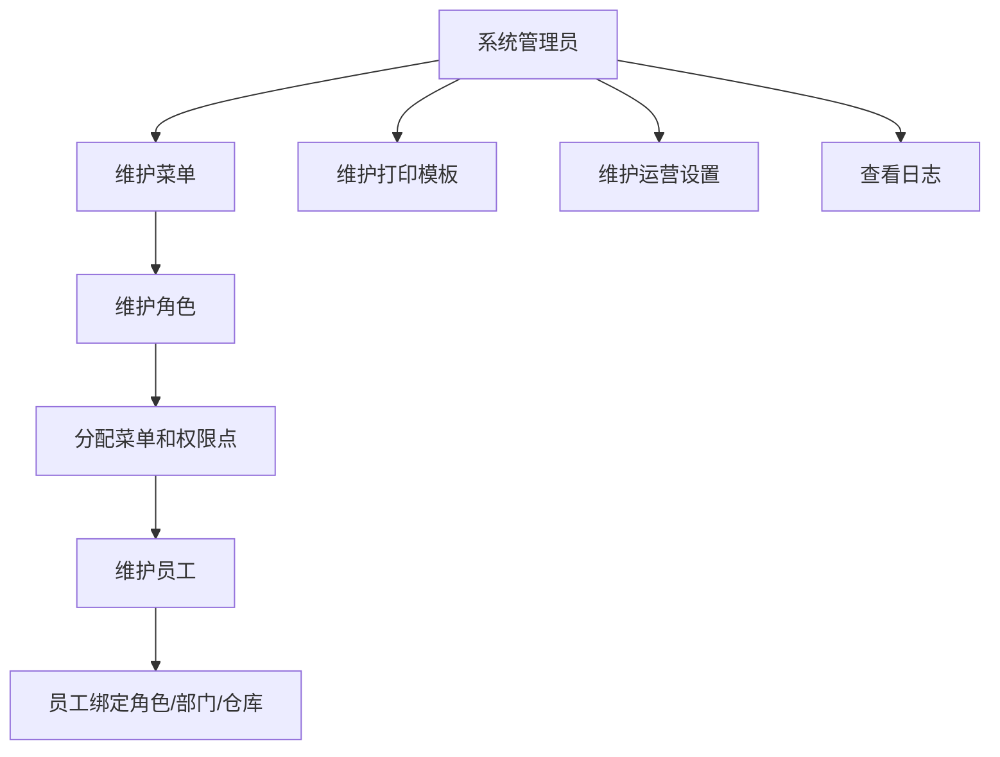
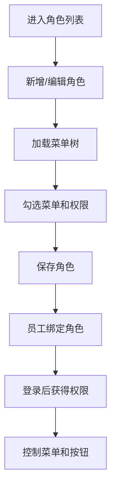
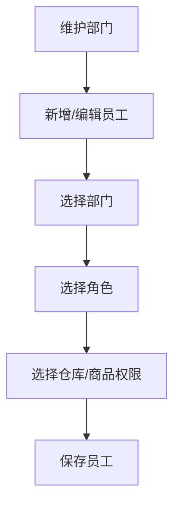
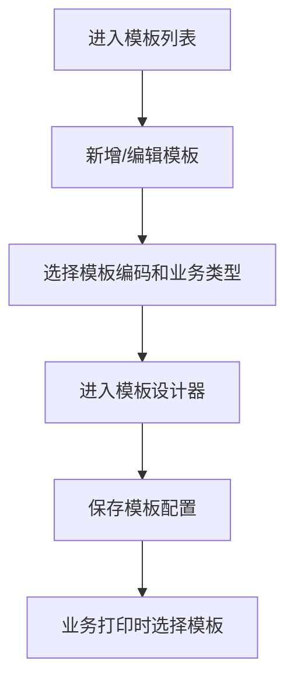
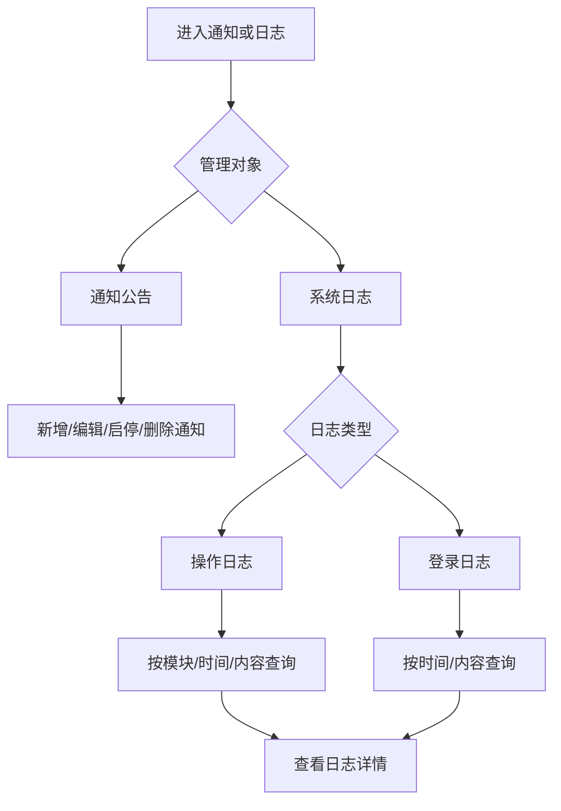

# 系统模块

## 业务目标

系统模块维护权限、菜单、角色、员工、部门、打印模板、运营时间、小程序下单设置、分拣权重、通知公告和日志，是整套后台的管理基础。

## 主流程图

## 页面清单

| 业务 | 旧文件 |
| --- | --- |
| 角色列表 | `src/views/system/role/index.vue` |
| 新增角色壳页面 | `src/views/system/role/addRole.vue` |
| 角色详情 | `src/views/system/role/details.vue` |
| 编辑角色占位页 | `src/views/system/role/editRole.vue` |
| 菜单管理 | `src/views/system/menu/index.vue` |
| 员工列表 | `src/views/system/employee/index.vue` |
| 员工详情 | `src/views/system/employee/details.vue` |
| 员工商品权限选择弹窗 | `src/views/system/employee/selectGoods.vue` |
| 部门管理 | `src/views/system/dept/index.vue` |
| 打印模板 | `src/views/system/template/index.vue` |
| 打印模板详情 | `src/views/system/template/details.vue` |
| 模板设计 | `src/views/system/template/design/*` |
| 模板 JSON 查看 | `src/views/system/template/json-view.vue` |
| 运营时间 | `src/views/system/operate/operationTime.vue` |
| 运营时间详情 | `src/views/system/operate/details.vue` |
| 小程序下单设置 | `src/views/system/appOrderOption/index.vue` |
| 分拣权重 | `src/views/system/operate/stationScreen.vue` |
| 通知公告 | `src/views/system/noticeManager/index.vue` |
| 日志 | `src/views/system/log/index.vue` |
| 用户占位页 | `src/views/system/user/index.vue` |

## 角色权限流程

角色接口：

| 动作 | 方法 | URL |
| --- | --- | --- |
| 角色列表 | GET | `/system/role/list` |
| 新增角色 | POST | `/system/role` |
| 角色详情 | GET | `/system/role/{roleId}` |
| 修改角色 | PUT | `/system/role` |
| 修改角色权限 | PUT | `/system/role/updateRolePermission` |
| 删除角色 | DELETE | `/system/role/{roleIds}` |
| 清空角色 | DELETE | `/system/role/all` |

系统管理接口按操作类型执行细粒度授权：查询使用 `read`，新增使用 `create`，修改与状态切换使用 `update`，删除与批量删除使用 `delete`。用户角色分配使用 `system:user:assign-roles`，角色菜单分配使用 `system:role:assign-menus`；菜单按钮使用独立的 `system:menu-button:*` 权限，部门使用 `system:department:*` 权限。所有管理接口均要求 Bearer Token，不提供匿名创建入口。

菜单接口：

| 动作 | 方法 | URL |
| --- | --- | --- |
| 菜单列表 | GET | `/system/menu/list` |
| 菜单树 | GET | `/system/menu/treeSelect` |
| 菜单详情 | GET | `/system/menu/{menuId}` |
| 新增菜单 | POST | `/system/menu` |
| 修改菜单 | PUT | `/system/menu` |
| 删除菜单 | DELETE | `/system/menu/{menuId}` |

## 员工部门流程

员工接口：

| 动作 | 方法 | URL |
| --- | --- | --- |
| 员工列表 | GET | `/business/employee/list` |
| 新增员工 | POST | `/business/employee` |
| 员工详情 | GET | `/business/employee/{id}` |
| 修改员工 | PUT | `/business/employee` |
| 删除员工 | DELETE | `/business/employee/{ids}` |
| 清空员工 | DELETE | `/business/employee/all` |

部门接口：

| 动作 | 方法 | URL |
| --- | --- | --- |
| 部门列表 | GET | `/system/dept/pageList` |
| 新增部门 | POST | `/system/dept` |
| 部门详情 | GET | `/system/dept/{deptId}` |
| 修改部门 | PUT | `/system/dept` |
| 删除部门 | DELETE | `/system/dept/{deptIds}` |
| 清空部门 | DELETE | `/system/dept/all` |

## 打印模板流程

模板接口：

| 动作 | 方法 | URL |
| --- | --- | --- |
| 按编码取模板 | GET | `/api/print-templates/by-code/{templateCode}` |
| 模板分页 | GET | `/api/print-templates?pageNumber=1&pageSize=20` |
| 新增模板 | POST | `/api/print-templates` |
| 修改模板 | PUT | `/api/print-templates` |
| 删除模板 | DELETE | `/api/print-templates/{id}` |

模板以全局唯一 `templateCode`、适用 `businessType`、设计器 `designJson` 和字段路径集合组成。字段路径从业务打印数据中绑定，例如 `documentNo`、`businessPartyName` 和 `details[].itemName`；后端不渲染 HTML。模板管理需要 `system:print-template:*` 权限。

## 运营设置

SkyRoc 使用日内服务时段、小程序下单开关和三项分拣权重构成运营设置。服务时段的结束时间必须晚于开始时间，不能跨日；小程序最多可提前 30 个自然日下单；分拣权重为最多四位小数的非负相对值。设置均由 `system:operation-setting:*` 权限保护。

服务时间接口：

| 动作 | 方法 | URL |
| --- | --- | --- |
| 服务时间列表 | GET | `/api/system-settings/service-periods?includeDisabled=false` |
| 服务时间详情 | GET | `/api/system-settings/service-periods/{id}` |
| 新增服务时间 | POST | `/api/system-settings/service-periods` |
| 修改服务时间 | PUT | `/api/system-settings/service-periods/{id}` |
| 删除服务时间 | DELETE | `/api/system-settings/service-periods/{id}` |

小程序下单设置：

| 动作 | 方法 | URL |
| --- | --- | --- |
| 查询设置 | GET | `/api/system-settings/mini-program-order` |
| 保存设置 | PUT | `/api/system-settings/mini-program-order` |

分拣权重：

| 动作 | 方法 | URL |
| --- | --- | --- |
| 查询分拣权重 | GET | `/api/system-settings/sorting-weights` |
| 保存分拣权重 | PUT | `/api/system-settings/sorting-weights` |

## 通知和日志

通知接口：

| 动作 | 方法 | URL |
| --- | --- | --- |
| 通知列表 | GET | `/api/notices?current=1&size=20&includeDraft=false` |
| 新增通知草稿 | POST | `/api/notices` |
| 修改通知内容 | PUT | `/api/notices/{id}` |
| 发布或撤回 | PATCH | `/api/notices/{id}/status` |
| 删除通知 | DELETE | `/api/notices/{id}` |

日志接口：

| 动作 | 方法 | URL |
| --- | --- | --- |
| 操作日志 | GET | `/api/logs/operations` |
| 登录日志 | GET | `/api/logs/logins` |

公告正文只接受纯文本，拒绝 HTML 标记，前端必须按文本而非 `innerHTML` 渲染。关键写操作（`POST`、`PUT`、`PATCH`、`DELETE`）在认证和授权成功后由中间件记录模块、方法、路径、结果、执行耗时和当前操作人。审计使用独立的 DI/DbContext 作用域写入，绝不会提交原请求因异常遗留的 EF 追踪变更；它只保存已脱敏的查询参数与 HTTP 状态摘要，不读取请求正文或响应正文。密码、令牌和密钥类型参数会被替换为 `***`。登录认证无论成功或失败均写入独立登录日志，失败原因只记录安全摘要，绝不保存密码、访问令牌或刷新令牌；审计写入异常不会改变已确定的认证结果。两个日志接口都是只读的，使用 `system:log:read` 权限。

## React 重写提示

- 权限模型要先定好：路由权限、按钮权限、数据权限分层。
- 打印模板设计器是复杂子系统，可作为后置阶段迁移。
- 员工详情涉及角色、部门、仓库、商品权限，建议拆成多个表单区块。
- 系统模块可以最后重写，但登录权限和菜单必须第一阶段完成。
