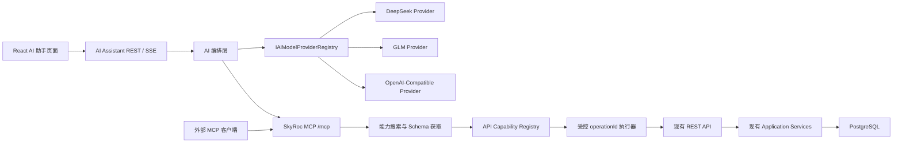

# SkyRoc 通用 AI 助手、全量 API 能力网关、可插拔模型层与 MCP 服务实施计划

> 文档状态：计划已确认；P6-00、P6-01 已完成，下一阶段为 P6-01A“API 能力网关增量契约”。
>
> 编写日期：2026-07-22。
>
> 范围修订：2026-07-23，明确“全部有 OpenAPI 契约的 JSON 业务接口默认可被 AI 发现和调用”，不再局限于首期手写工具白名单；P6-01 已交付内容保持不变，新增 P6-01A 承接能力网关公共契约。
>
> 详细任务登记：[`docs/自动开发任务清单.md`](../../自动开发任务清单.md) 的 P6 阶段。
>
> 开始条件：后端 P5-01 与前端 M07 均已完成。P6-00、P6-01 已通过测试；必须先完成新增的 P6-01A，才能继续 P6-02。

## 1. 目标与范围

为 SkyRoc 增加一个类似千问的通用 AI 助手：

- 普通问题直接使用当前配置的大模型回答。
- 涉及 SkyRoc 数据、业务流程或业务操作时，由模型通过 SkyRoc MCP 搜索后端能力，并调用对应 `operationId`。
- 所有具备 OpenAPI 请求/响应契约的 `/api/**` JSON 业务接口默认进入 AI 能力目录；新增业务接口也自动进入，只有标注 `[AiIgnore]` 并填写原因的技术或不支持接口可以排除。
- 读取接口可以在当前用户权限内直接执行；新增、修改、审核、删除等写操作采用“生成通用操作草稿 → 页面人工确认 → 调用原业务接口”。
- 下单使用更严格的专用流程：“生成订单草稿 → 重新验证价格 → 页面人工确认 → 创建正式订单”；模型和外部 MCP 客户端不能绕过确认接口。
- 模型层通过项目自有的统一接口接入，首期支持 DeepSeek、GLM、通用 OpenAI-Compatible，后续更换厂商不修改聊天页、MCP 工具和订单应用服务。
- 支持浏览器语音输入和回答朗读；音频不上传、不保存。
- 对外提供受限 MCP 服务，允许 Codex、Claude 等客户端使用个人访问令牌搜索 API 能力、读取数据和生成写操作草稿；实际能力仍受 Token 范围与用户实时权限的交集限制。

首期不实现联网搜索、文件/图片理解、实时双向语音、用户自行选择模型、数据库动态保存厂商密钥、完整 OAuth/OIDC、任意 SQL、任意外部 URL 转发或全表读取。上传、下载、SSE、Webhook、认证换票、健康检查、Swagger 和 AI 自身接口不作为普通 JSON 业务能力自动调用；需要支持时必须增加专用适配器，不能伪装成通用 JSON 调用。

本文中的“全部后端接口”特指内部 AI 助手可按当前登录用户权限调用全部符合条件的 JSON 业务接口。外部 MCP 客户端可以使用同一能力目录，但可见与可调用范围还必须受到 PAT scope 限制，不能因为内部助手具备全量目录而自动获得全部外部权限。

## 2. 固定架构决策



固定约束如下：

1. 业务代码只依赖 `IAiModelProvider` 和统一类型，不直接依赖厂商 SDK、请求 DTO 或响应 DTO。
2. 厂商差异只能出现在对应 Provider 目录和契约样例中；“兼容各种格式”通过显式适配实现，不进行未声明格式的猜测解析。
3. MCP 使用官方 `ModelContextProtocol.AspNetCore` 稳定 1.x SDK、无状态 Streamable HTTP，并映射到 `/mcp`；2026-07-22 已复核并冻结实际采用版本为 `1.4.1`，不采用 `2.0.0-preview.*`。
4. `/mcp` 遵循 MCP JSON-RPC 与 HTTP 规范，不套 `ApiResponse<T>`；普通 REST API 继续使用 HTTP 200 加 `body.code`。
5. SkyRoc 项目事实必须来自 MCP 知识资源或后端 API 实际结果；系统提示不得允许模型凭记忆编造项目事实。
6. 能力注册表从 ASP.NET Core `ApiExplorer`/OpenAPI 元数据构建。全部 `/api/**` JSON 业务 Action 必须满足“已注册”或“使用 `[AiIgnore]` 说明排除原因”二选一，并由自动化测试阻止遗漏。
7. 模型永远不能传入 URL、HTTP 方法、请求头、用户 ID 或权限编码，只能传稳定 `operationId` 和符合 JSON Schema 的业务参数；执行器从注册表解析固定路由，因而不是任意 HTTP 转发器。
8. 模型先调用 `search_api_capabilities`，再按需调用 `get_api_operation_schema`，最后调用 `invoke_api_operation`。每轮只返回相关能力，不能把全部接口 Schema 一次塞入模型上下文。
9. API 调用继续使用当前用户身份并经过原接口的认证、资源权限、模型验证、业务服务和 `body.code` 判断。内部助手转发当前 JWT；外部 PAT 只能交换为 60 秒内、仅供内部调用的委托令牌。
10. GET/HEAD 默认为读取，可直接执行；POST/PUT/PATCH/DELETE 默认为写入，必须先保存 `AiActionDraft` 并由当前用户确认。高风险操作需要更醒目的二次确认；技术端点使用 `[AiIgnore]` 排除。
11. 所有增长型查询必须在原业务接口的数据库查询层分页或限量；AI 网关不得通过“全量调用后截断响应”掩盖不安全接口。知识最多 5 段，能力搜索最多 20 项，单次工具结果另设字节上限。
12. 订单创建仍使用专用草稿；正式订单只能由登录用户确认后调用现有 `ISaleOrderService.CreateAsync` 创建，并在确认时重新验证价格。
13. API Key 只从环境变量读取。个人 MCP 令牌原文只显示一次，数据库只保存 HMAC-SHA256 哈希。
14. 推理内容不展示、不入库；音频不上传、不保存；完整敏感工具响应不写入会话或日志。
15. 默认配置为 `Ai:Enabled=false`、`Mcp:ExternalEnabled=false`，模型故障不得影响普通业务接口。

## 3. 串行执行与测试门禁

本计划共 16 个阶段，必须严格按 P6-00、P6-01、P6-01A、P6-02 至 P6-14 顺序执行：

1. 一次只领取一个阶段，不并行开发后续阶段。
2. 开始阶段前检查 `git status`，保留用户已有改动。
3. 完成代码后先执行该阶段的“必跑测试”，再执行公共门禁。
4. 任一必跑测试失败时，立即停止；记录失败原因，不勾选当前阶段，不进入下一阶段。
5. 环境依赖验收无法执行时，标记“代码完成、待环境验收”，不得宣称功能完成。
6. 每个阶段通过后，才允许勾选 `docs/自动开发任务清单.md` 中对应任务，并把测试证据写入 `docs/测试进度.md`。

每个后端阶段的公共门禁：

```powershell
dotnet build SkyRoc.sln --no-restore
dotnet format SkyRoc.sln --verify-no-changes --no-restore
git diff --check
```

每个前端阶段的公共门禁：

```powershell
Set-Location client
pnpm check:options
pnpm typecheck
pnpm exec eslint <本阶段改动的前端文件>
Set-Location ..
git diff --check
```

涉及数据库模型的阶段额外执行：

```powershell
dotnet ef migrations has-pending-model-changes --project Infrastructure --startup-project SkyRoc --no-build
```

最终交付才运行完整后端套件与前端构建；当前仓库已有测试失败必须以执行时的 `docs/测试进度.md` 为基线，不能把既有失败算作本功能通过，也不能引入新失败。

## 4. 阶段计划列表

| 阶段 | 交付结果 | 进入下一阶段的测试门禁 |
| --- | --- | --- |
| P6-00 | 基线、依赖和契约冻结 | 当前后端构建、前端 typecheck、配置与依赖验证通过 |
| P6-01 | AI/MCP 公共契约、配置和权限骨架 | 配置校验、DI、禁用开关与权限测试通过 |
| P6-01A | 全量 API 能力网关增量契约、元数据和配置 | 默认注册/排除、风险分类、受控参数与配置测试通过 |
| P6-02 | 会话、消息、通用操作草稿、订单草稿、令牌持久化与迁移 | EF 模型、迁移 Up/Down、注释和隔离测试通过 |
| P6-03 | Provider 公共契约测试框架 | 全部统一类型、流分片聚合和错误归一测试通过 |
| P6-04 | DeepSeek、GLM、OpenAI-Compatible 适配器 | 三个适配器通过同一套脱敏样例契约测试 |
| P6-05 | 项目知识库与检索服务 | 来源、限量、单篇读取、敏感内容排除测试通过 |
| P6-06 | `/mcp` 传输、知识资源、动态能力工具与身份传播 | MCP 初始化、能力发现、资源读取和 JWT 鉴权测试通过 |
| P6-07 | 全量业务 API 能力注册表与受控调用网关 | API 覆盖率、operationId、权限、限量、脱敏和参数测试通过 |
| P6-08 | 通用操作草稿、订单专用草稿与人工确认 | 风险分级、价格优先级、过期、越权、重放和并发测试通过 |
| P6-09 | 个人 MCP Token、委托令牌与外部 MCP 鉴权 | 哈希、范围交集、委托令牌、过期/撤销/停用测试通过 |
| P6-10 | 会话 REST、AI 编排、动态能力选择、SSE 与工具循环 | 通用问答、能力搜索/调用、SSE、取消和循环上限测试通过 |
| P6-11 | 前端服务层、AI 页面和通用/订单确认卡片 | typecheck、ESLint、build、核心页面交互测试通过 |
| P6-12 | 语音输入、回答朗读和 Token 管理 UI | Chrome/Edge 手测与不支持语音回退测试通过 |
| P6-13 | 安全、日志、保留期和全链路自动化收口 | AI/MCP 全部定向测试、完整构建和前端构建通过 |
| P6-14 | 真实 DeepSeek/GLM、MCP Inspector、外部客户端验收与发布 | 全部真实场景和最终质量门禁通过后才可完成 |

## 5. 分阶段实施明细

### P6-00 基线、依赖和契约冻结

实施清单：

- 读取 `AGENTS.md`、`docs/开发进度.md`、`docs/自动开发任务清单.md`、`docs/测试进度.md`、前端两份续接文档和本计划。
- 确认 P5-01、M07 和现有测试基线；不修改它们的完成状态。
- 验证 .NET 9、Node、pnpm、PostgreSQL 和 Redis 可用性。
- 验证官方 MCP SDK 稳定 1.x 能在 `net9.0` 项目还原；固定实际采用版本。
- 记录真实 DeepSeek/GLM Key、外部 MCP 客户端和浏览器是否可用于最终验收，但不得把 Key 写入仓库。
- 冻结本计划中的 REST、SSE、MCP、权限、数据保留和下单确认边界；若必须修改，先更新本文再写代码。

必跑测试：

```powershell
dotnet restore SkyRoc.sln
dotnet build SkyRoc.sln --no-restore
Set-Location client
pnpm typecheck
Set-Location ..
git diff --check
```

通过条件：基线命令结果已记录，新增功能依赖可以还原，没有未知的仓库改动。失败则停在 P6-00。

冻结结果（2026-07-22）：

| 项目 | 冻结结果 |
| --- | --- |
| 前置与回归基线 | P5-01、前端 M07 和自动业务测试 T0–T14 均已完成；最近完整后端套件基线为发现 558 项，沿用同日已收口结果。 |
| 工具链 | `.NET SDK 9.0.100`、`Node v22.16.0`、`pnpm 10.12.1`；前端声明的 `pnpm >=10.4.1` 约束满足。 |
| 数据基础设施 | PostgreSQL 可读取到最新迁移 `20260721024046_AddSelectionOptionSearchIndexes`；Redis `PING` 返回 `PONG`，现有 `/health` 返回 `Healthy`。 |
| MCP SDK | 官方 NuGet 当前稳定 1.x 为 `ModelContextProtocol.AspNetCore 1.4.1`；已在隔离的 `net9.0` Web 项目完成还原和构建，0 警告、0 错误。仓库在 P6-06 引入时必须显式固定该版本。 |
| 最终验收能力 | Codex CLI、Claude CLI、Chrome 和 Edge 可用；MCP Inspector 未预装，P6-14 执行时再按官方发行方式获取。`SKYROC_AI_DEEPSEEK_API_KEY`、`SKYROC_AI_GLM_API_KEY`、`SKYROC_AI_CUSTOM_API_KEY`、`SKYROC_MCP_TOKEN_HASH_KEY`、`SKYROC_AI_DELEGATION_SIGNING_KEY` 当前均未配置，P6-14 前必须由环境注入。 |
| 契约边界 | P6-00 当时冻结了固定工具方案；用户在 2026-07-23 明确改为“全部 JSON 业务 API 默认可调用”，本次范围修订通过 P6-01A、通用操作草稿和第七类 `action-draft.ready` SSE 事件承接，不追溯修改已完成的 P6-00/P6-01 代码结论。 |
| 基线门禁 | `dotnet restore`、`dotnet build --no-restore`、`dotnet format --verify-no-changes --no-restore`、前端 `pnpm typecheck`、进度基线防退化测试和 `git diff --check` 通过；后端仅保留 7 条既有 NuGet 漏洞警告。 |

### P6-01 公共契约、配置和权限骨架

实施清单：

- 在 `Shared` 或 `Application` 的窄层定义 `AiChatMessage`、`AiToolDefinition`、`AiToolCall`、`AiToolResult`、`AiStreamChunk`、`AiUsage`、`AiProviderError`、`AiProviderCapabilities`。
- 定义 `IAiModelProvider`：`StreamChatAsync`、`GetCapabilitiesAsync`、`NormalizeError`、`ValidateConfiguration`。
- 定义 `IAiModelProviderRegistry`，只由 `Ai:ActiveProvider` 选择一个已注册 Provider。
- 增加 `AiOptions`、`AiProviderOptions`、`McpOptions`，使用启动校验检查地址、模型名、数值边界和密钥环境变量名。
- 增加 `Ai:Enabled=false` 与 `Mcp:ExternalEnabled=false` 默认配置；示例配置只保存环境变量名称，不保存密钥。
- 在 `Shared/Constants/PermissionCodes.cs` 增加 AI 助手使用、订单草稿、MCP Token 管理权限，并纳入权限完整性测试。
- 保持厂商类型只存在于适配器目录。

计划文件范围：

- `Application/AI/Abstractions/`
- `Application/AI/Models/`
- `Shared/Options/AiOptions.cs`
- `Shared/Options/McpOptions.cs`
- `Shared/Constants/PermissionCodes.cs`
- `Application/DependencyInjection.cs`
- `SkyRoc/appsettings.json`

必跑测试：

- 配置缺少 Base URL、Model、API Key 环境变量时返回可识别启动错误。
- AI 禁用时不解析厂商密钥、不影响普通 API 启动。
- Provider 名称不存在或 Adapter 重复注册时启动失败。
- 权限定义完整性测试通过。
- 运行后端公共门禁。

完成结果（2026-07-22）：统一 Provider 类型、活动 Registry、启动校验、安全默认开关和三项稳定权限已落地，定向回归 41/41 通过；详细证据见 `docs/测试进度.md`。本阶段按原冻结范围完成，不包含 2026-07-23 新增的全量 API 能力网关契约。

### P6-01A 全量 API 能力网关增量契约、元数据和配置

实施清单：

- 保留 P6-01 已实现的 `IAiModelProvider`、Provider Registry、AI/MCP 配置和权限，不回滚、不重写已通过测试的公共模型层。
- 新增 `IAiApiCapabilityRegistry`、`IAiApiOperationExecutor`、`IAiApiResponseProjector`、`AiApiCapability`、`AiOperationRiskLevel`、`AiConfirmationMode` 和通用调用结果。
- 新增 `[AiOperation]`，用于覆盖标题、分类、风险级别、确认方式、结果上限和敏感字段策略；新增 `[AiIgnore]`，且排除原因不能为空。
- 默认规则为：有 OpenAPI 契约的 `/api/**` JSON 业务 Action 自动注册；GET/HEAD 为读取，其他 HTTP 方法为写入并要求确认。显式元数据只覆盖默认值，不要求逐接口手写 MCP Tool。
- 注册表直接读取现有 `[PermissionResource]`、`[ResourcePermission]`、`[Authorize]` 和匿名访问元数据；AI 元数据不能重新定义或放宽业务权限。
- 扩展 `AiOptions`/`McpOptions`：内部 API 基地址、能力搜索上限、单次结果字节上限、通用草稿过期时间、委托令牌有效期和高风险确认有效期。
- 内部 API 基地址只能来自配置并通过 scheme/host 允许列表校验；模型参数不能包含 URL、HTTP Method、Header、UserId 或权限编码。
- 在 `PermissionCodes` 增加通用操作确认权限；保持已存在的 AI 助手、订单草稿和 MCP Token 权限编码稳定。

计划文件范围：

- `Application/AI/Capabilities/`
- `Application/AI/Models/`
- `Shared/Options/AiOptions.cs`
- `Shared/Options/McpOptions.cs`
- `Shared/Constants/PermissionCodes.cs`
- `SkyRoc/AI/Attributes/AiOperationAttribute.cs`
- `SkyRoc/AI/Attributes/AiIgnoreAttribute.cs`
- `SkyRoc/appsettings.json`
- `SkyRoc.Tests/AI/Capabilities/`

必跑测试：

- P6-01 现有 41 项定向回归继续通过。
- 默认 HTTP 方法风险分类、显式覆盖和空 `[AiIgnore]` 原因校验正确。
- operationId、业务参数和统一调用结果契约可序列化且不依赖厂商类型。
- 模型不能在通用调用参数中提供 URL、Method、Header、UserId 或权限编码。
- 内部基地址、搜索上限、结果字节上限、委托令牌和确认时限的配置边界测试通过。
- AI 禁用时不构造能力网关执行器、不影响普通 API 启动。
- 运行后端公共门禁；任一测试失败时不得进入 P6-02。

### P6-02 持久化模型与迁移

新增实体：

- `AiConversation`：用户、标题、最后消息时间、保留期相关状态。
- `AiMessage`：会话、角色、文字内容、序号、Provider/Model、必要工具摘要；禁止保存推理和完整敏感结果。
- `AiActionDraft`：通用写操作的 operationId、规范化参数、风险等级、确认摘要、参数哈希、过期时间、状态、确认用户和执行结果引用。
- `AiOrderDraft`：会话、用户、客户、订单信息、状态、过期时间、正式订单关联和幂等键。
- `AiOrderDraftDetail`：商品、单位、数量、固定价、价格来源、来源记录和确认快照。
- `McpAccessToken`：用户、名称、前缀、哈希、范围、过期/撤销/最后使用时间。

实施清单：

- 在 `Domain/Entities/AI/` 创建实体和枚举，每个顶级类型单独文件，补齐中文 XML 注释。
- 在 `Infrastructure/Data/EntityConfigurations/AI/` 配置表、列、关系、唯一索引、并发或幂等约束。
- 所有表和列使用 `HasComment` 写入中文数据库注释。
- 在 `ApplicationDbContext` 增加 DbSet，并生成可回滚迁移。
- 会话默认保留 30 天；通用操作草稿和订单草稿默认 30 分钟过期。
- 通用操作参数使用规范化 JSON 保存，并同时保存不可变哈希；确认时 operationId、参数或当前用户发生变化即拒绝执行。
- 设计用户隔离、会话消息游标和两类草稿确认的必要索引，避免 offset 扫描会话消息。

必跑测试：

- 六个实体的 EF 模型、表名、字段、关系、索引和全部数据库注释测试。
- 迁移 Up 创建完整结构，Down 只回滚本阶段对象。
- 会话用户隔离、消息游标排序、通用操作参数哈希和两类草稿幂等索引测试。
- `has-pending-model-changes` 返回无挂起模型变更。
- 运行后端公共门禁。

### P6-03 Provider 公共契约测试框架

实施清单：

- 建立适配器共享契约测试基类；新增 Provider 必须复用，不能自行降低断言。
- 统一内容解析为文字增量；兼容 `content` 字符串或内容块数组。
- 统一工具调用增量，能够跨多个流片段拼接工具 ID、名称和 JSON 参数。
- 统一 usage、finish reason、取消、超时、断流和厂商错误。
- 未知字段忽略，同时只在适配器内部保留扩展数据，不能把厂商原始 JSON 传给前端。
- 工具参数在完整 JSON 形成后做 JSON Schema 校验；非法参数最多让模型修正一次。

必跑测试：

- 普通非流式与流式回答。
- 单工具、多工具和跨分片参数。
- 字符串/内容块两种 content。
- 缺失 usage、结束原因、未知字段和 HTTP 200 错误体。
- 非流式错误、超时、断流、用户取消和非法工具参数。
- 运行后端公共门禁。

### P6-04 三个模型适配器

实施清单：

- 在基础设施或 Web 组合层实现 `DeepSeekAiModelProvider`、`GlmAiModelProvider`、`OpenAiCompatibleModelProvider`。
- DeepSeek 处理 `reasoning_content`，工具回合按厂商要求回放必要推理字段，但推理不展示、不入库。
- GLM 处理思考字段、工具选择和流式工具分片。
- OpenAI-Compatible 通过配置映射内容字段、推理字段、最大 token 字段和额外请求参数。
- API Key 从各自环境变量读取；日志、异常和遥测不得输出请求头或密钥。
- 注册表按 Provider 名称选择 Adapter；切换 Provider 只改配置并重启。
- 保存脱敏响应样例，样例不得包含真实 Key、客户数据或内部地址。

计划文件范围：

- `Infrastructure/AI/Providers/DeepSeek/`
- `Infrastructure/AI/Providers/Glm/`
- `Infrastructure/AI/Providers/OpenAiCompatible/`
- `SkyRoc.Tests/AI/Providers/Fixtures/`
- `SkyRoc.Tests/AI/Providers/`

必跑测试：三个适配器逐一运行 P6-03 的同一套公共契约测试，任何一个失败都不能注册或进入 P6-05。

### P6-05 项目知识库与检索

实施清单：

- 在 `docs/ai-knowledge/` 建立面向用户问答的知识文档，首期至少覆盖数据来源、Clean Architecture 模块职责、销售订单、采购、库存、配送、售后和定价流程。
- 每篇知识包含稳定 slug、标题、摘要、正文和可展示来源；不得把连接串、密钥、内部备注或个人信息放入知识库。
- 实现知识索引和限量搜索服务；最多返回 5 段，每段最多 800 个字符。
- 搜索结果必须包含来源 slug/标题，供 SSE `source` 事件和前端来源标签使用。
- 首期采用受控文档索引，不把整个仓库源代码、数据库或任意文件暴露给模型。

必跑测试：

- 知识索引包含全部首期主题。
- 单篇 slug 只能读取一篇，非法 slug 不得路径穿越。
- 搜索始终不超过 5 段和每段 800 字。
- 搜索结果包含来源且不含预设敏感样例。
- 运行后端公共门禁。

### P6-06 MCP 传输、知识资源、动态能力工具和 JWT 身份传播

实施清单：

- 引入官方 `ModelContextProtocol.AspNetCore` 稳定 1.x，配置无状态 Streamable HTTP。
- 映射 `/mcp`，关闭旧版 SSE 传输，启用官方授权过滤器和身份传播。
- `/mcp` 不经过普通业务 `ApiResponse` 包装；现有业务异常/响应约定不得被改坏。
- 暴露 `skyroc://knowledge/index` 与 `skyroc://knowledge/{slug}` 资源。
- 暴露 `search_project_knowledge` 工具。
- 暴露 `search_api_capabilities`、`get_api_operation_schema` 和 `invoke_api_operation` 三个通用能力工具；业务接口本身不需要逐个手写 MCP Tool 类。
- `search_api_capabilities` 根据自然语言、模块、HTTP 风险和当前用户权限返回最多 20 个候选，只返回 operationId、名称、摘要、风险与确认要求。
- `get_api_operation_schema` 一次只返回一个 operationId 的参数 JSON Schema、结果摘要和确认策略。
- `invoke_api_operation` 只接收 operationId 与业务参数。读取操作可返回结果；写操作只生成 `AiActionDraft`，不能直接执行正式写入。
- 内部聊天编排使用当前 SkyRoc JWT 身份访问 MCP，不能使用后台超级账号或共享令牌代替用户。
- `Ai:Enabled=false` 时内部编排入口不可用；`Mcp:ExternalEnabled=false` 时不接受个人令牌，但内部 JWT MCP 仍可按配置使用。

必跑测试：

- MCP initialize、tools/list、resources/list、resources/read 协议测试，断言三个通用能力工具可发现。
- 能力搜索最多 20 项，Schema 每次只读取一个 operationId；工具结果不得返回全量 OpenAPI 文档。
- 读取 operationId 可以执行，写入 operationId 只能生成草稿，传 URL/Method/Header 必须拒绝。
- 未认证、无 AI 权限、合法 JWT 三种身份结果。
- `/mcp` 响应不包含 `ApiResponse` 外壳；普通 REST 失败仍为 HTTP 200 加业务 code。
- Origin 校验和无状态会话测试。
- 运行后端公共门禁。

### P6-07 全量业务 API 能力注册表与受控调用网关

能力覆盖规则：

1. `ApiExplorer` 中路由为 `/api/**`、具有明确 HTTP 方法并能生成 JSON 请求/响应 Schema 的业务 Action 默认注册。
2. operationId 必须稳定且全局唯一，建议由“Controller 名 + Action 名”生成；路由重命名不能静默复用其他 operationId。
3. 登录、刷新令牌、修改密码、重置凭据、AI 会话自身、草稿确认自身、MCP、Swagger、健康检查和回调类技术端点使用 `[AiIgnore]` 排除，原因必须进入覆盖报告。
4. 上传、下载、流式文件、非 JSON 响应，以及请求中包含密码、密钥、Token 等不可持久化秘密的操作，首期使用 `[AiIgnore]` 标记“等待专用适配器”；不能被通用执行器错误调用。
5. 新增或修改 Controller 时，契约测试必须证明每个 Action 已注册或被显式排除，避免新增接口对 AI 静默不可见。

受控调用流程：

1. `IAiApiCapabilityRegistry` 根据关键词、模块、权限和风险搜索能力。
2. 注册表直接读取现有 `[PermissionResource]`、`[ResourcePermission]`、`[Authorize]` 和匿名访问元数据生成权限要求；`[AiOperation]` 不能重新定义或放宽业务权限。
3. `get_api_operation_schema` 返回单个能力的路径/查询/请求体合并 Schema，但不向模型暴露固定路由模板、内部基地址和认证头。
4. `invoke_api_operation` 使用 operationId 从注册表取得固定方法和路由，完成参数 Schema 校验、未知字段拒绝与路径参数编码。
5. `IAiApiOperationExecutor` 使用命名 `HttpClient` 调用配置的 SkyRoc 内部基地址。内部聊天转发当前 JWT；执行器拒绝重定向、代理、模型 URL 和非注册目标。
6. 原 REST Controller 再次执行认证授权、模型绑定、FluentValidation、业务服务和异常中间件；执行器按 HTTP 200 响应中的 `body.code` 判断业务成功，不能只看 HTTP 状态。
7. 读取结果经过 `IAiApiResponseProjector` 按 OpenAPI Schema 和敏感字段策略生成模型摘要；原始完整结果不进入会话和日志。

风险与确认默认值：

| 分类 | 默认来源 | AI 行为 |
| --- | --- | --- |
| `Read` | GET、HEAD | 当前用户有权限时直接执行 |
| `Write` | POST、PUT、PATCH、DELETE | 保存 `AiActionDraft`，页面单次明确确认后执行 |
| `HighRisk` | 权限、角色、审核/反审核、作废、结算、批量删除等显式标注操作 | 保存草稿，页面显示完整影响摘要并二次确认 |
| `Ignored` | `[AiIgnore]` | 不出现在能力搜索结果，覆盖报告必须给出原因 |

数据规模规则：

- 注册表必须识别分页和 limit 参数，并施加项目级最大值；模型不能请求超过原接口允许的上限。
- 对返回增长型集合但没有分页/硬上限的接口，覆盖测试标记为 `NeedsBoundedContract` 并阻止 P6-07 完成；必须先修复原接口，不能在网关拿到全量结果后截断。
- 能力搜索最多 20 项，单个 JSON 工具结果设置元素数和序列化字节双重上限。
- 手机号、地址、成本、内部备注、密钥、Token 等字段按策略删除或脱敏；用户原本无权访问的数据不得因 AI 网关出现。
- 能力覆盖测试必须识别 password、secret、token、apiKey 等敏感请求字段；没有专用安全适配器时禁止生成会保存这些值的通用操作草稿。

计划文件范围：

- `Application/AI/Capabilities/IAiApiCapabilityRegistry.cs`
- `Application/AI/Capabilities/IAiApiOperationExecutor.cs`
- `Application/AI/Capabilities/IAiApiResponseProjector.cs`
- `Application/AI/Capabilities/Models/`
- `SkyRoc/AI/Capabilities/ApiExplorerAiCapabilityRegistry.cs`
- `SkyRoc/AI/Capabilities/AiApiOperationExecutor.cs`
- `SkyRoc/AI/Capabilities/AiApiResponseProjector.cs`
- `SkyRoc/AI/Mcp/AiCapabilityMcpTools.cs`
- `SkyRoc.Tests/AI/Capabilities/`
- `SkyRoc.Tests/Documentation/AiApiCapabilityCoverageTests.cs`

必跑测试：

- 全部 `/api/**` Action 的“已注册或已说明排除”覆盖测试，operationId 无重复且跨构建稳定。
- 代表性订单、采购、库存、配送、财务、基础资料和系统管理读取接口可以通过能力搜索、Schema 获取和 operationId 调用。
- 每种路径、查询和 JSON Body 参数绑定测试，以及未知字段、空 GUID、非法枚举和超限参数测试。
- 无权限操作不会出现在搜索结果；伪造 operationId、URL、Method、Header、UserId 和跨域目标全部拒绝。
- HTTP 200 但 `body.code != 200` 被归一为业务错误。
- 增长型结果数据库侧限量、响应字节上限和敏感字段脱敏测试；不存在“全量读取后截断”。
- 写操作不会立即改库，只生成当前用户的 `AiActionDraft`。
- 运行后端公共门禁。

### P6-08 通用操作草稿、订单专用草稿与人工确认

通用写操作规则：

1. 模型调用写操作时，`invoke_api_operation` 只创建 `AiActionDraft`，保存 operationId、规范化参数、参数哈希、风险等级、影响摘要、当前用户和过期时间。
2. 页面通过 `GET /api/ai-assistant/action-drafts/{id}` 读取安全确认摘要，通过 `POST /api/ai-assistant/action-drafts/{id}/confirm` 执行。
3. 确认时重新检查草稿归属、当前用户、实时权限、接口仍存在、参数哈希、风险策略和 30 分钟有效期。
4. `Write` 操作需要一次明确确认；`HighRisk` 操作需要“查看完整影响摘要 → 再次确认”的两阶段确认令牌。令牌使用安全随机数，数据库只保存哈希，只能使用一次并在 5 分钟内失效。
5. 执行前以数据库原子状态转换取得草稿执行权；重复或并发确认只能调用原接口一次。
6. 执行仍经过原 REST 接口和业务服务；失败保存安全错误摘要，允许用户修改意图后生成新草稿，不得篡改旧草稿参数。
7. 外部 MCP 客户端只能生成写操作草稿，不能调用任何确认 REST。

计划文件范围：

- `Domain/Entities/AI/AiActionDraft.cs`
- `Domain/Entities/AI/AiOrderDraft.cs`
- `Infrastructure/Data/EntityConfigurations/AI/`
- `Application/AI/Actions/`
- `Application/AI/Orders/`
- `SkyRoc/Controllers/AiAssistantController.cs`
- `SkyRoc.Tests/AI/Actions/`
- `SkyRoc.Tests/AI/Orders/`

价格规则固定为：

1. 优先选择订单日期内有效、绑定客户且匹配商品和计价单位的唯一协议价。
2. 没有协议价时，使用客户关联的唯一有效、已审核默认报价。
3. 没有唯一价格时不自动选价，返回歧义并继续询问用户。
4. 用户明确提供的价格可以使用，价格来源标记为“用户提供”。
5. 页面确认时重新解析价格；价格变化、来源失效或最低起订量不满足时要求重新确认。
6. 草稿 30 分钟过期。
7. 重复或并发确认只能创建一张待审核销售订单。

实施清单：

- 实现通用操作草稿详情、取消、一次确认和高风险二次确认契约。
- 将订单创建标记为专用处理策略；通用网关遇到销售订单创建 operationId 时转入订单草稿构建，不能生成绕过价格校验的普通草稿。
- 实现订单草稿准备能力，只保存草稿，不创建正式订单。
- 草稿保存当前用户、客户、商品、单位、数量、价格来源和必要业务快照。
- 新增草稿详情与 `POST /api/ai-assistant/order-drafts/{id}/confirm`。
- 确认接口验证登录用户、归属、权限、有效期、状态、价格、最低起订量和幂等键，再调用现有 `ISaleOrderService.CreateAsync`。
- 外部 MCP 客户端首期没有正式确认能力。

必跑测试：

- 选择代表性新增、修改、审核、反审核、作废和删除接口，验证只生成草稿，确认后才调用原接口。
- `Write` 单次确认、`HighRisk` 二次确认、确认令牌一次性和 5 分钟过期测试。
- 通用草稿参数哈希变化、接口元数据变化、权限被撤回、草稿过期和用户越权测试。
- 同一通用草稿顺序重复确认与并发确认，断言原接口只执行一次。
- 协议价、默认报价、用户价格、无价格、多个价格和失效价格。
- 确认前价格变化、最低起订量、草稿过期、用户越权。
- 同一草稿顺序重复确认与并发确认，断言只产生一张正式订单。
- 正式订单为待审核状态，并完整复用现有订单校验和数值精度规则。
- 运行后端公共门禁及订单相关回归测试。

### P6-09 个人 MCP Token、委托令牌与外部鉴权

实施清单：

- 新增个人 Token 创建、列表和撤销 REST 接口。
- 生成 32 字节随机令牌，建议展示格式 `skmcp_<prefix>_<secret>`；完整原文只在创建响应中出现一次。
- 使用服务端独立密钥对令牌执行 HMAC-SHA256，数据库只保存哈希和可识别前缀。
- Token 名称必填，有效期限制为 30–365 天。
- 范围只允许 `knowledge:read`、`api:read`、`api:write:draft`；不提供 `api:confirm`。
- 每次使用重新检查 Token 过期/撤销、用户启用状态和用户当前角色权限；实际权限为 PAT 范围与实时角色权限交集。
- 外部 PAT 经过验证后，由服务端生成最长 60 秒、限定 audience 为 `skyroc-ai-internal-api` 的内部委托令牌；令牌包含用户 ID、当次允许权限和 PAT 标识，只在服务端调用原 REST API 时使用，永不返回外部客户端或写入日志。
- 原业务 API 只接受签名正确、未过期、正确 audience 的委托令牌；用户停用、PAT 撤销或权限变化后不得继续签发。
- 更新最后使用时间时避免每次请求造成热点写，可采用最短更新间隔。
- 外部 Token 的能力搜索结果按 scope 和用户实时权限过滤；不能访问任何草稿确认 REST，也不能获得超出范围的操作 Schema。

必跑测试：

- 原文只返回一次，列表/数据库/日志均不出现完整 Token。
- 正确哈希、错误 Token、过期、撤销、用户停用和密钥轮换行为。
- 三种范围及其组合与用户实时角色权限的交集；`api:read` 不能生成写草稿，`api:write:draft` 也不能确认。
- 委托令牌签名、60 秒过期、audience、不可外传和不能直接长期使用测试。
- 外部客户端无法确认通用操作或订单，撤销后立即失效。
- 运行后端公共门禁。

### P6-10 会话、AI 编排、动态能力选择和统一 SSE

新增 REST 契约：

- `POST /api/ai-assistant/conversations`
- `GET /api/ai-assistant/conversations`
- `GET /api/ai-assistant/conversations/{id}/messages`
- `DELETE /api/ai-assistant/conversations/{id}`
- `POST /api/ai-assistant/conversations/{id}/messages/stream`
- `GET /api/ai-assistant/action-drafts/{id}`
- `POST /api/ai-assistant/action-drafts/{id}/confirm`
- `POST /api/ai-assistant/action-drafts/{id}/confirm-high-risk`
- `DELETE /api/ai-assistant/action-drafts/{id}`
- `GET /api/ai-assistant/order-drafts/{id}`
- `POST /api/ai-assistant/order-drafts/{id}/confirm`

统一 SSE 事件：

| 事件 | 最小数据 |
| --- | --- |
| `message.delta` | `conversationId`、`messageId`、`delta` |
| `tool.status` | `toolCallId`、`toolName`、`status`、安全摘要 |
| `source` | `slug`、`title` |
| `action-draft.ready` | `draftId`、operationId、风险级别、过期时间、安全影响摘要 |
| `order-draft.ready` | `draftId`、过期时间、摘要 |
| `message.completed` | 消息 ID、结束原因、可展示 usage |
| `error` | 统一错误 code、用户可读消息、是否可重试 |

实施清单：

- 编排器先把统一模型消息、四个稳定 MCP 工具（知识搜索、能力搜索、Schema 获取、operationId 调用）和系统规则传给当前 Provider，不把所有业务接口 Schema 一次性加入上下文。
- 普通问题允许模型直接回答；项目事实必须调用知识或实际后端读取能力，业务动作必须通过动态能力目录调用。
- 模型先搜索能力，再获取单个 operationId Schema，最后调用；能力搜索无唯一结果时继续向用户澄清，不能自行猜 operationId。
- 读取能力直接返回经过投影的结果；写能力产生 `action-draft.ready`，销售订单创建产生 `order-draft.ready`。
- 工具参数通过 schema 校验后才能执行；非法参数最多让模型修正一次。
- 单轮最多 8 次工具循环，超限返回统一错误。
- 正确处理停止生成、请求取消、超时、客户端断开和模型中途断流。
- 只保存用户/助手文字和必要工具摘要；不保存推理、音频、API Key、PAT 或完整敏感工具响应。
- 会话列表分页，消息采用游标分页，所有操作按当前用户隔离。

必跑测试：

- 通用问题不调用 MCP；项目流程问题调用知识 MCP；查单通过能力搜索找到订单读取 operationId 并调用。
- 从订单、采购、库存、配送、财务、基础资料和系统管理各选一个接口，验证模型使用“搜索 → Schema → 调用”而不是依赖手写工具名。
- 代表性新增/修改/审核/删除意图只能产生通用操作草稿，订单创建只能产生订单专用草稿。
- 工具成功、工具失败、非法参数修正一次、8 次循环上限。
- 七种 SSE 事件序列、断流、取消、超时和前端断开。
- 会话分页、游标稳定性、用户隔离和删除。
- DeepSeek/GLM 厂商原始字段不泄漏到 SSE 或数据库。
- 运行后端公共门禁与 Swagger 契约测试。

### P6-11 前端服务层、AI 助手页面和通用操作确认

实施清单：

- 按 `types → urls → api → hooks/调用页 → 路由/i18n/权限` 顺序接入。
- 新增顶级“AI 助手”路由和菜单，包含会话历史、消息流、输入框、停止生成和空态。
- 实现安全 Markdown 渲染，不允许原始 HTML 或脚本执行。
- 显示工具执行状态和项目来源标签。
- 对 `action-draft.ready` 渲染通用操作确认卡片，展示接口业务名称、操作对象、参数摘要、风险级别、影响范围、过期时间和确认/取消按钮，不展示内部 URL、请求头或敏感原始参数。
- `HighRisk` 卡片必须先展开完整影响摘要，再进行第二次明确确认；普通 `Write` 只需要一次确认。
- 对 `order-draft.ready` 渲染结构化草稿卡片，展示客户、日期、商品、单位、数量、价格来源、金额、过期时间和确认按钮。
- 确认成功后展示正式订单号和可跳转订单详情的入口。
- 使用现有主题 token、UnoCSS、请求封装和权限体系；不读取原始 `response.data`，不用 `any`。
- 同步中英文路由、页面文案、API 类型和权限。

计划文件范围：

- `client/src/service/types/ai-assistant.d.ts`
- `client/src/service/urls/ai-assistant.ts`
- `client/src/service/api/ai-assistant.ts`
- `client/src/service/hooks/use-ai-assistant.ts`
- `client/src/pages/(base)/ai/assistant/`
- `client/build/plugins/router.ts`
- `client/src/locales/langs/zh-cn/`
- `client/src/locales/langs/en-us/`

必跑测试：

```powershell
Set-Location client
pnpm check:options
pnpm typecheck
pnpm exec eslint <本阶段改动文件>
pnpm build
```

运行时手测：创建会话、发送消息、停止生成、来源标签、读取接口调用、普通写操作确认、高风险二次确认、订单草稿确认与订单跳转。任何主流程未验证时标记“代码完成、待环境验收”，不能进入 P6-12。

### P6-12 语音与 Token 管理 UI

实施清单：

- Chrome/Edge 使用 Web Speech API 支持按住说话，识别结果只填入输入框。
- 使用 `speechSynthesis` 朗读助手回答，提供开始/停止朗读控制。
- 不支持语音、权限拒绝或识别失败时回退文字输入，不阻塞聊天。
- 页面和请求层不得上传 Blob、音频流或录音文件；数据库不增加音频字段。
- 个人中心增加 MCP Token 创建、列表、复制一次性密钥和撤销界面。
- 创建 Token 时明确提示原文只显示一次，并显示范围和有效期。

必跑测试：

- 前端公共门禁和 `pnpm build`。
- Chrome、Edge 分别手测语音输入、取消、朗读、停止朗读和权限拒绝。
- 不支持 Web Speech API 的模拟环境可以正常文字聊天。
- 浏览器 Network 确认没有音频上传；Token 列表不返回完整密钥。

### P6-13 安全、日志、清理和自动化收口

实施清单：

- 增加会话 30 天保留期清理后台任务，清理过程按批次执行并记录数量，不记录消息正文。
- 为模型调用、工具调用和草稿确认增加结构化审计，只记录必要标识、耗时、结果码和安全摘要。
- 增加日志脱敏：API Key、Authorization、PAT、手机号、地址、内部备注和完整工具结果不得出现。
- 检查速率限制、最大输入字符、最大输出 token、请求超时、工具循环上限和并发连接边界。
- 增加 API 能力覆盖守卫：所有 JSON 业务 Action 均已注册或有 `[AiIgnore]` 原因；所有增长型读取具备原接口分页/硬上限；新增 Action 违反规则时测试失败。
- 增加 operationId 稳定性快照、风险分类快照和 `[AiIgnore]` 报告，评审时可以看到新增、删除和风险变化。
- 确认模型或 MCP 故障不会影响现有业务控制器和后台任务。
- 补齐 Swagger、HTTP 示例、README、模型适配说明、MCP 接入说明和运维配置说明。

必跑测试：

- AI/MCP/API 能力注册表/通用草稿/订单草稿/PAT 的全部定向测试。
- 全业务 Controller 覆盖、operationId 稳定性、风险分类和增长型接口有界契约测试。
- 日志敏感字段扫描、保留期清理、限流、超时和故障隔离测试。
- `dotnet build`、`dotnet format`、`has-pending-model-changes`、`pnpm check:options`、`pnpm typecheck`、改动文件 ESLint、`pnpm build`、`git diff --check`。
- 未解决本功能新增失败时不得进入 P6-14。

### P6-14 真实环境验收、发布和回滚

真实 DeepSeek 和 GLM 各执行：

1. 普通流式聊天。
2. 项目数据来源或流程问答，并核对来源。
3. 用自然语言搜索能力，找到订单读取 operationId 后按订单号查单。
4. 分别从订单、采购、库存、配送、财务、基础资料和系统管理选择读取接口，验证动态发现、参数 Schema、权限和结果上限。
5. 选择普通写接口生成通用草稿，页面确认后执行；使用专用测试数据验证高风险操作二次确认。
6. 搜索客户、商品和商品单位，生成订单专用草稿。
7. 页面人工确认并创建一张待审核订单。
8. 停止生成、超时、内部 API 不可达和模型不可用时的错误体验。

外部 MCP 执行：

- 使用 MCP Inspector 完成 initialize、资源读取、工具发现和工具调用。
- 使用至少一个外部客户端通过个人 Token 搜索能力、读取单个 Schema、调用多个模块的读取接口并生成写操作草稿。
- 验证过期、撤销、范围不足和用户停用后立即拒绝。
- 验证外部客户端不能确认通用操作或创建正式订单。

最终门禁：

```powershell
dotnet build SkyRoc.sln --no-restore
dotnet test SkyRoc.Tests\SkyRoc.Tests.csproj --no-build
dotnet format SkyRoc.sln --verify-no-changes --no-restore
dotnet ef migrations has-pending-model-changes --project Infrastructure --startup-project SkyRoc --no-build
Set-Location client
pnpm check:options
pnpm typecheck
pnpm lint
pnpm build
Set-Location ..
git diff --check
```

通过后：

- 先部署数据库迁移，保持 AI 与外部 MCP 开关关闭。
- 先启用内部聊天并观察错误率、延迟、工具调用和草稿确认。
- 内部验收稳定后再启用外部 MCP。
- 更新 `docs/开发进度.md`、`docs/测试进度.md`、前端进度、README 和接入文档，并勾选 P6-14。

缺少真实模型密钥、真实 PostgreSQL、浏览器或外部 MCP 客户端中的任一验收时，只能记录“代码完成、待环境验收”，P6-14 保持未勾选。

## 6. 统一契约附录

### 6.1 Provider 配置

```json
{
  "Ai": {
    "Enabled": false,
    "ActiveProvider": "DeepSeek",
    "MaxInputCharacters": 8000,
    "MaxOutputTokens": 4096,
    "MaxToolIterations": 8,
    "RequestTimeoutSeconds": 120,
    "ConversationRetentionDays": 30,
    "DraftExpiryMinutes": 30,
    "CapabilityGateway": {
      "InternalBaseUrl": "由环境配置为当前 SkyRoc 内部地址",
      "SearchLimit": 20,
      "MaxToolResultBytes": 65536,
      "DelegationTokenLifetimeSeconds": 60,
      "HighRiskConfirmationLifetimeSeconds": 300
    },
    "Providers": {
      "DeepSeek": {
        "Adapter": "DeepSeek",
        "BaseUrl": "https://api.deepseek.com",
        "Model": "由环境配置",
        "ApiKeyEnvironmentVariable": "SKYROC_AI_DEEPSEEK_API_KEY"
      },
      "GLM": {
        "Adapter": "GLM",
        "BaseUrl": "https://open.bigmodel.cn/api/paas/v4",
        "Model": "由环境配置",
        "ApiKeyEnvironmentVariable": "SKYROC_AI_GLM_API_KEY"
      },
      "Custom": {
        "Adapter": "OpenAiCompatible",
        "BaseUrl": "由环境配置",
        "Model": "由环境配置",
        "ApiKeyEnvironmentVariable": "SKYROC_AI_CUSTOM_API_KEY"
      }
    }
  },
  "Mcp": {
    "ExternalEnabled": false,
    "AllowedOrigins": [],
    "TokenHashKeyEnvironmentVariable": "SKYROC_MCP_TOKEN_HASH_KEY",
    "DelegationSigningKeyEnvironmentVariable": "SKYROC_AI_DELEGATION_SIGNING_KEY"
  }
}
```

生产环境建议把 Base URL、Model 和所有密钥均通过环境变量覆盖；仓库配置只保留安全默认值和变量名。

`CapabilityGateway:InternalBaseUrl` 由运维固定为当前 SkyRoc 服务的内部地址，启动时验证 scheme、host 和允许列表；任何模型消息、工具参数、PAT 或普通请求都不能覆盖该地址。

### 6.2 Provider 接口边界

```csharp
public interface IAiModelProvider
{
    IAsyncEnumerable<AiStreamChunk> StreamChatAsync(
        AiChatRequest request,
        CancellationToken cancellationToken);

    ValueTask<AiProviderCapabilities> GetCapabilitiesAsync(
        CancellationToken cancellationToken = default);

    AiProviderError NormalizeError(Exception exception);

    void ValidateConfiguration();
}
```

接口名称可以按仓库实际命名微调，但调用方向和厂商隔离边界不能改变。

### 6.3 MCP 首期资源与通用能力工具

| 类型 | 名称 | 结果边界 |
| --- | --- | --- |
| Resource | `skyroc://knowledge/index` | 受控知识索引 |
| Resource | `skyroc://knowledge/{slug}` | 单篇受控文档 |
| Tool | `search_project_knowledge` | 最多 5 段，每段 800 字 |
| Tool | `search_api_capabilities` | 最多返回 20 个当前身份可用的 operationId 摘要 |
| Tool | `get_api_operation_schema` | 一次返回一个 operationId 的业务参数 Schema 和风险策略 |
| Tool | `invoke_api_operation` | 读取接口返回脱敏摘要；写接口返回待确认草稿 |

订单、客户、商品、采购、库存、配送、财务、系统管理等能力来自 API 注册表，不再为每个 Controller 手写一套 MCP 工具。复杂工作流可以在未来增加语义更强的专用工具，但专用工具是优化层，不能成为后端 API 能否被 AI 调用的前提。

### 6.4 API 能力注册与执行契约

| 项目 | 固定契约 |
| --- | --- |
| 默认纳入 | `/api/**`、可生成 JSON OpenAPI 请求/响应 Schema 的业务 Action |
| 默认风险 | GET/HEAD=`Read`；POST/PUT/PATCH/DELETE=`Write` |
| 风险覆盖 | `[AiOperation]` 可改为 `HighRisk`、设置确认策略、结果上限和脱敏策略 |
| 显式排除 | `[AiIgnore("原因")]`；技术、自调用、非 JSON 或等待专用适配器的端点 |
| 稳定标识 | 全局唯一 operationId；模型只能引用该标识，不能提供 URL/Method/Header |
| 身份 | 内部助手转发当前 JWT；外部 PAT 换取 60 秒内部委托令牌 |
| 权限 | 能力搜索先过滤，原 REST API 执行时再次授权 |
| 读取 | 参数校验后执行原接口，按 `body.code` 归一结果并脱敏/限量 |
| 写入 | 只创建 `AiActionDraft`；当前用户页面确认后执行原接口 |
| 高风险 | 展示完整安全影响摘要，使用 5 分钟一次性令牌二次确认 |
| 新接口守卫 | 自动化测试要求已注册或说明排除；operationId、风险和排除清单形成可评审差异 |

### 6.5 数据保存边界

允许保存：

- 用户与助手最终文字。
- Provider 名称、模型名、消息顺序和时间。
- 工具名称、结果状态和经过脱敏的必要摘要。
- 知识来源 slug/标题。
- 通用操作草稿的 operationId、规范化参数、参数哈希、风险、确认摘要和执行状态。
- 订单草稿及其确认所需业务快照。

禁止保存：

- DeepSeek/GLM 的推理或思考内容。
- 音频和语音识别原始数据。
- API Key、完整个人 MCP Token 或 Authorization 请求头。
- 完整模型原始响应和完整敏感工具响应。
- 与用户请求无关的手机号、地址、成本和内部备注。

## 7. 风险与应对

| 风险 | 应对 |
| --- | --- |
| 厂商格式变化 | 只修改对应适配器与脱敏样例，公共契约测试防止业务层受影响 |
| 接口数量过多挤占模型上下文 | MCP 只暴露能力搜索、单 Schema 获取和 operationId 调用三个通用工具，按需检索最多 20 项 |
| 模型伪造 URL 或借网关发起 SSRF | 模型只能传 operationId；固定方法、路由和内部基地址全部来自注册表与服务端配置，禁止重定向和代理 |
| 模型误调用或误写数据 | JSON Schema 校验、当前用户权限、风险分级、写操作草稿、高风险二次确认和工具循环上限 |
| 新增高风险接口被自动开放 | 非 GET 默认只能生成草稿；能力覆盖和风险快照必须评审，高风险显式标注，技术端点必须 `[AiIgnore]` |
| API 网关绕过现有权限或业务验证 | 受控执行器调用原 REST API 并传播身份，原授权、模型验证、服务和 `body.code` 契约再次执行 |
| 模型编造项目事实 | 系统规则要求项目事实调用 MCP，集成测试断言工具调用与来源 |
| 大表查询拖垮数据库 | 原业务接口数据库侧分页/硬上限、覆盖守卫、索引和禁止网关全量后截断测试 |
| 重复确认导致重复写入 | 通用/订单草稿原子状态转换、参数哈希、数据库幂等约束和并发测试 |
| PAT 或委托令牌泄漏 | PAT 一次性原文和 HMAC 哈希；委托令牌 60 秒、专用 audience、不出服务端；日志统一脱敏 |
| 模型故障影响主业务 | 功能开关、独立 HttpClient/超时/并发限制、故障隔离测试 |
| 服务自调用不可用或形成递归 | AI/确认/认证等自身端点排除，命名 HttpClient 使用固定基址、独立超时和熔断，不自动重试写请求 |
| SSE 断流产生半条消息 | 明确消息状态，断流不把未完成内容标为 completed，可安全重试 |
| 浏览器语音兼容性 | 仅作为渐进增强，不支持时完整回退文字聊天 |

## 8. 验收定义与回滚

全部满足时才能称为完成：

- 三个 Provider 通过同一套契约测试，切换 Provider 不修改业务代码。
- 通用问题可以直接回答，项目问题按规则调用 MCP 并展示来源。
- 所有有 OpenAPI 契约的 JSON 业务 Action 均已自动注册或有可审计的 `[AiIgnore]` 原因；新增接口无需手写 MCP Tool 即可被能力搜索发现。
- 模型通过“能力搜索 → 单接口 Schema → operationId 调用”访问多个业务模块，不能控制 URL、Method、Header、用户或权限。
- 读取能力权限正确、结果脱敏且原接口数据库侧硬上限生效；不存在全量读取后截断。
- 所有通用写操作必须人工确认，高风险操作必须二次确认；重复/并发确认只执行一次。
- 订单草稿必须走专用价格复验，重复/并发确认只创建一单。
- JWT、个人 MCP Token 和内部委托令牌的范围交集、过期、audience、撤销、用户停用均通过测试。
- 前端聊天、停止生成、Markdown、来源、通用确认、高风险二次确认、订单确认、语音和 Token 管理通过静态及运行时验收。
- 日志和数据库不包含禁止保存的数据。
- 真实 DeepSeek、GLM、MCP Inspector 和至少一个外部客户端验收完成。
- 后端、前端、EF、格式化和差异检查全部通过，没有新增回归失败。

回滚方式：

1. 设置 `Mcp:ExternalEnabled=false` 关闭外部 MCP。
2. 设置 `Ai:Enabled=false` 关闭聊天和内部 AI 编排。
3. 保留已确认创建的正式订单，不因 AI 功能回滚而删除或修改。
4. 需要回滚数据库时，先确认没有仍需保留的会话、草稿和 Token 审计数据，再执行迁移 Down；正式订单表不在回滚范围。

## 9. 仓库影响范围

| 层/目录 | 主要变化 |
| --- | --- |
| `Domain/Entities/AI/` | 会话、消息、通用操作草稿、订单草稿明细、MCP Token 和状态枚举 |
| `Application/AI/` | 已实现 Provider 公共契约；后续增加能力注册/执行抽象、编排、草稿确认、知识和 Token 服务 |
| `Infrastructure/AI/` | 三个模型 Provider、知识索引、外部调用与持久化实现 |
| `Infrastructure/Data/` | AI 实体配置、DbSet、索引、数据库注释和迁移 |
| `SkyRoc/AI/` | ApiExplorer 能力注册表、operationId 执行器、MCP 资源/工具、PAT 与委托令牌认证 |
| `SkyRoc/Controllers/` | 会话、SSE、通用操作草稿、订单草稿和 Token REST 控制器 |
| `SkyRoc/Extensions/` | AI、MCP、认证、Swagger 和命名 HttpClient 组合注册 |
| `SkyRoc.Tests/AI/` | 已有 P6-01 配置/Registry 测试；后续增加 Provider、能力覆盖、执行、草稿、PAT、编排和 SSE 测试 |
| `SkyRoc.Tests/Documentation/` | OpenAPI operationId、AI 能力覆盖、风险分类和 `[AiIgnore]` 报告测试 |
| `client/src/` | AI 页面、SSE 客户端、通用/高风险/订单确认卡片、语音和 Token 管理 |
| `docs/` | AI 知识、模型适配、MCP/API 能力接入、配置、发布和测试证据 |

## 10. 参考资料

- [MCP Streamable HTTP 传输规范](https://modelcontextprotocol.io/specification/2025-03-26/basic/transports)
- [官方 MCP C# SDK](https://github.com/modelcontextprotocol/csharp-sdk)
- [MCP C# SDK 授权过滤器](https://csharp.sdk.modelcontextprotocol.io/concepts/filters.html)
- [MCP C# SDK 身份传播](https://csharp.sdk.modelcontextprotocol.io/concepts/identity/identity.html)
- [DeepSeek Tool Calls](https://api-docs.deepseek.com/guides/tool_calls)
- [GLM 工具调用](https://docs.bigmodel.cn/cn/guide/capabilities/function-calling)
