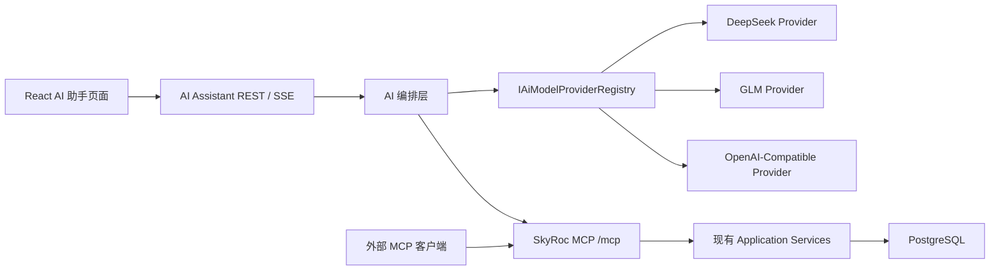

# SkyRoc 通用 AI 助手、可插拔模型层与 MCP 服务实施计划

> 文档状态：计划已确认；P6-01 公共契约、配置和权限骨架已完成，下一阶段为 P6-02。
>
> 编写日期：2026-07-22。
>
> 详细任务登记：[`docs/自动开发任务清单.md`](../../自动开发任务清单.md) 的 P6 阶段。
>
> 默认开始条件：后端 P5-01 完成，且前端 M07 完成；用户明确指定提前实施时，可以覆盖该排序，但不得把 P5-01 或 M07 误标为完成。

## 1. 目标与范围

为 SkyRoc 增加一个类似千问的通用 AI 助手：

- 普通问题直接使用当前配置的大模型回答。
- 涉及 SkyRoc 数据、业务流程、查单或下单时，由模型调用 SkyRoc MCP 能力。
- 下单必须经过“生成草稿 → 页面人工确认 → 创建正式订单”，模型和外部 MCP 客户端不能绕过确认接口。
- 模型层通过项目自有的统一接口接入，首期支持 DeepSeek、GLM、通用 OpenAI-Compatible，后续更换厂商不修改聊天页、MCP 工具和订单应用服务。
- 支持浏览器语音输入和回答朗读；音频不上传、不保存。
- 对外提供受限 MCP 服务，允许 Codex、Claude 等客户端使用个人访问令牌读取知识、查单和生成订单草稿。

首期不实现联网搜索、文件/图片理解、实时双向语音、用户自行选择模型、数据库动态保存厂商密钥、完整 OAuth/OIDC，以及任意 SQL、任意 HTTP 转发、全表读取或通用写入工具。

## 2. 固定架构决策



固定约束如下：

1. 业务代码只依赖 `IAiModelProvider` 和统一类型，不直接依赖厂商 SDK、请求 DTO 或响应 DTO。
2. 厂商差异只能出现在对应 Provider 目录和契约样例中；“兼容各种格式”通过显式适配实现，不进行未声明格式的猜测解析。
3. MCP 使用官方 `ModelContextProtocol.AspNetCore` 稳定 1.x SDK、无状态 Streamable HTTP，并映射到 `/mcp`；2026-07-22 已复核并冻结实际采用版本为 `1.4.1`，不采用 `2.0.0-preview.*`。
4. `/mcp` 遵循 MCP JSON-RPC 与 HTTP 规范，不套 `ApiResponse<T>`；普通 REST API 继续使用 HTTP 200 加 `body.code`。
5. SkyRoc 项目事实必须从 MCP 知识资源或工具结果产生；系统提示不得允许模型凭记忆编造项目事实。
6. 所有增长型查询都在数据库层限量：知识最多 5 段、订单/客户/商品最多 20 条；禁止先全量读取再在内存截断。
7. 模型只能生成订单草稿；正式订单只能由登录用户在页面确认后，通过 REST 接口调用现有 `ISaleOrderService.CreateAsync` 创建。
8. API Key 只从环境变量读取。个人 MCP 令牌原文只显示一次，数据库只保存 HMAC-SHA256 哈希。
9. 推理内容不展示、不入库；音频不上传、不保存；完整敏感工具响应不写入会话或日志。
10. 默认配置为 `Ai:Enabled=false`、`Mcp:ExternalEnabled=false`，模型故障不得影响普通业务接口。

## 3. 串行执行与测试门禁

本计划必须严格按 P6-00 至 P6-14 顺序执行：

1. 一次只领取一个阶段，不并行开发后续阶段。
2. 开始阶段前检查 `git status`，保留用户已有改动。
3. 完成代码后先执行该阶段的“必跑测试”，再执行公共门禁。
4. 任一必跑测试失败时，立即停止；记录失败原因，不勾选当前阶段，不进入下一阶段。
5. 环境依赖验收无法执行时，标记“代码完成、待环境验收”，不得宣称功能完成。
6. 每个阶段通过后，才允许勾选 `docs/自动开发任务清单.md` 中对应任务，并把测试证据写入 `docs/测试进度.md`。

每个后端阶段的公共门禁：

```powershell
dotnet build SkyRoc.sln --no-restore
dotnet format SkyRoc.sln --verify-no-changes --no-restore
git diff --check
```

每个前端阶段的公共门禁：

```powershell
Set-Location client
pnpm check:options
pnpm typecheck
pnpm exec eslint <本阶段改动的前端文件>
Set-Location ..
git diff --check
```

涉及数据库模型的阶段额外执行：

```powershell
dotnet ef migrations has-pending-model-changes --project Infrastructure --startup-project SkyRoc --no-build
```

最终交付才运行完整后端套件与前端构建；当前仓库已有测试失败必须以执行时的 `docs/测试进度.md` 为基线，不能把既有失败算作本功能通过，也不能引入新失败。

## 4. 阶段计划列表

| 阶段 | 交付结果 | 进入下一阶段的测试门禁 |
| --- | --- | --- |
| P6-00 | 基线、依赖和契约冻结 | 当前后端构建、前端 typecheck、配置与依赖验证通过 |
| P6-01 | AI/MCP 公共契约、配置和权限骨架 | 配置校验、DI、禁用开关与权限测试通过 |
| P6-02 | 会话、消息、草稿、令牌持久化与迁移 | EF 模型、迁移 Up/Down、注释和隔离测试通过 |
| P6-03 | Provider 公共契约测试框架 | 全部统一类型、流分片聚合和错误归一测试通过 |
| P6-04 | DeepSeek、GLM、OpenAI-Compatible 适配器 | 三个适配器通过同一套脱敏样例契约测试 |
| P6-05 | 项目知识库与检索服务 | 来源、限量、单篇读取、敏感内容排除测试通过 |
| P6-06 | `/mcp` 传输、资源、身份传播 | MCP 初始化、工具发现、资源读取和 JWT 鉴权测试通过 |
| P6-07 | 订单、客户、商品、单位和价格 MCP 查询工具 | 权限、数据库限量、脱敏和非法参数测试通过 |
| P6-08 | 订单草稿、价格规则与人工确认 | 价格优先级、过期、越权、重放和并发确认测试通过 |
| P6-09 | 个人 MCP Token 与外部 MCP 鉴权 | 哈希、只显示一次、范围交集、过期/撤销/停用测试通过 |
| P6-10 | 会话 REST、AI 编排、SSE 与工具循环 | 通用问答、项目工具调用、SSE、取消和循环上限测试通过 |
| P6-11 | 前端服务层、AI 页面和草稿确认卡片 | typecheck、ESLint、build、核心页面交互测试通过 |
| P6-12 | 语音输入、回答朗读和 Token 管理 UI | Chrome/Edge 手测与不支持语音回退测试通过 |
| P6-13 | 安全、日志、保留期和全链路自动化收口 | AI/MCP 全部定向测试、完整构建和前端构建通过 |
| P6-14 | 真实 DeepSeek/GLM、MCP Inspector、外部客户端验收与发布 | 全部真实场景和最终质量门禁通过后才可完成 |

## 5. 分阶段实施明细

### P6-00 基线、依赖和契约冻结

实施清单：

- 读取 `AGENTS.md`、`docs/开发进度.md`、`docs/自动开发任务清单.md`、`docs/测试进度.md`、前端两份续接文档和本计划。
- 确认 P5-01、M07 和现有测试基线；不修改它们的完成状态。
- 验证 .NET 9、Node、pnpm、PostgreSQL 和 Redis 可用性。
- 验证官方 MCP SDK 稳定 1.x 能在 `net9.0` 项目还原；固定实际采用版本。
- 记录真实 DeepSeek/GLM Key、外部 MCP 客户端和浏览器是否可用于最终验收，但不得把 Key 写入仓库。
- 冻结本计划中的 REST、SSE、MCP、权限、数据保留和下单确认边界；若必须修改，先更新本文再写代码。

必跑测试：

```powershell
dotnet restore SkyRoc.sln
dotnet build SkyRoc.sln --no-restore
Set-Location client
pnpm typecheck
Set-Location ..
git diff --check
```

通过条件：基线命令结果已记录，新增功能依赖可以还原，没有未知的仓库改动。失败则停在 P6-00。

冻结结果（2026-07-22）：

| 项目 | 冻结结果 |
| --- | --- |
| 前置与回归基线 | P5-01、前端 M07 和自动业务测试 T0–T14 均已完成；最近完整后端套件基线为发现 558 项，沿用同日已收口结果。 |
| 工具链 | `.NET SDK 9.0.100`、`Node v22.16.0`、`pnpm 10.12.1`；前端声明的 `pnpm >=10.4.1` 约束满足。 |
| 数据基础设施 | PostgreSQL 可读取到最新迁移 `20260721024046_AddSelectionOptionSearchIndexes`；Redis `PING` 返回 `PONG`，现有 `/health` 返回 `Healthy`。 |
| MCP SDK | 官方 NuGet 当前稳定 1.x 为 `ModelContextProtocol.AspNetCore 1.4.1`；已在隔离的 `net9.0` Web 项目完成还原和构建，0 警告、0 错误。仓库在 P6-06 引入时必须显式固定该版本。 |
| 最终验收能力 | Codex CLI、Claude CLI、Chrome 和 Edge 可用；MCP Inspector 未预装，P6-14 执行时再按官方发行方式获取。`SKYROC_AI_DEEPSEEK_API_KEY`、`SKYROC_AI_GLM_API_KEY`、`SKYROC_AI_CUSTOM_API_KEY`、`SKYROC_MCP_TOKEN_HASH_KEY` 当前均未配置，P6-14 前必须由环境注入。 |
| 契约边界 | 本计划的 REST、六类 SSE 事件、无状态 `/mcp`、权限交集、30 天会话保留、30 分钟草稿有效期及“草稿后人工确认创建正式订单”边界全部冻结，本阶段无变更。 |
| 基线门禁 | `dotnet restore`、`dotnet build --no-restore`、`dotnet format --verify-no-changes --no-restore`、前端 `pnpm typecheck`、进度基线防退化测试和 `git diff --check` 通过；后端仅保留 7 条既有 NuGet 漏洞警告。 |

### P6-01 公共契约、配置和权限骨架

实施清单：

- 在 `Shared` 或 `Application` 的窄层定义 `AiChatMessage`、`AiToolDefinition`、`AiToolCall`、`AiToolResult`、`AiStreamChunk`、`AiUsage`、`AiProviderError`、`AiProviderCapabilities`。
- 定义 `IAiModelProvider`：`StreamChatAsync`、`GetCapabilitiesAsync`、`NormalizeError`、`ValidateConfiguration`。
- 定义 `IAiModelProviderRegistry`，只由 `Ai:ActiveProvider` 选择一个已注册 Provider。
- 增加 `AiOptions`、`AiProviderOptions`、`McpOptions`，使用启动校验检查地址、模型名、数值边界和密钥环境变量名。
- 增加 `Ai:Enabled=false` 与 `Mcp:ExternalEnabled=false` 默认配置；示例配置只保存环境变量名称，不保存密钥。
- 在 `Shared/Constants/PermissionCodes.cs` 增加 AI 助手使用、订单草稿、MCP Token 管理权限，并纳入权限完整性测试。
- 保持厂商类型只存在于适配器目录。

计划文件范围：

- `Application/AI/Abstractions/`
- `Application/AI/Models/`
- `Shared/Options/AiOptions.cs`
- `Shared/Options/McpOptions.cs`
- `Shared/Constants/PermissionCodes.cs`
- `Application/DependencyInjection.cs`
- `SkyRoc/appsettings.json`

必跑测试：

- 配置缺少 Base URL、Model、API Key 环境变量时返回可识别启动错误。
- AI 禁用时不解析厂商密钥、不影响普通 API 启动。
- Provider 名称不存在或 Adapter 重复注册时启动失败。
- 权限定义完整性测试通过。
- 运行后端公共门禁。

### P6-02 持久化模型与迁移

新增实体：

- `AiConversation`：用户、标题、最后消息时间、保留期相关状态。
- `AiMessage`：会话、角色、文字内容、序号、Provider/Model、必要工具摘要；禁止保存推理和完整敏感结果。
- `AiOrderDraft`：会话、用户、客户、订单信息、状态、过期时间、正式订单关联和幂等键。
- `AiOrderDraftDetail`：商品、单位、数量、固定价、价格来源、来源记录和确认快照。
- `McpAccessToken`：用户、名称、前缀、哈希、范围、过期/撤销/最后使用时间。

实施清单：

- 在 `Domain/Entities/AI/` 创建实体和枚举，每个顶级类型单独文件，补齐中文 XML 注释。
- 在 `Infrastructure/Data/EntityConfigurations/AI/` 配置表、列、关系、唯一索引、并发或幂等约束。
- 所有表和列使用 `HasComment` 写入中文数据库注释。
- 在 `ApplicationDbContext` 增加 DbSet，并生成可回滚迁移。
- 会话默认保留 30 天；草稿默认 30 分钟过期。
- 设计用户隔离、会话消息游标和草稿确认的必要索引，避免 offset 扫描会话消息。

必跑测试：

- 五个实体的 EF 模型、表名、字段、关系、索引和全部数据库注释测试。
- 迁移 Up 创建完整结构，Down 只回滚本阶段对象。
- 会话用户隔离、消息游标排序和草稿幂等索引测试。
- `has-pending-model-changes` 返回无挂起模型变更。
- 运行后端公共门禁。

### P6-03 Provider 公共契约测试框架

实施清单：

- 建立适配器共享契约测试基类；新增 Provider 必须复用，不能自行降低断言。
- 统一内容解析为文字增量；兼容 `content` 字符串或内容块数组。
- 统一工具调用增量，能够跨多个流片段拼接工具 ID、名称和 JSON 参数。
- 统一 usage、finish reason、取消、超时、断流和厂商错误。
- 未知字段忽略，同时只在适配器内部保留扩展数据，不能把厂商原始 JSON 传给前端。
- 工具参数在完整 JSON 形成后做 JSON Schema 校验；非法参数最多让模型修正一次。

必跑测试：

- 普通非流式与流式回答。
- 单工具、多工具和跨分片参数。
- 字符串/内容块两种 content。
- 缺失 usage、结束原因、未知字段和 HTTP 200 错误体。
- 非流式错误、超时、断流、用户取消和非法工具参数。
- 运行后端公共门禁。

### P6-04 三个模型适配器

实施清单：

- 在基础设施或 Web 组合层实现 `DeepSeekAiModelProvider`、`GlmAiModelProvider`、`OpenAiCompatibleModelProvider`。
- DeepSeek 处理 `reasoning_content`，工具回合按厂商要求回放必要推理字段，但推理不展示、不入库。
- GLM 处理思考字段、工具选择和流式工具分片。
- OpenAI-Compatible 通过配置映射内容字段、推理字段、最大 token 字段和额外请求参数。
- API Key 从各自环境变量读取；日志、异常和遥测不得输出请求头或密钥。
- 注册表按 Provider 名称选择 Adapter；切换 Provider 只改配置并重启。
- 保存脱敏响应样例，样例不得包含真实 Key、客户数据或内部地址。

计划文件范围：

- `Infrastructure/AI/Providers/DeepSeek/`
- `Infrastructure/AI/Providers/Glm/`
- `Infrastructure/AI/Providers/OpenAiCompatible/`
- `SkyRoc.Tests/AI/Providers/Fixtures/`
- `SkyRoc.Tests/AI/Providers/`

必跑测试：三个适配器逐一运行 P6-03 的同一套公共契约测试，任何一个失败都不能注册或进入 P6-05。

### P6-05 项目知识库与检索

实施清单：

- 在 `docs/ai-knowledge/` 建立面向用户问答的知识文档，首期至少覆盖数据来源、Clean Architecture 模块职责、销售订单、采购、库存、配送、售后和定价流程。
- 每篇知识包含稳定 slug、标题、摘要、正文和可展示来源；不得把连接串、密钥、内部备注或个人信息放入知识库。
- 实现知识索引和限量搜索服务；最多返回 5 段，每段最多 800 个字符。
- 搜索结果必须包含来源 slug/标题，供 SSE `source` 事件和前端来源标签使用。
- 首期采用受控文档索引，不把整个仓库源代码、数据库或任意文件暴露给模型。

必跑测试：

- 知识索引包含全部首期主题。
- 单篇 slug 只能读取一篇，非法 slug 不得路径穿越。
- 搜索始终不超过 5 段和每段 800 字。
- 搜索结果包含来源且不含预设敏感样例。
- 运行后端公共门禁。

### P6-06 MCP 传输、资源和 JWT 身份传播

实施清单：

- 引入官方 `ModelContextProtocol.AspNetCore` 稳定 1.x，配置无状态 Streamable HTTP。
- 映射 `/mcp`，关闭旧版 SSE 传输，启用官方授权过滤器和身份传播。
- `/mcp` 不经过普通业务 `ApiResponse` 包装；现有业务异常/响应约定不得被改坏。
- 暴露 `skyroc://knowledge/index` 与 `skyroc://knowledge/{slug}` 资源。
- 暴露 `search_project_knowledge` 工具。
- 内部聊天编排使用当前 SkyRoc JWT 身份访问 MCP，不能使用后台超级账号或共享令牌代替用户。
- `Ai:Enabled=false` 时内部编排入口不可用；`Mcp:ExternalEnabled=false` 时不接受个人令牌，但内部 JWT MCP 仍可按配置使用。

必跑测试：

- MCP initialize、tools/list、resources/list、resources/read 协议测试。
- 未认证、无 AI 权限、合法 JWT 三种身份结果。
- `/mcp` 响应不包含 `ApiResponse` 外壳；普通 REST 失败仍为 HTTP 200 加业务 code。
- Origin 校验和无状态会话测试。
- 运行后端公共门禁。

### P6-07 有界业务查询 MCP 工具

实现以下工具：

| 工具 | 权限 | 强制上限 |
| --- | --- | ---: |
| `search_sale_orders` | `business:order:read` | 20 |
| `get_sale_order_status` | `business:order:read` | 单个订单号 |
| `search_customers` | 下单权限与客户读取权限 | 20 |
| `search_goods` | 下单权限与商品读取权限 | 20 |
| `get_goods_units` | 下单权限与商品读取权限 | 指定单个商品 |
| `resolve_order_price` | 下单权限与定价读取权限 | 指定客户、商品、单位、日期 |

实施要求：

- 复用现有应用服务或增加窄的 AI 查询服务，禁止 MCP 工具直接拼接任意 SQL。
- 查询在 EF/仓储层 `Take`，不能读取全量后再截断。
- 返回专用摘要 DTO，不返回地址、手机号、成本、内部备注等非必要字段。
- 工具参数采用 JSON Schema 严格校验，拒绝未知写入字段、空 GUID 和超限 limit。
- 查询不到、重名或价格歧义应返回可让模型继续询问用户的结构化结果。

必跑测试：

- 每个工具的成功、空结果、无权限和非法参数测试。
- 20 条硬上限、数据库侧限量和敏感字段脱敏测试。
- `get_goods_units` 不允许无商品参数全量读取。
- 工具发现中 schema、描述和必填字段正确。
- 运行后端公共门禁。

### P6-08 订单草稿、价格规则与人工确认

价格规则固定为：

1. 优先选择订单日期内有效、绑定客户且匹配商品和计价单位的唯一协议价。
2. 没有协议价时，使用客户关联的唯一有效、已审核默认报价。
3. 没有唯一价格时不自动选价，返回歧义并继续询问用户。
4. 用户明确提供的价格可以使用，价格来源标记为“用户提供”。
5. 页面确认时重新解析价格；价格变化、来源失效或最低起订量不满足时要求重新确认。
6. 草稿 30 分钟过期。
7. 重复或并发确认只能创建一张待审核销售订单。

实施清单：

- 实现 `prepare_sale_order_draft` MCP 工具，只保存草稿，不创建正式订单。
- 草稿保存当前用户、客户、商品、单位、数量、价格来源和必要业务快照。
- 新增草稿详情与 `POST /api/ai-assistant/order-drafts/{id}/confirm`。
- 确认接口验证登录用户、归属、权限、有效期、状态、价格、最低起订量和幂等键，再调用现有 `ISaleOrderService.CreateAsync`。
- 外部 MCP 客户端首期没有正式确认能力。

必跑测试：

- 协议价、默认报价、用户价格、无价格、多个价格和失效价格。
- 确认前价格变化、最低起订量、草稿过期、用户越权。
- 同一草稿顺序重复确认与并发确认，断言只产生一张正式订单。
- 正式订单为待审核状态，并完整复用现有订单校验和数值精度规则。
- 运行后端公共门禁及订单相关回归测试。

### P6-09 个人 MCP Token 与外部鉴权

实施清单：

- 新增个人 Token 创建、列表和撤销 REST 接口。
- 生成 32 字节随机令牌，建议展示格式 `skmcp_<prefix>_<secret>`；完整原文只在创建响应中出现一次。
- 使用服务端独立密钥对令牌执行 HMAC-SHA256，数据库只保存哈希和可识别前缀。
- Token 名称必填，有效期限制为 30–365 天。
- 范围只允许 `knowledge:read`、`orders:read`、`orders:draft`。
- 每次使用重新检查 Token 过期/撤销、用户启用状态和用户当前角色权限；实际权限为 PAT 范围与实时角色权限交集。
- 更新最后使用时间时避免每次请求造成热点写，可采用最短更新间隔。
- 外部 Token 不能访问草稿确认 REST，也不能获得超出范围的工具定义。

必跑测试：

- 原文只返回一次，列表/数据库/日志均不出现完整 Token。
- 正确哈希、错误 Token、过期、撤销、用户停用和密钥轮换行为。
- 三种范围及其组合与用户实时角色权限的交集。
- 外部客户端无法确认订单，撤销后立即失效。
- 运行后端公共门禁。

### P6-10 会话、AI 编排和统一 SSE

新增 REST 契约：

- `POST /api/ai-assistant/conversations`
- `GET /api/ai-assistant/conversations`
- `GET /api/ai-assistant/conversations/{id}/messages`
- `DELETE /api/ai-assistant/conversations/{id}`
- `POST /api/ai-assistant/conversations/{id}/messages/stream`
- `GET /api/ai-assistant/order-drafts/{id}`
- `POST /api/ai-assistant/order-drafts/{id}/confirm`

统一 SSE 事件：

| 事件 | 最小数据 |
| --- | --- |
| `message.delta` | `conversationId`、`messageId`、`delta` |
| `tool.status` | `toolCallId`、`toolName`、`status`、安全摘要 |
| `source` | `slug`、`title` |
| `order-draft.ready` | `draftId`、过期时间、摘要 |
| `message.completed` | 消息 ID、结束原因、可展示 usage |
| `error` | 统一错误 code、用户可读消息、是否可重试 |

实施清单：

- 编排器先把统一模型消息、MCP 工具 schema 和系统规则传给当前 Provider。
- 普通问题允许模型直接回答；项目事实和业务动作必须调用 MCP。
- 工具参数通过 schema 校验后才能执行；非法参数最多让模型修正一次。
- 单轮最多 8 次工具循环，超限返回统一错误。
- 正确处理停止生成、请求取消、超时、客户端断开和模型中途断流。
- 只保存用户/助手文字和必要工具摘要；不保存推理、音频、API Key、PAT 或完整敏感工具响应。
- 会话列表分页，消息采用游标分页，所有操作按当前用户隔离。

必跑测试：

- 通用问题不调用 MCP；项目流程问题调用知识 MCP；查单调用订单 MCP。
- 工具成功、工具失败、非法参数修正一次、8 次循环上限。
- 六种 SSE 事件序列、断流、取消、超时和前端断开。
- 会话分页、游标稳定性、用户隔离和删除。
- DeepSeek/GLM 厂商原始字段不泄漏到 SSE 或数据库。
- 运行后端公共门禁与 Swagger 契约测试。

### P6-11 前端服务层与 AI 助手页面

实施清单：

- 按 `types → urls → api → hooks/调用页 → 路由/i18n/权限` 顺序接入。
- 新增顶级“AI 助手”路由和菜单，包含会话历史、消息流、输入框、停止生成和空态。
- 实现安全 Markdown 渲染，不允许原始 HTML 或脚本执行。
- 显示工具执行状态和项目来源标签。
- 对 `order-draft.ready` 渲染结构化草稿卡片，展示客户、日期、商品、单位、数量、价格来源、金额、过期时间和确认按钮。
- 确认成功后展示正式订单号和可跳转订单详情的入口。
- 使用现有主题 token、UnoCSS、请求封装和权限体系；不读取原始 `response.data`，不用 `any`。
- 同步中英文路由、页面文案、API 类型和权限。

计划文件范围：

- `client/src/service/types/ai-assistant.d.ts`
- `client/src/service/urls/ai-assistant.ts`
- `client/src/service/api/ai-assistant.ts`
- `client/src/service/hooks/use-ai-assistant.ts`
- `client/src/pages/(base)/ai/assistant/`
- `client/build/plugins/router.ts`
- `client/src/locales/langs/zh-cn/`
- `client/src/locales/langs/en-us/`

必跑测试：

```powershell
Set-Location client
pnpm check:options
pnpm typecheck
pnpm exec eslint <本阶段改动文件>
pnpm build
```

运行时手测：创建会话、发送消息、停止生成、来源标签、草稿展示、确认与订单跳转。任何主流程未验证时标记“代码完成、待环境验收”，不能进入 P6-12。

### P6-12 语音与 Token 管理 UI

实施清单：

- Chrome/Edge 使用 Web Speech API 支持按住说话，识别结果只填入输入框。
- 使用 `speechSynthesis` 朗读助手回答，提供开始/停止朗读控制。
- 不支持语音、权限拒绝或识别失败时回退文字输入，不阻塞聊天。
- 页面和请求层不得上传 Blob、音频流或录音文件；数据库不增加音频字段。
- 个人中心增加 MCP Token 创建、列表、复制一次性密钥和撤销界面。
- 创建 Token 时明确提示原文只显示一次，并显示范围和有效期。

必跑测试：

- 前端公共门禁和 `pnpm build`。
- Chrome、Edge 分别手测语音输入、取消、朗读、停止朗读和权限拒绝。
- 不支持 Web Speech API 的模拟环境可以正常文字聊天。
- 浏览器 Network 确认没有音频上传；Token 列表不返回完整密钥。

### P6-13 安全、日志、清理和自动化收口

实施清单：

- 增加会话 30 天保留期清理后台任务，清理过程按批次执行并记录数量，不记录消息正文。
- 为模型调用、工具调用和草稿确认增加结构化审计，只记录必要标识、耗时、结果码和安全摘要。
- 增加日志脱敏：API Key、Authorization、PAT、手机号、地址、内部备注和完整工具结果不得出现。
- 检查速率限制、最大输入字符、最大输出 token、请求超时、工具循环上限和并发连接边界。
- 确认模型或 MCP 故障不会影响现有业务控制器和后台任务。
- 补齐 Swagger、HTTP 示例、README、模型适配说明、MCP 接入说明和运维配置说明。

必跑测试：

- AI/MCP/草稿/PAT 的全部定向测试。
- 日志敏感字段扫描、保留期清理、限流、超时和故障隔离测试。
- `dotnet build`、`dotnet format`、`has-pending-model-changes`、`pnpm check:options`、`pnpm typecheck`、改动文件 ESLint、`pnpm build`、`git diff --check`。
- 未解决本功能新增失败时不得进入 P6-14。

### P6-14 真实环境验收、发布和回滚

真实 DeepSeek 和 GLM 各执行：

1. 普通流式聊天。
2. 项目数据来源或流程问答，并核对来源。
3. 按订单号查单。
4. 搜索客户、商品和商品单位，确认结果上限。
5. 生成订单草稿。
6. 页面人工确认并创建一张待审核订单。
7. 停止生成、超时和模型不可用时的错误体验。

外部 MCP 执行：

- 使用 MCP Inspector 完成 initialize、资源读取、工具发现和工具调用。
- 使用至少一个外部客户端通过个人 Token 读取知识、查单和生成草稿。
- 验证过期、撤销、范围不足和用户停用后立即拒绝。
- 验证外部客户端不能创建正式订单。

最终门禁：

```powershell
dotnet build SkyRoc.sln --no-restore
dotnet test SkyRoc.Tests\SkyRoc.Tests.csproj --no-build
dotnet format SkyRoc.sln --verify-no-changes --no-restore
dotnet ef migrations has-pending-model-changes --project Infrastructure --startup-project SkyRoc --no-build
Set-Location client
pnpm check:options
pnpm typecheck
pnpm lint
pnpm build
Set-Location ..
git diff --check
```

通过后：

- 先部署数据库迁移，保持 AI 与外部 MCP 开关关闭。
- 先启用内部聊天并观察错误率、延迟、工具调用和草稿确认。
- 内部验收稳定后再启用外部 MCP。
- 更新 `docs/开发进度.md`、`docs/测试进度.md`、前端进度、README 和接入文档，并勾选 P6-14。

缺少真实模型密钥、真实 PostgreSQL、浏览器或外部 MCP 客户端中的任一验收时，只能记录“代码完成、待环境验收”，P6-14 保持未勾选。

## 6. 统一契约附录

### 6.1 Provider 配置

```json
{
  "Ai": {
    "Enabled": false,
    "ActiveProvider": "DeepSeek",
    "MaxInputCharacters": 8000,
    "MaxOutputTokens": 4096,
    "MaxToolIterations": 8,
    "RequestTimeoutSeconds": 120,
    "ConversationRetentionDays": 30,
    "DraftExpiryMinutes": 30,
    "Providers": {
      "DeepSeek": {
        "Adapter": "DeepSeek",
        "BaseUrl": "https://api.deepseek.com",
        "Model": "由环境配置",
        "ApiKeyEnvironmentVariable": "SKYROC_AI_DEEPSEEK_API_KEY"
      },
      "GLM": {
        "Adapter": "GLM",
        "BaseUrl": "https://open.bigmodel.cn/api/paas/v4",
        "Model": "由环境配置",
        "ApiKeyEnvironmentVariable": "SKYROC_AI_GLM_API_KEY"
      },
      "Custom": {
        "Adapter": "OpenAiCompatible",
        "BaseUrl": "由环境配置",
        "Model": "由环境配置",
        "ApiKeyEnvironmentVariable": "SKYROC_AI_CUSTOM_API_KEY"
      }
    }
  },
  "Mcp": {
    "ExternalEnabled": false,
    "AllowedOrigins": [],
    "TokenHashKeyEnvironmentVariable": "SKYROC_MCP_TOKEN_HASH_KEY"
  }
}
```

生产环境建议把 Base URL、Model 和所有密钥均通过环境变量覆盖；仓库配置只保留安全默认值和变量名。

### 6.2 Provider 接口边界

```csharp
public interface IAiModelProvider
{
    IAsyncEnumerable<AiStreamChunk> StreamChatAsync(
        AiChatRequest request,
        CancellationToken cancellationToken);

    ValueTask<AiProviderCapabilities> GetCapabilitiesAsync(
        CancellationToken cancellationToken = default);

    AiProviderError NormalizeError(Exception exception);

    void ValidateConfiguration();
}
```

接口名称可以按仓库实际命名微调，但调用方向和厂商隔离边界不能改变。

### 6.3 MCP 首期资源与工具

| 类型 | 名称 | 结果边界 |
| --- | --- | --- |
| Resource | `skyroc://knowledge/index` | 受控知识索引 |
| Resource | `skyroc://knowledge/{slug}` | 单篇受控文档 |
| Tool | `search_project_knowledge` | 最多 5 段，每段 800 字 |
| Tool | `search_sale_orders` | 最多 20 条摘要 |
| Tool | `get_sale_order_status` | 单个订单详情与履约状态 |
| Tool | `search_customers` | 最多 20 条摘要 |
| Tool | `search_goods` | 最多 20 条摘要 |
| Tool | `get_goods_units` | 指定商品的单位 |
| Tool | `resolve_order_price` | 单一客户/商品/单位/日期 |
| Tool | `prepare_sale_order_draft` | 保存一张当前用户草稿 |

### 6.4 数据保存边界

允许保存：

- 用户与助手最终文字。
- Provider 名称、模型名、消息顺序和时间。
- 工具名称、结果状态和经过脱敏的必要摘要。
- 知识来源 slug/标题。
- 订单草稿及其确认所需业务快照。

禁止保存：

- DeepSeek/GLM 的推理或思考内容。
- 音频和语音识别原始数据。
- API Key、完整个人 MCP Token 或 Authorization 请求头。
- 完整模型原始响应和完整敏感工具响应。
- 与用户请求无关的手机号、地址、成本和内部备注。

## 7. 风险与应对

| 风险 | 应对 |
| --- | --- |
| 厂商格式变化 | 只修改对应适配器与脱敏样例，公共契约测试防止业务层受影响 |
| 模型误调用工具 | JSON Schema 校验、权限过滤、工具循环上限、只暴露白名单工具 |
| 模型编造项目事实 | 系统规则要求项目事实调用 MCP，集成测试断言工具调用与来源 |
| 大表查询拖垮数据库 | 仓储层限量、专用投影、索引和禁止全量后截断测试 |
| 重复确认创建多单 | 草稿状态并发控制、数据库唯一幂等约束和事务测试 |
| PAT 泄漏 | 一次性原文、HMAC 哈希、日志脱敏、范围交集、撤销与短有效期 |
| 模型故障影响主业务 | 功能开关、独立 HttpClient/超时/并发限制、故障隔离测试 |
| SSE 断流产生半条消息 | 明确消息状态，断流不把未完成内容标为 completed，可安全重试 |
| 浏览器语音兼容性 | 仅作为渐进增强，不支持时完整回退文字聊天 |

## 8. 验收定义与回滚

全部满足时才能称为完成：

- 三个 Provider 通过同一套契约测试，切换 Provider 不修改业务代码。
- 通用问题可以直接回答，项目问题按规则调用 MCP 并展示来源。
- 查询工具权限正确、数据脱敏且硬上限生效。
- 订单草稿必须人工确认，价格重新校验，重复/并发确认只创建一单。
- JWT 与个人 MCP Token 鉴权、范围交集、过期、撤销、用户停用均通过测试。
- 前端聊天、停止生成、Markdown、来源、草稿确认、语音和 Token 管理通过静态及运行时验收。
- 日志和数据库不包含禁止保存的数据。
- 真实 DeepSeek、GLM、MCP Inspector 和至少一个外部客户端验收完成。
- 后端、前端、EF、格式化和差异检查全部通过，没有新增回归失败。

回滚方式：

1. 设置 `Mcp:ExternalEnabled=false` 关闭外部 MCP。
2. 设置 `Ai:Enabled=false` 关闭聊天和内部 AI 编排。
3. 保留已确认创建的正式订单，不因 AI 功能回滚而删除或修改。
4. 需要回滚数据库时，先确认没有仍需保留的会话、草稿和 Token 审计数据，再执行迁移 Down；正式订单表不在回滚范围。

## 9. 参考资料

- [MCP Streamable HTTP 传输规范](https://modelcontextprotocol.io/specification/2025-03-26/basic/transports)
- [官方 MCP C# SDK](https://github.com/modelcontextprotocol/csharp-sdk)
- [MCP C# SDK 授权过滤器](https://csharp.sdk.modelcontextprotocol.io/concepts/filters.html)
- [MCP C# SDK 身份传播](https://csharp.sdk.modelcontextprotocol.io/concepts/identity/identity.html)
- [DeepSeek Tool Calls](https://api-docs.deepseek.com/guides/tool_calls)
- [GLM 工具调用](https://docs.bigmodel.cn/cn/guide/capabilities/function-calling)
